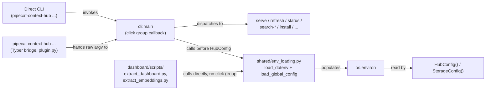

# Task: Global config.toml fallback + refresh prune safety for machine-scoped hub installs

**Status**: Not Started
**Component**: cli
**Assigned to**: Claude
**Priority**: Medium
**Branch**: feature/global-config-toml
**Created**: 2026-08-07
**Completed**: (fill when done)
**Review Gates**: none

## Objective

Two fixes from the same discussion, landing together because they compose:

1. Let a globally-installed context-hub (invoked with no meaningful project
   `cwd` — e.g. as an MCP server from Claude Code) source `PIPECAT_HUB_*`
   settings from `~/.config/pipecat-context-hub/config.toml`, so the operator
   stops exporting them from `~/.zshrc`, without changing the existing
   project-local `.env` behavior or its precedence.
2. Stop `refresh` from silently deleting indexed data for any repo not named
   in *that invocation's* `effective_repos` — today this fires even when the
   repo is still configured, just not visible from the current directory/env
   layering (e.g. a project checkout with its own narrower `.env`). Without
   this fix, #1 alone does not close the bug it's meant to fix: a project
   `.env` still wins over `config.toml` per-key (whole-string override, not a
   list merge), so running `refresh` from inside such a project reproduces
   the exact deletion markbackman reported, on top of `config.toml`.

## Context

Repo config (`PIPECAT_HUB_EXTRA_REPOS`, etc.) is read from `os.environ`,
populated either by the real shell environment or by `_load_dotenv()`
(`src/pipecat_context_hub/cli.py:92-128`), which loads `.env` from
`Path.cwd()`. That works for a project-local checkout, but the on-disk index
and repo clones are machine-global (`~/.pipecat-context-hub` by default —
`shared/config.py:58-67`), and a globally-installed MCP server may have no
project `cwd` to hold a `.env` at all. **Assumption, not yet verified**:
whether Claude Code spawns this server with a fixed/no project `cwd`, or
inherits a project directory — see Phase 0 below, which adds an explicit
verification step before the rest of the plan leans on this claim. The
operator (vr000m) has been working around the gap by `export`ing
`PIPECAT_HUB_*` vars from `~/.zshrc` (currently: `PIPECAT_HUB_STALE_AFTER_DAYS`,
a ~70-repo `PIPECAT_HUB_EXTRA_REPOS` list), which is unversioned, invisible
to `refresh`/`serve` provenance, and awkward to maintain.

This mirrors the design agreed in the discussion at
`pipecat-ai/pipecat#5122` (comment 5209812757, markbackman/vr000m): the
index is machine-global, so config that governs it should have a
machine-global home too, layered under real env vars and cwd `.env` so
nothing about the existing precedence changes for project-local use. The
config file itself lives in `~/.config/pipecat-context-hub/` rather than
alongside the index (`~/.pipecat-context-hub/`) — see Architecture
Decisions for why the two must not share a directory.

**The deletion bug (markbackman, same thread):** `refresh` already runs a
cleanup pass —

```
configured = set(config.sources.effective_repos)
...
if slug not in configured:
    ...
    await index_store.delete_by_repo(slug)
```

(`cli.py:623-637`, present today, unconditional). His repro: `cd customer-a
&& refresh` indexes it; `cd anywhere-else && refresh` deletes it, because
that directory's env doesn't name it. He proposed two fixes that "compose":
(1) a quick safety fix — warn instead of silently deleting, gated behind an
explicit `--prune` flag/`PIPECAT_HUB_PRUNE` env var to actually delete — and
(3) the global config file this plan already builds. Both land here.

## Requirements

- Project-local `.env` (loaded from `Path.cwd()`) is unchanged — same file,
  same loader, same "first-writer-wins" semantics.
- A new `~/.config/pipecat-context-hub/config.toml`, read only if present,
  adds a third precedence layer *below* real env vars and cwd `.env`,
  *above* `HubConfig` field defaults.
- `config.toml` uses the exact same `PIPECAT_HUB_*` names as flat string
  keys — no separate schema to keep in sync by hand. Only keys under the
  `PIPECAT_HUB_` prefix are honored; any other key is skipped with a
  `logger.warning` naming it (matches the Objective's stated scope, keeps a
  machine-global file from becoming a general environment injector). One
  exception to "flat string keys": a value that is a homogeneous TOML array
  of scalars is accepted and coerced to a comma-separated string via
  `",".join(str(v) for v in value)` — losslessly equivalent to the CSV
  parsing `shared/config.py:468` already does on the env-var form. This lets
  `PIPECAT_HUB_EXTRA_REPOS` (the flagship ~70-repo use case) be authored as
  a native TOML array instead of one long quoted string.
- **`PIPECAT_HUB_PRUNE` is invocation-scoped, not machine config, and is
  explicitly excluded from `config.toml`** (decided in review — a global
  file silently re-enabling `refresh`'s deletion behavior defeats Phase 4's
  purpose): `load_global_config()` skips it with a `logger.warning` naming
  it as invocation-scoped, using the same skip pattern as a
  non-`PIPECAT_HUB_`-prefixed key. It is excluded from `config.toml.example`
  and the README parity table — the 11-var registry is unchanged by this
  plan. An operator who wants pruning on by default should export a real
  `PIPECAT_HUB_PRUNE` env var instead (already works today, no plan changes
  needed).
- The `config.toml` *lookup path* (`~/.config/pipecat-context-hub/`) is
  fixed and does not follow `PIPECAT_HUB_DATA_DIR` — it lives outside
  `StorageConfig.data_dir` entirely, so this is not a chicken-and-egg case:
  `PIPECAT_HUB_DATA_DIR` set inside `config.toml` still relocates the
  storage/index directory for every other purpose once loaded into
  `os.environ`.
- A `config.toml.example` ships alongside `.env.example`. Its key set is
  kept from silently drifting apart from `docs/README.md`'s Environment
  Variables table (the full 11-var registry) by a parity test — see
  Architecture Decisions for why the README table, not `.env.example`, is
  the parity partner.
- Every consumer that constructs `StorageConfig`/`HubConfig` independently
  of `cli.main()` — today, the dashboard scripts — also loads
  `config.toml`, via a shared loader module rather than duplicated logic.
- No new runtime dependency — `tomllib` is stdlib as of the project's
  `>=3.11` floor (`pyproject.toml:18`) and is already used elsewhere in this
  codebase (`services/ingest/github_ingest.py:664,668`).
- `docs/README.md` and `CLAUDE.md` document the three-layer precedence and
  both file locations.
- `refresh`'s repo-cleanup pass (`cli.py:623-637`) no longer deletes index
  records for an unconfigured-this-invocation repo by default — it warns
  instead. Deletion happens only when the operator opts in via `--prune`
  (or `PIPECAT_HUB_PRUNE=1`). Tainted repos (`config.sources.tainted_repos`)
  are unaffected by this change — they are an explicit skip list, not an
  accidental-absence case, and continue to be cleaned up unconditionally as
  today.

## Review Focus

- Precedence must degrade cleanly, **scoped to the config-loading layer
  only**: unset `config.toml` → identical *config resolution* behavior to
  today (verifies the loader is additive, not a behavior change for existing
  `.env`-only or env-var-only users). This does NOT extend to Phase 4's
  `refresh` prune-safety change — that is an intentional, separately
  documented behavior change to `refresh`'s default (warn instead of
  delete) that applies to every user regardless of whether `config.toml`
  exists.
- `config.toml`'s own lookup path must survive `refresh --reset-index`
  (which `shutil.rmtree`s `StorageConfig.data_dir`) — this is why the file
  lives outside `data_dir` rather than inside it. Cover with a test, not
  just directory separation by construction.
- Every `PIPECAT_HUB_*`-var consumer that builds config independently of
  `cli.main()` (dashboard scripts) must see `config.toml` too — not just
  `serve`/`refresh`.
- Parity test must fail (not silently pass) when a key is added to one
  source (`config.toml.example` or the README table) and not the other, and
  must not vacuously pass on a format change that empties one side's
  extracted set.
- Test mechanisms must actually work on the platforms CI runs — in
  particular, `Path.home()` overrides must work on the `windows-latest` CI
  leg, not just POSIX.
- The manual verification step must be capable of observing the feature at
  all — on the operator's actual machine, real env vars (from `~/.zshrc`)
  outrank `config.toml` per this plan's own precedence, so the manual check
  must neutralize those exports rather than compete with them.
- The prune-safety fix must actually close markbackman's repro: a `refresh`
  run from a directory whose local `.env` sets a narrower
  `PIPECAT_HUB_EXTRA_REPOS` than `config.toml`'s must NOT delete the
  config.toml-only repos' index records without `--prune`/`PIPECAT_HUB_PRUNE=1`.
  Cover with a test that reproduces his exact scenario, not just the
  unit-level warn/delete branch.
- Tainted-repo cleanup (`config.sources.tainted_repos`) must remain
  unconditional — it is an explicit exclusion, not an accidental absence,
  and gating it behind `--prune` would be a regression (a tainted repo's
  data would linger until the operator remembers to pass a flag for an
  exclusion they already made explicitly).

## Architecture & Call Flow

This plan touches multiple independently-invoked front doors that must all
route through the same loader for the design to hold: the CLI entry point,
the `pipecat context-hub` Typer bridge, the MCP `serve` process, and the
dashboard build scripts (a separate, non-CLI entry point).




| Step | Trigger | Enters context | Cleared/persisted | Turn boundary |
|------|---------|-----------------|--------------------|----------------|
| 1 | Any `cli:main` subcommand invoked (direct CLI, Typer bridge, one-shot query) | CLI args | N/A (single process) | before `_configure_logging` |
| 2 | `shared.env_loading.load_dotenv()` | cwd `.env` contents | written into `os.environ`, process-lifetime | immediately, synchronous |
| 3 | `shared.env_loading.load_global_config()` | `~/.config/pipecat-context-hub/config.toml` contents | written into `os.environ` (only unset keys), process-lifetime | immediately, synchronous |
| 4 | `HubConfig()` construction | resolved `os.environ` | held for process lifetime | after step 3, before any tool/command runs |
| 5 | `dashboard/scripts/*.py` run directly (not through `cli:main`) | same two loader calls, invoked at script top | written into `os.environ`, process-lifetime | before `StorageConfig()`/`HubConfig()` construction in the script |

## Implementation Checklist

### Phase 0: Verify the MCP-cwd assumption

**Impl files:** (none — investigation only; findings feed Phase 3 docs)
**Test files:** (none)
**Test command:** (none — manual verification)
**Goal:** Confirm (rather than assume) how Claude Code's MCP client spawns this server, since the Context section's claim about `cwd` was flagged as unverified during review and the operator was unsure.

- Add a one-line `logger.info("serve cwd=%s env_keys=%s", Path.cwd(), sorted(k for k in os.environ if k.startswith("PIPECAT_HUB_")))` (or equivalent) at `serve` startup — `logger.info`, not `logger.debug`: `_configure_logging` defaults to `INFO` (`cli.py:147`), so a `DEBUG` record would never surface without the operator passing `--log-level DEBUG` to their MCP registration. Log key *names* only, never values, since `PIPECAT_HUB_EXTRA_REPOS` is a ~70-repo list.
- Before inspecting logs, confirm where Claude Code actually exposes an MCP server's stderr (e.g. Claude Code's `/mcp` log viewer or its log cache directory) — the mechanism is unverified going in — and confirm the operator's MCP server registration points at this dev checkout (`uv run` from this repo), not an installed package, so the instrumented code is what's actually observed.
- Record the finding in `## Findings` below the marker once known, including whether the `PIPECAT_HUB_*` key names logged above actually include the operator's `~/.zshrc` exports — this answers whether that workaround reaches the MCP subprocess at all, a claim the Context section currently states without verification.
- Document the actual behavior in Phase 3's README precedence note — specifically, whether a project `.env` can shadow `config.toml` even in a "global" MCP install, and what that means for an operator who expects `config.toml` to always apply.

### Phase 1: Shared env-loading module + precedence wiring

**Impl files:** `src/pipecat_context_hub/shared/env_loading.py` (new), `src/pipecat_context_hub/cli.py`
**Test files:** `tests/unit/test_env_loading.py` (new), `tests/unit/test_cli.py`
**Test command:** `uv run pytest tests/unit/test_env_loading.py tests/unit/test_cli.py -v`
**Goal:** Real env vars > cwd `.env` > `~/.config/pipecat-context-hub/config.toml` > `HubConfig` defaults, using the same first-writer-wins pattern the existing `_load_dotenv()` already uses — no new precedence concept — and every entry point (CLI, dashboard scripts) reaches the same loader.

- Create `src/pipecat_context_hub/shared/env_loading.py` with two functions:
  - `load_dotenv()` — moved from `cli.py:92-128` verbatim (same cwd-`.env`
    behavior, same quoting/comment handling, same `not in os.environ` guard).
  - `load_global_config()` — new. Reads
    `Path.home() / ".config" / "pipecat-context-hub" / "config.toml"` via
    `tomllib.load`. Returns silently if the file doesn't exist. On a TOML
    parse error, `logger.warning` naming the file and the error, then
    return (do not raise) — matches the Architecture Decision below. For
    each top-level `key, value` pair: if `key` doesn't start with
    `PIPECAT_HUB_`, `logger.warning` naming the skipped key and continue.
    If `key == "PIPECAT_HUB_PRUNE"`, `logger.warning` naming it as
    invocation-scoped (not eligible for machine-global config) and continue
    — decided in review (see Requirements) to keep `refresh`'s deletion
    behavior an explicit per-run choice rather than a silent machine
    default. If `value` is a homogeneous array of scalars (`str`/`int`/
    `float`/`bool`), coerce via `",".join(str(v) for v in value)` — this is
    what makes `PIPECAT_HUB_EXTRA_REPOS` authorable as a native TOML array.
    If `value` isn't a plain `str`/`int`/`float`/`bool` or a homogeneous
    scalar array (i.e. is a table, a mixed-type array, or a nested array),
    `logger.warning` naming the offending key and continue. Coerce the
    accepted scalar to `str()` (booleans thus become the Python-style
    `"True"`/`"False"` strings that `cli.py`'s `_WARMUP_DISABLED_VALUES` and
    `shared/config.py`'s reranker check already accept case-insensitively —
    see the test added below). If `key not in os.environ: os.environ[key] = str(value)`.
- Update `cli.py` to import both functions from `shared/env_loading` (delete
  the old `_load_dotenv` body, keep a thin re-export or update call sites
  directly — whichever keeps `cli.py`'s existing tests passing with minimal
  churn). Call `load_dotenv()` then `load_global_config()` in `main()`
  *after* `_configure_logging(log_level)` and *before* `HubConfig()`
  construction (`cli.py:161`) — ordering after logging setup means
  malformed-file warnings are emitted through configured logging, not
  Python's last-resort handler. **This deliberately inverts today's call
  order** (`cli.py:158-159` currently runs `_load_dotenv()` *before*
  `_configure_logging`) — the inversion is intentional, not drift: no
  `.env`-settable key feeds `_configure_logging` today (it reads only the
  `--log-level` CLI option), so nothing is lost by moving both loader calls
  later.
- Tests (`tests/unit/test_env_loading.py`): file present/absent, file
  present but empty, real env var wins over `config.toml`, cwd `.env` wins
  over `config.toml`, `config.toml` fills an unset var, malformed TOML syntax
  logs a warning and doesn't raise, a non-`PIPECAT_HUB_` key is skipped with
  a warning and doesn't leak into `os.environ`, a key with a non-scalar
  value (table, mixed-type array, or nested array) is skipped with a
  warning and doesn't crash, a homogeneous scalar array (e.g.
  `PIPECAT_HUB_EXTRA_REPOS = ["a", "b", "c"]`) is coerced to `"a,b,c"` in
  `os.environ`, `PIPECAT_HUB_PRUNE` set in `config.toml` is skipped with an
  invocation-scoped warning and never reaches `os.environ` (so `refresh`'s
  prune behavior is unaffected by the global file), a behavioral round-trip
  test that a TOML-native `false`/`true` value produces the intended effect
  through the real consumers (`_warmup_enabled()` is `False` when
  `config.toml` sets `PIPECAT_HUB_WARMUP = false`;
  `HubConfig().reranker.effective_enabled` is `False` when
  `PIPECAT_HUB_RERANKER_ENABLED = false`) — not just the raw string in
  `os.environ` — `config.toml` sets `PIPECAT_HUB_DATA_DIR=<tmp>` and
  `HubConfig().storage.data_dir == <tmp>` after `load_global_config()`, a
  caplog test that `load_global_config()` emits exactly one INFO record
  matching `"Loaded N key(s)"` when the file has keys and none when it's
  empty (this line is the manual-verification step's sole observable — see
  Testing Notes), and `config.toml` survives `refresh --reset-index`:
  patch `Path.home()` with `config.toml` present, run `refresh
  --reset-index` (or call `_delete_local_index_storage` directly), assert
  the file still exists and still loads afterward.
- **Hermeticity**: add an autouse `pytest` fixture in a shared
  `tests/conftest.py` (or `tests/unit/conftest.py`) — not scoped to
  `test_cli.py` alone — that monkeypatches `pathlib.Path.home` to a
  `tmp_path`-derived directory. `load_global_config()` runs inside `main()`,
  which is exercised via `CliRunner` by **seven** test files
  (`test_cli.py`, `test_cli_query.py`, `test_plugin.py`,
  `test_cli_install.py`, `test_server.py`, `test_staleness.py`,
  `tests/benchmarks/test_runtime_stability.py`), so a module-scoped fixture
  in `test_cli.py` alone would leave the other six reading a real
  `~/.config/pipecat-context-hub/config.toml` on the machine running the
  tests. `tests/benchmarks/test_runtime_stability.py` additionally spawns
  real subprocesses — a `Path.home` monkeypatch does not propagate across
  process boundaries, so that suite needs `HOME`/`USERPROFILE` set in the
  spawned subprocess's env instead. Monkeypatch `pathlib.Path.home` directly
  (not `HOME`/`USERPROFILE` env vars, for the in-process suites) so the
  fixture works unmodified on the `windows-latest` CI leg that runs
  `test_cli.py` (`.github/workflows/ci.yml`).
- Emit one `logger.info("Loaded %d key(s) from %s", n, path)` line from
  `load_global_config()` when `n > 0` — this becomes the concrete manual/
  smoke-test observable (see Phase 1 Testing Notes below), replacing the
  vague "visible via status" claim from the original draft.

### Phase 2: `config.toml.example` + parity test

**Impl files:** `config.toml.example` (new, repo root), `tests/unit/test_config.py`
**Test files:** `tests/unit/test_config.py`
**Test command:** `uv run pytest tests/unit/test_config.py -v -k parity`
**Goal:** Adding a `PIPECAT_HUB_*` var to one example/doc source without the other must fail CI, the same way `test_every_click_command_is_bridged` (`tests/unit/test_plugin.py:87-90`) catches an unbridged CLI command — and the check must not be foolable by a format change that empties one side's extracted set.

- Add `config.toml.example` at repo root: one commented block per
  `PIPECAT_HUB_*` var (all 11 — see Technical Specifications; `PRUNE` is
  deliberately excluded, see Requirements and Phase 4), each with a
  one-line description and a commented-out `# KEY = value` example, TOML
  key/value syntax (not `export KEY=value`). Show boolean examples as
  **bare native TOML** (`# PIPECAT_HUB_WARMUP = false`), not quoted
  strings — Phase 1's loader accepts scalar bools natively (only tables,
  mixed-type arrays, and nested arrays are warn-skipped), so there is no
  coercion risk to hedge against, and this is the form Phase 1's own
  behavioral round-trip test exercises. Show `PIPECAT_HUB_EXTRA_REPOS` as a
  native TOML array (`# PIPECAT_HUB_EXTRA_REPOS = ["org/repo-a",
  "org/repo-b"]`) per Phase 1's array-coercion support, rather than one long
  quoted CSV string.
- Parity source is `docs/README.md`'s Environment Variables table
  (`docs/README.md:302-317`), which already lists all 11 vars — not
  `.env.example`, which is intentionally a curated subset of copy/paste
  repo-bundle presets (5 of 11 vars today). This is stated once, here and
  in Architecture Decisions, and nowhere else in the plan — Requirements
  above names this table explicitly rather than `.env.example`.
  `PIPECAT_HUB_PRUNE` (added in Phase 4) is deliberately excluded from both
  `config.toml.example` and this table — it is invocation-scoped, not
  machine config (see Requirements) — so the 11-var registry this test
  enforces is unchanged by this plan.
- Add `test_config_toml_example_matches_readme_env_var_table` to
  `tests/unit/test_config.py`: extract `PIPECAT_HUB_[A-Z_]+` tokens via
  regex from `config.toml.example` (matches whether the line is commented
  or not, tolerant of missing space around `=`) and from the first-column
  cells of `docs/README.md`'s "Environment Variables" section specifically
  (not the whole file) into two sets; assert both sets are non-empty
  (guards against a format change silently zeroing one side and vacuously
  passing set equality); assert the sets are equal, with a message naming
  the symmetric-difference keys on failure.

### Phase 3: Dashboard script wiring + Docs

**Impl files:** `dashboard/scripts/extract_dashboard.py`, `dashboard/scripts/extract_embeddings.py`, `scripts/smoke_check_removals.py`, `docs/README.md`, `CLAUDE.md`
**Test files:** `tests/unit/test_config.py` (new dashboard-coverage test)
**Test command:** `uv run pytest tests/unit/test_config.py -v -k "parity or dashboard"`
**Validation cmd:** `uv run python dashboard/scripts/extract_dashboard.py --help`

- `dashboard/scripts/extract_dashboard.py` and `extract_embeddings.py`: call
  `shared.env_loading.load_dotenv()` and `load_global_config()` at script
  startup, before constructing `StorageConfig()`/`HubConfig()` — same two
  calls, same order, as `cli.py:main()`. This closes the gap where a
  `config.toml`-only `PIPECAT_HUB_DATA_DIR` would otherwise diverge the
  dashboard's data dir from `serve`/`refresh`'s.
- `scripts/smoke_check_removals.py` also constructs `HubConfig()` directly
  (`_registry_path()`, line 92) independently of `cli.main()` — the plan's
  original "today, the dashboard scripts" completeness claim was wrong
  (found in review). Wire it into the same two loader calls at script
  startup, before `HubConfig()` construction.
- Add `test_config.py` coverage for the dashboard-coverage acceptance
  criterion, which previously had none beyond "verified by construction":
  a source-level parity test asserting `extract_dashboard.py`,
  `extract_embeddings.py`, and `smoke_check_removals.py` each call
  `load_dotenv()` and `load_global_config()` before constructing
  `StorageConfig()`/`HubConfig()` — same pattern as
  `test_every_click_command_is_bridged` (`tests/unit/test_plugin.py:87-90`).
- `docs/README.md`: extend the "Environment Variables" section
  (`docs/README.md:302-320`) with a short subsection describing the
  three-layer precedence (real env > cwd `.env` > `~/.config/pipecat-context-hub/config.toml`
  > defaults), link `config.toml.example` next to the existing
  `.env.example` link (`docs/README.md:319-320`), document the actual
  MCP-client `cwd` behavior found in Phase 0 (including the precedence
  consequence if a project `.env` can shadow `config.toml`), and name the
  concrete Windows lookup path (`C:\Users\<name>\.config\pipecat-context-hub\config.toml`
  — `Path.home() / ".config"` resolves the same way cross-platform via
  `pathlib`, even though the project's existing Windows convention for the
  index/repo cache is `%LOCALAPPDATA%`; this is a deliberate, stated
  divergence for `config.toml` specifically, not an oversight).
- `CLAUDE.md`: add a short note under an appropriate existing section
  pointing at the same precedence rule and file locations, so agents
  reading project instructions don't miss the global-config path.

### Phase 4: Refresh prune safety

**Impl files:** `src/pipecat_context_hub/cli.py`
**Test files:** `tests/unit/test_cli.py`
**Test command:** `uv run pytest tests/unit/test_cli.py -v -k "Prune or Refresh"`
**Goal:** `refresh` must never delete previously-indexed data for a repo that's still configured somewhere, just not visible from the current invocation's env layering — deletion becomes an explicit, opt-in action, not an automatic side effect of running `refresh` from the "wrong" directory.

- Add `--prune` (`is_flag=True`) to the `refresh` command (`cli.py:456-472`,
  alongside `--force`/`--reset-index`/`--framework-version`), plus
  `PIPECAT_HUB_PRUNE` as its env-var equivalent. **Polarity is inverted from
  `_warmup_enabled()`, so "same 1/0-style parsing" needs its own explicit
  spec, not a direct copy**: `_warmup_enabled()` defaults `True` (disabled
  only on a known falsy value in `_WARMUP_DISABLED_VALUES`), whereas
  `PIPECAT_HUB_PRUNE` must default `False` (deletion is opt-in) — so an
  *unrecognized* value must resolve to the safe default (`False`, no
  deletion), not the enabling one. Define `_PRUNE_ENABLED_VALUES =
  frozenset({"1", "true", "True", "TRUE", "yes", "Yes", "YES"})`; a
  `_prune_enabled()` helper returns `True` only if the value is in that set
  (case- and value-exact, mirroring `_WARMUP_DISABLED_VALUES`'s style), else
  `False` — this covers `"0"`, empty string, and any garbage value
  (`"maybe"`, `"2"`, typos) uniformly as `False`. Precedence: CLI `--prune`
  flag wins if passed, else `PIPECAT_HUB_PRUNE` via `_prune_enabled()`, else
  default `False`.
- **Forward/backward-compat note**: an operator running a *pre-Phase-4*
  context-hub binary is unaffected by either knob. `PIPECAT_HUB_PRUNE` set
  in the environment is simply never read by old code — inert, not a crash,
  since old code has no reference to that env var at all. `--prune` passed
  to an old `refresh` command *does* fail — Click raises a `UsageError`
  ("no such option") and exits non-zero, a clean CLI error, not a Python
  traceback or silent skip. This matters only for scripts/CI that pin an
  older context-hub version while also passing `--prune`; document this in
  `docs/README.md`'s `--prune` section as a one-line caveat rather than
  treating it as in-scope compatibility work (there is no cross-version
  invocation shipped by this plan).
- `PIPECAT_HUB_PRUNE` is invocation-scoped only, decided in review (see
  Requirements): it is deliberately excluded from `config.toml.example` and
  the README Environment Variables table Phase 2's parity test enforces —
  the 11-var registry is unchanged by this phase. `load_global_config()`
  (Phase 1) already skip-lists it with a warning if a `config.toml` sets it,
  so a machine-global file can never silently re-enable deletion.
- In the repo-cleanup pass (`cli.py:623-637`): keep the loop that finds
  `slug not in configured`, but split its two branches differently than
  today:
  - `slug in tainted_repos` (explicit exclusion): unchanged — always
    `logger.warning(...)` and delete, regardless of `--prune`.
  - `slug not in tainted_repos` (implicit absence — the actual bug): when
    `--prune`/`PIPECAT_HUB_PRUNE` is **not** set, `logger.warning("Repo %s
    not configured in this run; leaving %d indexed record(s) in place — "
    "pass --prune to remove", slug, <count>)` and **do not delete** — this
    means skipping `index_store.delete_metadata(meta_key)` too (and, for the
    framework repo, `indexed_framework_version`/
    `indexed_framework_commits_ahead`), not just `delete_by_repo`: deleting
    metadata while records survive would orphan the repo from every future
    cleanup pass (the loop keys off `all_meta`), so a later `--prune` could
    never find and remove those records. When `--prune`/`PIPECAT_HUB_PRUNE`
    **is** set, behave as today (log + delete records + delete metadata).
  - `<count>` reuses `pre_counts.get(slug, 0)` — `pre_counts =
    index_store.get_counts_by_repo()` is already computed earlier in
    `_run_refresh` (`cli.py:569`) before the cleanup loop runs, so no new
    `index_store` lookup is needed.
- Surface prune-skipped repos in the `refresh` summary output (the existing
  end-of-run summary block) as a distinct line, e.g. `Skipped pruning: N
  repo(s) not in this run's config (use --prune to remove)` — so an operator
  who *did* mean to remove a repo notices the warning instead of it scrolling
  past in `INFO`-level log noise.
- **This phase's default-behavior change is intentional and not covered by
  the plan's backward-compat claims** (decided in review — see Review
  Focus): `refresh` stopping automatic deletion by default is a deliberate
  change that applies to every existing user, `config.toml` or not. The
  "unset `config.toml` → identical behavior" language elsewhere in this plan
  is scoped to the config-loading layer only and does not extend to this
  phase.
- Tests — happy paths: repo not in `effective_repos`, no `--prune` → record
  survives, metadata survives (both the `repo:<slug>:commit_sha` key and,
  for the framework repo, the framework-version keys), warning logged,
  summary line present; same setup with `--prune` → record deleted (today's
  behavior, preserved as opt-in); `PIPECAT_HUB_PRUNE=1`/`"true"`/`"yes"`
  (and case variants) env var alone (no flag) → same as `--prune`; tainted
  repo, no `--prune` → still deleted (unconditional, unchanged); a two-run
  sequence — a no-prune `refresh` spares repo B's records+metadata, then a
  later `refresh --prune` successfully deletes them (proves metadata
  survival doesn't orphan the repo from a later prune); `--prune` passed
  when there is nothing to prune (no unconfigured repos this run) → clean
  no-op, no warning, no summary line; and the markbackman repro itself —
  `config.toml` configures repo A+B, a project-local `.env` configures only
  repo A, `refresh` runs from that project directory without `--prune` → repo
  B's records survive.
- Tests — unhappy / edge paths: `PIPECAT_HUB_PRUNE=0` (falsy) → records
  survive; `PIPECAT_HUB_PRUNE` set to an unrecognized/garbage value
  (`"maybe"`, `"2"`, `""`) → resolves to `False` (safe default), records
  survive — this is the case the inverted-polarity fix above exists to get
  right, since a naive copy of `_warmup_enabled()`'s truthy-by-default logic
  would silently enable deletion on a typo; a `config.toml` setting
  `PIPECAT_HUB_PRUNE` is skip-listed by the Phase 1 loader (warning logged,
  key absent from `os.environ`) and has no effect on `refresh`'s prune
  behavior either way; `--prune` combined with `--reset-index` in the same
  invocation → both apply independently, no interaction bug (reset-index
  clears the whole local index before the cleanup pass would even find
  anything to prune, so the prune branch is a no-op that still logs cleanly
  rather than erroring on a missing index); and `index_store.delete_by_repo`
  raising during a `--prune` delete → the error propagates and the summary
  reports it (not swallowed silently), consistent with today's unconditional
  delete-path error handling for tainted repos.
- `docs/README.md`: document `--prune`/`PIPECAT_HUB_PRUNE` next to the
  existing `--reset-index` documentation (outside the parity-checked
  Environment Variables table, per the exclusion decision above), and add a
  one-line callout that `refresh` no longer deletes unconfigured-this-run
  repos by default.

## Technical Specifications

### Files to Modify
- `src/pipecat_context_hub/cli.py` — remove `_load_dotenv()` body (moved), call the new shared loaders in `main()` after `_configure_logging`; add `--prune`/`PIPECAT_HUB_PRUNE`, split the repo-cleanup pass's warn-vs-delete branches including metadata handling (Phase 4).
- `dashboard/scripts/extract_dashboard.py` — call the shared loaders at startup.
- `dashboard/scripts/extract_embeddings.py` — call the shared loaders at startup.
- `scripts/smoke_check_removals.py` — call the shared loaders at startup (constructs `HubConfig()` directly at line 92; found in review — the plan's original "today, the dashboard scripts" completeness claim omitted it).
- `tests/unit/test_cli.py` — update/relocate `TestLoadDotenv` per the module move; new prune-safety tests including metadata-survival and falsy-`PRUNE` cases (Phase 4).
- `tests/conftest.py` (or `tests/unit/conftest.py`) — add the autouse `Path.home` hermeticity fixture, shared by all `CliRunner`-based suites, not just `test_cli.py`.
- `tests/unit/test_config.py` — new parity test; new dashboard-script-coverage test.
- `.github/workflows/ci.yml` — add `tests/unit/test_env_loading.py` to the `windows-smoke` job's explicit pytest file list.
- `docs/README.md` — Environment Variables section + `.example` link + Phase 0 finding + concrete Windows path + `--prune` documented alongside `--reset-index` (outside the parity-checked table).
- `CLAUDE.md` — config precedence note; `--prune` behavior note.

### New Files to Create
- `src/pipecat_context_hub/shared/env_loading.py` — `load_dotenv()` (moved from `cli.py`) + `load_global_config()` (new), shared by the CLI entry point and the dashboard scripts.
- `tests/unit/test_env_loading.py` — tests for both loader functions.
- `config.toml.example` (repo root) — TOML mirror of the full `PIPECAT_HUB_*` var registry.

### Architecture Decisions

- **`config.toml` lives at `~/.config/pipecat-context-hub/config.toml`, deliberately outside `StorageConfig.data_dir` (`~/.pipecat-context-hub/`).** Review surfaced that `refresh --reset-index` (`cli.py:140-142`, `_delete_local_index_storage`) `shutil.rmtree`s `data_dir` wholesale — placing config inside that directory would mean the documented index-recovery command destroys the operator's hand-authored config. Separating the two directories by construction removes the failure mode entirely rather than requiring `_delete_local_index_storage` to special-case a file it must preserve. This also removes what would otherwise be a `PIPECAT_HUB_DATA_DIR` chicken-and-egg case: since `config.toml`'s own lookup path never depends on `data_dir`, there is no circularity to reason about.
- **Only `PIPECAT_HUB_`-prefixed keys are honored from `config.toml`; other keys are skipped with a warning.** A machine-global file is a wider trust boundary than a cwd-local `.env`, and the Objective specifically scopes this feature to `PIPECAT_HUB_*` settings — unprefixed pass-through (e.g. silently setting `HF_HOME`) would be an undocumented, untested widening of that surface.
- **Parity source is `docs/README.md`'s Environment Variables table, not `.env.example`.** `.env.example` is intentionally curated (repo-bundle copy/paste presets) and documents only 5 of the 11 known `PIPECAT_HUB_*` vars. The README table already lists all 11 with defaults and descriptions (`docs/README.md:302-317`) and is the closest existing thing to a var registry. This decision is stated once here and mirrored in Requirements — a prior draft of this plan stated the parity partner as `.env.example` in Requirements while defining it as the README table in Phase 2, a contradiction caught in review; Requirements above has been corrected to match.
- **Malformed `config.toml` (bad TOML syntax, non-`PIPECAT_HUB_` keys, non-scalar values) always logs a warning and continues — never raises, never fails silently.** A prior draft of this plan said invalid TOML syntax specifically "returns silently" in the loader spec while its own test list and this Architecture Decision both said "logs and continues" — a contradiction caught in review. The behavior is now singular: every malformed-input case warns and continues. `serve`/`refresh`/dashboard scripts must never crash on a hand-edited global file.
- **The shared loader lives in `shared/env_loading.py`, called identically from `cli.py:main()` and both dashboard scripts.** Prior to review, only `cli.py` called the (then-CLI-local) loader, so a `config.toml`-only `PIPECAT_HUB_DATA_DIR` would silently diverge the dashboard's data directory from `serve`/`refresh`'s. Moving the loader to `shared/` and calling it from every independent entry point removes that divergence rather than documenting it as a known gap.
- **`refresh`'s repo-cleanup deletion is opt-in (`--prune`/`PIPECAT_HUB_PRUNE`), except for explicitly tainted repos.** This is the other half of the `pipecat-ai/pipecat#5122` discussion (markbackman's option 1), landing alongside the config.toml fix (option 3) because they compose: without prune-safety, `config.toml` alone doesn't close the deletion bug, since a project-local `.env`'s `PIPECAT_HUB_EXTRA_REPOS` still wins over `config.toml`'s per-key (whole-string override, not a merge), so the exact repro he gave (`cd customer-a && refresh` → `cd elsewhere && refresh` deletes it) still fires post-config.toml. Tainted-repo cleanup stays unconditional because it's an explicit exclusion the operator already made, not an accidental absence.
- **`PIPECAT_HUB_PRUNE` is invocation-scoped and cannot be set via `config.toml`, decided in review (grilled with the user).** `config.toml` is a machine-global, persistent file, whereas pruning is meant to be a deliberate, per-run choice — the entire reason Phase 4 exists is to stop deletion from happening silently. If a global `config.toml` could set `PIPECAT_HUB_PRUNE`, an operator setting it once would make deletion the default for every future `refresh`, on any machine sharing that config, indefinitely — reintroducing the exact "silently deletes stuff" failure mode Phase 4 fixes, just with an extra step to turn on. The loader (Phase 1) skip-lists this key with a warning; it is never added to `config.toml.example` or the parity-checked README table. An operator who wants prune-on-by-default should export a real shell env var instead (already works today, no plan changes needed) — a real env var is an explicit, visible, per-session choice, not a buried machine default.
- **`config.toml.example` shows TOML booleans bare (`false`/`true`), not as quoted strings.** An earlier draft showed quoted-string bool examples, citing a "string-coercion contract documented in the Architecture Decisions" — no such contract exists in this section (the scalar-to-`str()` coercion is defined only in Phase 1's loader spec), and the stated rationale (avoiding a warn-skip) doesn't apply to scalar bools, which Phase 1's loader accepts natively. This self-contradiction was caught in review; the example now shows the tested, supported bare form.

### Dependencies
None new — `tomllib` is stdlib at the project's `>=3.11` floor and already
imported in `services/ingest/github_ingest.py:664`.

### Integration Seams

| Seam | Writer (task) | Caller (task) | Contract |
|------|---------------|----------------|----------|
| `os.environ` population order | Phase 1 (`shared/env_loading.py`) | `cli.py:main()` → `HubConfig()` construction; dashboard scripts → `StorageConfig()`/`HubConfig()` construction | Must run after `_configure_logging` (CLI) / at script top (dashboard) and before any `HubConfig`/`StorageConfig` construction, using the `not in os.environ` guard so precedence holds without new logic in `HubConfig`/`shared/config.py` |
| Key-set source of truth | Phase 2 (`config.toml.example`) | Phase 3 (`docs/README.md` table) | Both must list the same 11 `PIPECAT_HUB_*` keys; the Phase 2 parity test is the enforcement mechanism Phase 3's doc edits must not silently break |
| Dashboard entry-point parity | Phase 1 (`shared/env_loading.py`) | Phase 3 (dashboard scripts) | Both dashboard scripts must call the identical two loader functions, in the identical order, as `cli.py:main()` — no divergent bootstrap logic |
| Effective-repos → cleanup pass | Phase 1/3 (`effective_repos` resolution, now also reachable via `config.toml`) | Phase 4 (repo-cleanup pass, `cli.py:623-637`) | Whatever `effective_repos` resolves to for *this* invocation still drives which repos are considered "not configured" — Phase 4 changes what happens on that outcome (warn vs. delete), not how the set is computed |

## Testing Notes

### Test Approach
- [ ] Unit tests for `load_dotenv()`/`load_global_config()` precedence and error handling (Phase 1)
- [ ] Parity test for `config.toml.example` vs. README var table (Phase 2)
- [ ] Prune-safety tests, including the markbackman repro reproduced end-to-end (Phase 4)
- [ ] Manual: back up any existing `~/.config/pipecat-context-hub/config.toml`,
      write one with `PIPECAT_HUB_EXTRA_REPOS` set, then live-enumerate and
      neutralize whatever `PIPECAT_HUB_*` vars are actually exported in the
      current shell before running `status` — don't hardcode a fixed pair of
      `env -u` flags, since the operator's `~/.zshrc` contents can drift from
      whatever was true when this plan was written:
      `env $(env | grep '^PIPECAT_HUB_' | cut -d= -f1 | sed 's/^/-u /') uv run pipecat-context-hub status`
      with `.env` absent from cwd — neutralizing real env vars is required
      because they outrank `config.toml` per this plan's precedence; without
      it the manual check observes nothing. Confirm via the `Loaded N key(s)
      from ...` INFO log line added in Phase 1 (not `status`/
      `check_deprecation`, neither of which surfaces configured-but-unindexed
      repos).

### Test Results
- [ ] All existing tests pass
- [ ] New tests added and passing
- [ ] Manual verification complete

### Edge Cases Tested
- [ ] `config.toml` absent (today's default behavior, unchanged)
- [ ] `config.toml` present but empty
- [ ] `config.toml` present, malformed TOML syntax — logs a warning, doesn't raise
- [ ] `config.toml` sets a non-`PIPECAT_HUB_` key — skipped with a warning, not leaked into `os.environ`
- [ ] `config.toml` sets a key already set by a real env var — real env var wins
- [ ] `config.toml` sets a key already set by cwd `.env` — `.env` wins
- [ ] `config.toml` sets `PIPECAT_HUB_DATA_DIR` — storage dir relocates for `serve`/`refresh`/dashboard scripts alike, independent of `config.toml`'s own (fixed) lookup path
- [ ] `refresh --reset-index` run with `config.toml` present — file survives (directory separation, verified by test)
- [ ] TOML-native `true`/`false` values produce the correct *behavioral* outcome, not just the right string in `os.environ`
- [ ] `refresh` without `--prune`, repo unconfigured this run — indexed records survive, warning + summary line emitted
- [ ] `refresh --prune` (or `PIPECAT_HUB_PRUNE=1`), repo unconfigured this run — indexed records deleted (today's behavior, now opt-in)
- [ ] `refresh` without `--prune`, tainted repo — indexed records still deleted (unconditional, unchanged)
- [ ] markbackman's repro end-to-end: `config.toml` configures A+B, a project `.env` configures only A, `refresh` from that project dir without `--prune` — B survives
- [ ] `PIPECAT_HUB_PRUNE` set to an unrecognized value (e.g. `"maybe"`) — resolves to `False` (safe default), no deletion
- [ ] `config.toml` sets `PIPECAT_HUB_PRUNE` — skipped by the loader with a warning, has no effect on `refresh`'s prune behavior
- [ ] no-prune `refresh` then later `--prune` `refresh` — metadata survives the first run and is cleanly deleted by the second, no orphaning
- [ ] `config.toml` sets `PIPECAT_HUB_EXTRA_REPOS` as a native TOML array — coerced to a CSV string, repos load correctly

## Acceptance Criteria

- `~/.config/pipecat-context-hub/config.toml`, if present, fills any
  `PIPECAT_HUB_*` var not already set by a real env var or cwd `.env` —
  verified by test.
- `config.toml` is unaffected by `refresh --reset-index` — verified by test.
- Non-`PIPECAT_HUB_` keys in `config.toml` are skipped with a warning, never
  written to `os.environ` — verified by test.
- Absence of `config.toml` is fully backward compatible **at the
  config-loading layer** — no change to how `.env`/real-env-var config is
  resolved for existing users. (Phase 4's `refresh` prune-default change is
  a separate, intentional behavior change that applies regardless of
  `config.toml` — see its own acceptance criterion below, not this one.)
- Dashboard scripts (`extract_dashboard.py`, `extract_embeddings.py`) and
  `scripts/smoke_check_removals.py` see identical resolved config to
  `cli.py:main()` — verified by a concrete test (Phase 3), not construction
  alone.
- `PIPECAT_HUB_PRUNE` is never settable via `config.toml` — the loader
  skip-lists it with a warning, and it is excluded from
  `config.toml.example` and the README parity table — verified by test.
- `config.toml.example` exists and its key set matches `docs/README.md`'s
  Environment Variables table, enforced by a CI test that cannot vacuously
  pass on an empty extracted set.
- `docs/README.md` and `CLAUDE.md` document the three-layer precedence and
  the actual (verified, not assumed) MCP-client `cwd` behavior.
- `refresh` no longer deletes an unconfigured-this-run repo's indexed
  records without an explicit `--prune`/`PIPECAT_HUB_PRUNE` opt-in —
  verified by test, including markbackman's original repro. Tainted-repo
  cleanup remains unconditional.
- Code reviewed and approved
- Tests passing
- Documentation updated

<!-- reviewed: 2026-08-07 @ 00cc273cb943a34bb2d998f499116b90d01431ad -->

<!-- /review-plan writes the marker line above. Everything below is the workspace: edits here do NOT invalidate the marker. -->

## Progress

- [ ] Phase 0: Verify the MCP-cwd assumption
- [ ] Phase 1: Shared env-loading module + precedence wiring
- [ ] Phase 2: `config.toml.example` + parity test
- [ ] Phase 3: Dashboard script wiring + Docs
- [ ] Phase 4: Refresh prune safety

## Findings

- **Review round (2026-08-07)**: `/review-plan` ran 5 lenses (architecture, sequencing, spec-and-testing, assumptions at `fable`; codebase-claims at `haiku`) plus a sequential Contradiction Pass. `codebase-claims` failed to return output after 3 resend attempts and is recorded as errored/excluded from reconciliation — every path/symbol it would have checked was independently spot-verified via the other lenses' evidence citations. Reconciliation: raw=22, merged=2, unique=18, related=2, 4 Contradiction findings. 1 Critical (config.toml location vs. `reset-index`), all addressed in this revision per user decisions: relocate to `~/.config/pipecat-context-hub/` (not carve out of rmtree), restrict `config.toml` to `PIPECAT_HUB_*` keys, wire dashboard scripts into the shared loader, and add Phase 0 to verify the MCP-cwd claim instead of asserting it.
- **Scope expansion (2026-08-07, post-review)**: user asked whether `pipecat-ai/pipecat#5122`'s discussion covered anything about repo deletion. It did — markbackman's thread proposed two fixes that "compose": (1) stop `refresh`'s repo-cleanup pass (`cli.py:623-637`) from silently deleting unconfigured-this-run repos (warn + opt-in `--prune` instead), and (3) the global config file this plan already built. Only #3 was in scope before this note; user confirmed the intent was always both, so Phase 4 (Refresh prune safety) was added. **This above-marker edit invalidates the prior review marker — re-run `/review-plan` before `/conduct`, since Phase 4 has not been through the 5-lens + contradiction-pass review the rest of the plan has.**
- **Review round 2 (2026-08-07, cont'd)**: `/review-plan` re-ran all 5 lenses + Contradiction Pass against the Phase-4-expanded plan (raw=26, unique=26, related=5, 5 Contradiction findings — reconciled findings persisted to `.review-plan/latest-claude.json`). 1 Critical, 12 Important, 9 Minor. All non-contradiction findings fixed directly (array-valued `config.toml` support, `PIPECAT_HUB_PRUNE` inverted-polarity parsing with a safe unrecognized-value default, `scripts/smoke_check_removals.py` added to the dashboard-wiring scope, hermeticity fixture moved to a shared conftest covering all 7 CliRunner-based suites, reset-index-survival/DATA_DIR-relocation/dashboard-coverage/no-prune-metadata/log-line/PRUNE-falsy tests added, `pre_counts` reuse instead of an extra lookup, deliberate call-order-inversion note, Windows path documented, live env-var enumeration in the manual check). 3 contradictions resolved via inline `/grill`: (1) `PIPECAT_HUB_PRUNE` is invocation-scoped only, never settable via `config.toml` — a global file silently re-enabling deletion would defeat Phase 4's purpose; an operator wanting default-on pruning exports a real env var instead; (2) the plan's backward-compat claims are scoped to the config-loading layer only — Phase 4's `refresh` default-behavior change is intentional and applies to all users regardless of `config.toml`; (3) `config.toml.example` shows bare TOML booleans, not quoted strings, and the phantom "string-coercion contract" cross-reference to Architecture Decisions was removed. Additionally, at the user's request: prune's forward/backward-compat behavior was specified (env var is inert on pre-Phase-4 binaries; `--prune` flag errors cleanly via Click's UsageError on old binaries) and happy/unhappy-path prune tests were expanded (unrecognized-`PRUNE`-value → safe default, `--prune`+`--reset-index` interaction, `delete_by_repo` error propagation, no-op `--prune` with nothing to prune). **Marker is still stale — re-run `/review-plan` once more before `/conduct` to confirm this revision closes clean.**
- (append further findings here as work proceeds)

## Issues & Solutions

### Issue 1: [Brief description]
- **Problem**: [What went wrong]
- **Solution**: [How it was resolved]
- **Files affected**: [List files]

## Final Results

[Fill this section when the work is complete]

### Summary
[Brief summary of what was accomplished]

### Outcomes
- Outcome 1
- Outcome 2

### Learnings
- [Any insights or lessons learned during implementation]

### Follow-up Work
- [Any related work identified for future plans]
