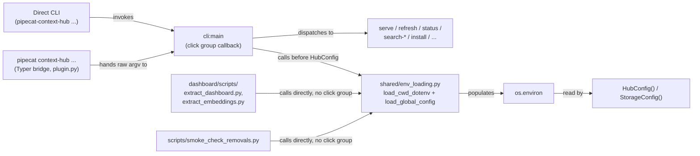
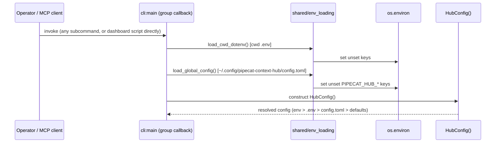

# Task: Global config.toml fallback + refresh prune safety for machine-scoped hub installs

**Status**: Completed
**Component**: cli
**Assigned to**: Claude
**Priority**: Medium
**Branch**: feature/global-config-toml
**Created**: 2026-08-07
**Completed**: 2026-08-09
**Review Gates**: none

## Objective

Two fixes from the same discussion, landing together because they compose:

1. Let a globally-installed context-hub (invoked with no meaningful project
   `cwd` — e.g. as an MCP server from Claude Code) source `PIPECAT_HUB_*`
   settings from `~/.config/pipecat-context-hub/config.toml`, so the operator
   stops exporting them from `~/.zshrc`, without changing the existing
   project-local `.env` behavior or its precedence.
2. Stop `refresh` from silently deleting indexed data for any repo not named
   in *that invocation's* `effective_repos` — today this fires even when the
   repo is still configured, just not visible from the current directory/env
   layering (e.g. a project checkout with its own narrower `.env`). Without
   this fix, #1 alone does not close the bug it's meant to fix: a project
   `.env` still wins over `config.toml` per-key (whole-string override, not a
   list merge), so running `refresh` from inside such a project reproduces
   the exact deletion markbackman reported, on top of `config.toml`.

## Context

Repo config (`PIPECAT_HUB_EXTRA_REPOS`, etc.) is read from `os.environ`,
populated either by the real shell environment or by `_load_dotenv()`
(`src/pipecat_context_hub/cli.py:92-128`), which loads `.env` from
`Path.cwd()`. That works for a project-local checkout, but the on-disk index
and repo clones are machine-global (`~/.pipecat-context-hub` by default —
`shared/config.py:58-67`), and a globally-installed MCP server may have no
project `cwd` to hold a `.env` at all. **Assumption, not yet verified**:
whether Claude Code spawns this server with a fixed/no project `cwd`, or
inherits a project directory — see Phase 0 below, which adds an explicit
verification step before the rest of the plan leans on this claim. The
operator (vr000m) has been working around the gap by `export`ing
`PIPECAT_HUB_*` vars from `~/.zshrc` (currently: `PIPECAT_HUB_STALE_AFTER_DAYS`,
a ~70-repo `PIPECAT_HUB_EXTRA_REPOS` list), which is unversioned, invisible
to `refresh`/`serve` provenance, and awkward to maintain.

This mirrors the design agreed in the discussion at
`pipecat-ai/pipecat#5122` (comment 5209812757, markbackman/vr000m): the
index is machine-global, so config that governs it should have a
machine-global home too, layered under real env vars and cwd `.env` so
nothing about the existing precedence changes for project-local use. The
config file itself lives in `~/.config/pipecat-context-hub/` rather than
alongside the index (`~/.pipecat-context-hub/`) — see Architecture
Decisions for why the two must not share a directory.

**The deletion bug (markbackman, same thread):** `refresh` already runs a
cleanup pass —

```
configured = set(config.sources.effective_repos)
...
if slug not in configured:
    ...
    await index_store.delete_by_repo(slug)
```

(`cli.py:623-637`, present today, unconditional). His repro: `cd customer-a
&& refresh` indexes it; `cd anywhere-else && refresh` deletes it, because
that directory's env doesn't name it. He proposed two fixes that "compose":
(1) a quick safety fix — warn instead of silently deleting, gated behind an
explicit `--prune` flag/`PIPECAT_HUB_PRUNE` env var to actually delete — and
(3) the global config file this plan already builds. Both land here.

## Requirements

- Project-local `.env` (loaded from `Path.cwd()`) is unchanged — same file,
  same loader, same "first-writer-wins" semantics.
- A new `~/.config/pipecat-context-hub/config.toml`, read only if present,
  adds a third precedence layer *below* real env vars and cwd `.env`,
  *above* `HubConfig` field defaults.
- `config.toml` uses the exact same `PIPECAT_HUB_*` names as flat string
  keys — no separate schema to keep in sync by hand. Only keys under the
  `PIPECAT_HUB_` prefix are honored; any other key is skipped with a
  `logger.warning` naming it (matches the Objective's stated scope, keeps a
  machine-global file from becoming a general environment injector). One
  exception to "flat string keys": a homogeneous TOML array of scalars is
  accepted and coerced to a comma-separated string via
  `",".join(str(v) for v in value)` **only when no stringified element
  contains a comma**. An array containing a comma is skipped with a warning,
  because the existing CSV parsing at `shared/config.py:468` has no escaping
  or quoting syntax and would split that element into multiple values. The
  comma-free subset is therefore losslessly equivalent to the existing CSV
  parser, and lets `PIPECAT_HUB_EXTRA_REPOS` (the flagship ~70-repo use case)
  be authored as a native TOML array instead of one long quoted string.
- **`PIPECAT_HUB_PRUNE` is invocation-scoped, not machine config, and is
  explicitly excluded from `config.toml`** (decided in review — a global
  file silently re-enabling `refresh`'s deletion behavior defeats Phase 4's
  purpose): `load_global_config()` skips it with a `logger.warning` naming
  it as invocation-scoped, using the same skip pattern as a
  non-`PIPECAT_HUB_`-prefixed key. It is excluded from `config.toml.example`
  and the README parity table — the 11-var registry is unchanged by this
  plan. An operator who wants pruning on by default should export a real
  `PIPECAT_HUB_PRUNE` env var instead — **this works as of Phase 4**, which
  is what implements the variable's consumer (`_prune_enabled()`); it is
  not already true today, and Phase 1's loader intentionally ships its
  skip-list for this key before Phase 4 lands, so the two land coherently
  regardless of commit order.
- The `config.toml` *lookup path* (`~/.config/pipecat-context-hub/`) is
  fixed and does not follow `PIPECAT_HUB_DATA_DIR` — it lives outside
  `StorageConfig.data_dir` entirely, so this is not a chicken-and-egg case:
  a **non-colliding** `PIPECAT_HUB_DATA_DIR` set inside `config.toml` still
  relocates the storage/index directory for every other purpose once loaded
  into `os.environ`; a colliding value is rejected by the guard below.
  **One exception, test-only**: `load_global_config()` also
  honors `PIPECAT_HUB_CONFIG_FILE`, if set, as the exact file path to read
  instead of the fixed lookup path — this is a test-hermeticity seam
  (decided in review, grilled with the user), not a documented operator
  feature, and is deliberately excluded from `docs/README.md` and
  `config.toml.example` so it isn't mistaken for a supported way to relocate
  the config file.
- The default directory separation is not sufficient by itself because
  `PIPECAT_HUB_DATA_DIR` can point storage back into the config location. The
  loader must normalize a `config.toml`-supplied data directory and skip it
  with a warning when that directory contains the active config file. The
  reset path must also use the same active-config-path resolver and refuse to
  `shutil.rmtree` any data directory that contains that file, regardless of
  whether the colliding value came from the global file, cwd `.env`, or a real
  environment variable. Both guards are covered by reset-index tests.
- A `config.toml.example` ships alongside `.env.example`. Its key set is
  kept from silently drifting apart from `docs/README.md`'s Environment
  Variables table (the full 11-var registry) by a parity test — see
  Architecture Decisions for why the README table, not `.env.example`, is
  the parity partner.
- Every consumer that constructs `StorageConfig`/`HubConfig` independently
  of `cli.main()` — the two dashboard scripts and `scripts/smoke_check_removals.py`
  (found in review — the original draft named only the dashboard scripts and
  missed this third consumer) — also loads `config.toml`, via a shared
  loader module rather than duplicated logic.
- No new runtime dependency — `tomllib` is stdlib as of the project's
  `>=3.11` floor (`pyproject.toml:18`) and is already used elsewhere in this
  codebase (`services/ingest/github_ingest.py:664,668`).
- `docs/README.md` and `CLAUDE.md` document the three-layer precedence and
  both file locations.
- `refresh`'s repo-cleanup pass (`cli.py:623-637`) no longer deletes index
  records for an unconfigured-this-invocation repo by default — it warns
  instead. Deletion happens only when the operator opts in via `--prune`
  (or `PIPECAT_HUB_PRUNE=1`). Tainted repos (`config.sources.tainted_repos`)
  are unaffected by this change — they are an explicit skip list, not an
  accidental-absence case, and continue to be cleaned up unconditionally as
  today.

## Review Focus

- Precedence must degrade cleanly, **scoped to the config-loading layer
  only**: unset `config.toml` → identical *config resolution* behavior to
  today (verifies the loader is additive, not a behavior change for existing
  `.env`-only or env-var-only users). This does NOT extend to Phase 4's
  `refresh` prune-safety change — that is an intentional, separately
  documented behavior change to `refresh`'s default (warn instead of
  delete) that applies to every user regardless of whether `config.toml`
  exists.
- `config.toml`'s own lookup path must survive `refresh --reset-index`
  (which `shutil.rmtree`s `StorageConfig.data_dir`). The default locations
  are separate, but `PIPECAT_HUB_DATA_DIR` can override that separation, so
  the loader's collision check and the reset path's defense-in-depth refusal
  must both be specified and tested, not just directory separation by
  construction.
- Every `PIPECAT_HUB_*`-var consumer that builds config independently of
  `cli.main()` (dashboard scripts) must see `config.toml` too — not just
  `serve`/`refresh`.
- Parity test must fail (not silently pass) when a key is added to one
  source (`config.toml.example` or the README table) and not the other, and
  must not vacuously pass on a format change that empties one side's
  extracted set.
- Test mechanisms must actually work on the platforms CI runs — in
  particular, `Path.home()` overrides must work on the `windows-latest` CI
  leg, not just POSIX.
- The manual verification step must be capable of observing the feature at
  all — on the operator's actual machine, real env vars (from `~/.zshrc`)
  outrank `config.toml` per this plan's own precedence, so the manual check
  must neutralize those exports rather than compete with them.
- The prune-safety fix must actually close markbackman's repro: a `refresh`
  run from a directory whose local `.env` sets a narrower
  `PIPECAT_HUB_EXTRA_REPOS` than `config.toml`'s must NOT delete the
  config.toml-only repos' index records without `--prune`/`PIPECAT_HUB_PRUNE=1`.
  Cover with a test that reproduces his exact scenario, not just the
  unit-level warn/delete branch.
- Tainted-repo cleanup (`config.sources.tainted_repos`) must remain
  unconditional — it is an explicit exclusion, not an accidental absence,
  and gating it behind `--prune` would be a regression (a tainted repo's
  data would linger until the operator remembers to pass a flag for an
  exclusion they already made explicitly).

## Architecture & Call Flow

This plan touches multiple independently-invoked front doors that must all
route through the same loader for the design to hold: the CLI entry point,
the `pipecat context-hub` Typer bridge, the MCP `serve` process, the
dashboard build scripts, and `scripts/smoke_check_removals.py` (three
separate, non-CLI entry points — the diagram below names all three; a
prior draft named only the two dashboard scripts and was corrected in
review).





| Step | Trigger | Enters context | Cleared/persisted | Turn boundary |
|------|---------|-----------------|--------------------|----------------|
| 1 | Any `cli:main` subcommand invoked (direct CLI, Typer bridge, one-shot query) | CLI args | N/A (single process) | before `_configure_logging` |
| 2 | `shared.env_loading.load_cwd_dotenv()` | cwd `.env` contents | written into `os.environ`, process-lifetime | immediately, synchronous |
| 3 | `shared.env_loading.load_global_config()` | `~/.config/pipecat-context-hub/config.toml` contents | written into `os.environ` (only unset keys), process-lifetime | immediately, synchronous |
| 4 | `HubConfig()` construction | resolved `os.environ` | held for process lifetime | after step 3, before any tool/command runs |
| 5 | `dashboard/scripts/*.py` and `scripts/smoke_check_removals.py` run directly (not through `cli:main`) | same two loader calls, invoked at script top | written into `os.environ`, process-lifetime | before `StorageConfig()`/`HubConfig()` construction in the script |

## Implementation Checklist

### Phase 0: Verify the MCP-cwd assumption

**Impl files:** `src/pipecat_context_hub/cli.py` (the `serve` command, `cli.py:220`) — the instrumentation line ships permanently, decided in review (grilled): it's a cheap, useful ongoing diagnostic that confirms config provenance at a glance, not throwaway debug code.
**Test files:** (none)
**Test command:** (none — manual verification)
**Goal:** Confirm (rather than assume) how Claude Code's MCP client spawns this server, since the Context section's claim about `cwd` was flagged as unverified during review and the operator was unsure.

- Add a one-line `logger.info("serve cwd=%s env_keys=%s", Path.cwd(), sorted(k for k in os.environ if k.startswith("PIPECAT_HUB_")))` (or equivalent) at `serve` startup (`cli.py:220`) — **permanent**, not removed after this phase's investigation concludes. `logger.info`, not `logger.debug`: `_configure_logging` defaults to `INFO` (`cli.py:147`), so a `DEBUG` record would never surface without the operator passing `--log-level DEBUG` to their MCP registration. Log key *names* only, never values, since `PIPECAT_HUB_EXTRA_REPOS` is a ~70-repo list.
- Before inspecting logs, confirm where Claude Code actually exposes an MCP server's stderr (e.g. Claude Code's `/mcp` log viewer or its log cache directory) — the mechanism is unverified going in — and confirm the operator's MCP server registration points at this dev checkout (`uv run` from this repo), not an installed package, so the instrumented code is what's actually observed. **Fallback if stderr inspection dead-ends** (found in review — the primary mechanism was flagged as itself unverified, which would otherwise make this phase's acceptance criterion unsatisfiable): write the same `cwd`/key-names line to a temp file (e.g. `Path.home() / ".cache" / "pipecat-context-hub" / "serve-debug.log"`, gated behind a `PIPECAT_HUB_DEBUG_PROBE=1` env var so it's opt-in and never fires in normal operation) as a secondary observable, and use that if the MCP client's log surface can't be located.
- Record the finding in `## Findings` below the marker once known, including whether the `PIPECAT_HUB_*` key names logged above actually include the operator's `~/.zshrc` exports — this answers whether that workaround reaches the MCP subprocess at all, a claim the Context section currently states without verification.
- Document the actual behavior in Phase 3's README precedence note — specifically, whether a project `.env` can shadow `config.toml` even in a "global" MCP install, and what that means for an operator who expects `config.toml` to always apply.
- As part of this phase's verification pass, re-fetch and paste the relevant excerpt of comment 5209812757 into this plan's `## Findings` section below the marker, so the repro this plan implements (Context section, "The deletion bug") is checked against the source thread, not a paraphrase carried forward from an earlier session.

### Phase 1: Shared env-loading module + precedence wiring

**Impl files:** `src/pipecat_context_hub/shared/env_loading.py` (new), `src/pipecat_context_hub/cli.py`, `.github/workflows/ci.yml`
**Test files:** `tests/unit/test_env_loading.py` (new), `tests/unit/test_cli.py`, `tests/conftest.py` (rewrites the autouse `_isolate_env_vars` fixture — see Hermeticity below)
**Test command:** `uv run pytest tests/ -v`
**Goal:** Real env vars > cwd `.env` > `~/.config/pipecat-context-hub/config.toml` > `HubConfig` defaults, using the same first-writer-wins pattern the existing `_load_dotenv()` already uses — no new precedence concept — and every entry point (CLI, dashboard scripts) reaches the same loader.

- Create `src/pipecat_context_hub/shared/env_loading.py` with two functions:
  - `load_cwd_dotenv()` — moved from `cli.py:92-128` verbatim (same cwd-`.env`
    behavior, same quoting/comment handling, same `not in os.environ` guard).
    Named to avoid colliding with the well-known `python-dotenv` package's
    `load_dotenv()` — found in review: an unqualified `load_dotenv` in a
    shared module could read as "this project depends on python-dotenv",
    which it doesn't, and python-dotenv's `load_dotenv()` has different
    semantics (searches parent directories by default, accepts a path
    argument) that a reader might wrongly assume apply here.
  - `load_global_config()` — new. Exports a module-level
    `DEFAULT_CONFIG_PATH = Path.home() / ".config" / "pipecat-context-hub" /
    "config.toml"` constant and a shared `resolve_global_config_path()` helper
    that resolves the config file path as
    `os.environ.get("PIPECAT_HUB_CONFIG_FILE")` if set, else
    `DEFAULT_CONFIG_PATH` — **it must read `DEFAULT_CONFIG_PATH` via
    module-attribute lookup at call time (i.e. `env_loading.DEFAULT_CONFIG_PATH`
    inside the function body), never a captured default argument or a
    `from env_loading import DEFAULT_CONFIG_PATH` alias evaluated at import
    time**, so a test-time `monkeypatch.setattr(env_loading,
    "DEFAULT_CONFIG_PATH", ...)` is guaranteed to be observed (found in
    review — a captured default or an aliased import would make such a
    monkeypatch silently inert). Every path-resolution consumer — the
    loader's own read, the loader's `PIPECAT_HUB_DATA_DIR` collision guard,
    and `_delete_local_index_storage()`'s reset-path guard (below) — must
    call this helper rather than import or compare the raw
    `DEFAULT_CONFIG_PATH` constant directly, so all three stay
    monkeypatch-observable and in lockstep. This
    override exists purely for **test hermeticity** (decided in review,
    grilled with the user, see Architecture Decisions): it lets tests point
    the loader at a `tmp_path` file directly, so no test needs to
    monkeypatch `pathlib.Path.home` at all, and there is no suite-wide
    blast radius onto unrelated `Path.home()` consumers (the ONNX backend's
    HF model-cache fallback, `cli_install.py`, `shared/paths.py`). This is
    an internal test seam, not a documented operator-facing config
    location — it is deliberately excluded from `docs/README.md` and
    `config.toml.example` to avoid implying it's a supported way to relocate
    the config file. Open the resolved path in binary mode and call
    `tomllib.load` inside a guarded read/parse block. A missing file returns
    silently; `tomllib.TOMLDecodeError`, `UnicodeError` (including
    `UnicodeDecodeError`), and `OSError` (including `IsADirectoryError`,
    permission failures, and other read errors) each produce a
    `logger.warning` naming the file and error, then return without raising —
    malformed or unreadable hand-edited files must never crash an entry point.
    For each top-level `key, value` pair: if
    `key` doesn't start with `PIPECAT_HUB_`, `logger.warning` naming the
    skipped key and continue. Also export a module-level
    `PRUNE_ENV_VAR = "PIPECAT_HUB_PRUNE"` constant from this module — this is
    the single source of truth for the literal string, referenced (not
    re-hardcoded) both by `_INVOCATION_SCOPED_KEYS` below and by Phase 4's
    `--prune`/`_prune_enabled()` wiring in `cli.py` (see Phase 4 and
    Architecture Decisions). If `key` is in `_INVOCATION_SCOPED_KEYS =
    frozenset({PRUNE_ENV_VAR, "PIPECAT_HUB_DEBUG_PROBE",
    "PIPECAT_HUB_CONFIG_FILE", "PIPECAT_HUB_ENABLE_STABILITY_BENCHMARK",
    "PIPECAT_HUB_STABILITY_OUTPUT"})` — a named, extensible module-level
    constant rather than an inline single-key check, so a future
    invocation-scoped var reuses the same seam — `logger.warning` naming it
    as invocation-scoped (not eligible for machine-global config) and
    continue. Five keys live here, each for its own one-clause reason:
    `PIPECAT_HUB_PRUNE` — decided in review (see Requirements) — keeps
    `refresh`'s deletion behavior an explicit per-run choice rather than a
    silent machine default; `PIPECAT_HUB_DEBUG_PROBE` (Phase 0's opt-in
    fallback-probe gate) is skip-listed for the same rationale as PRUNE:
    `config.toml` must never persistently enable a disk-writing debug
    probe; `PIPECAT_HUB_CONFIG_FILE` is skip-listed because it's the
    loader's own lookup-path seam — honoring it from inside the file it's
    used to locate would be circular; `PIPECAT_HUB_ENABLE_STABILITY_BENCHMARK`
    and `PIPECAT_HUB_STABILITY_OUTPUT` (`tests/benchmarks/test_runtime_stability.py:34-35`)
    are pytest-invocation-only dev controls for the opt-in stability
    benchmark suite — meaningless outside a live `pytest` run against this
    repo checkout, and not part of the documented 11-var registry — found
    in review: that suite invokes `cli.main()` via `CliRunner`
    (`test_runtime_stability.py:192,209`), so without this skip-list entry a
    `config.toml` that happened to set either var would silently affect the
    benchmark's behavior the same way an untracked `config.toml` entry could
    silently re-enable `PIPECAT_HUB_PRUNE`; skip-listing them here is
    orthogonal to (and does not replace) the Hermeticity fixture's
    `_FIXTURE_PASSTHROUGH_KEYS` allowlist below, which protects the *real*
    shell-invocation env var a developer sets to run that suite
    (`PIPECAT_HUB_ENABLE_STABILITY_BENCHMARK=1 pytest ...`) from being wiped
    by the fixture's own setup-time delete — this entry only stops
    `config.toml` from being a second, silent way to set them. This also
    makes the Edge Cases Tested claim that `PIPECAT_HUB_CONFIG_FILE` set in
    `config.toml` "has no meaning" actually true by construction rather than
    true only by absence of a consumer. If `value` is a homogeneous array of
    scalars (`str`/`int`/`float`/`bool`), first stringify its elements and skip
    the key with a warning if any element contains a comma; otherwise coerce
    via `",".join(...)` — this makes `PIPECAT_HUB_EXTRA_REPOS` authorable as
    a native TOML array without claiming unsupported CSV escaping. An empty
    array (`[]`) coerces to the empty string `""`, matching the behavior of an
    explicitly-empty CSV env var. If `value` isn't a plain
    `str`/`int`/`float`/`bool` or a homogeneous, comma-free scalar array (i.e.
    is a table, a mixed-type array, a nested array, or an array containing a
    comma), `logger.warning` naming the offending key and continue. Coerce the
    accepted scalar to `str()` (booleans thus become the Python-style
    `"True"`/`"False"` strings — `_WARMUP_DISABLED_VALUES` (`cli.py:50`) is
    a **value-exact** frozenset that already includes the `"False"`
    spelling, and `shared/config.py`'s reranker check separately
    `.strip().lower()`s before comparing, so both consumers correctly treat
    the coerced string as disabled; neither is "case-insensitive" as such —
    see the test added below). For `PIPECAT_HUB_DATA_DIR`, before writing the
    accepted string, expand and normalize it with
    `Path(value).expanduser().resolve(strict=False)` and skip it with a
    warning if `resolve_global_config_path().resolve(strict=False)` is inside
    that candidate directory **and refers to an existing file** — a
    nonexistent resolved config path never triggers this skip, matching the
    loader's own missing-file-silent contract above (a config file that
    isn't there can't be "collided with"); this prevents the global file
    from configuring its own future `refresh --reset-index` deletion target
    only when there's an actual file in effect to protect. If `key not in
    os.environ: os.environ[key] = str(value)`.
- Update `cli.py` to import both functions from `shared/env_loading` (delete
  the old `_load_dotenv` body, keep a thin re-export or update call sites
  directly — whichever keeps `cli.py`'s existing tests passing with minimal
  churn). Call `load_cwd_dotenv()` then `load_global_config()` in `main()`
  *after* `_configure_logging(log_level)` and *before* `HubConfig()`
  construction (`cli.py:161`) — ordering after logging setup means
  malformed-file warnings are emitted through configured logging, not
  Python's last-resort handler. **This deliberately inverts today's call
  order** (`cli.py:158-159` currently runs `_load_dotenv()` *before*
  `_configure_logging`) — the inversion is intentional, not drift: no
  `.env`-settable key feeds `_configure_logging` today (it reads only the
  `--log-level` CLI option), so nothing is lost by moving both loader calls
  later.
- Harden `_delete_local_index_storage()` (`cli.py:140-142`) using
  `resolve_global_config_path()` and normalized paths to detect when the
  active config file is inside the requested `data_dir` **and refers to an
  existing file** — the same existence contract as the loader's
  `PIPECAT_HUB_DATA_DIR` skip above, so a stale/deleted or never-created
  `PIPECAT_HUB_CONFIG_FILE`/`DEFAULT_CONFIG_PATH` never blocks a real
  `--reset-index` to protect a config that isn't even in effect; abort the
  reset with a clear `click.ClickException` (or equivalent non-zero CLI error)
  before calling `shutil.rmtree` only when the resolved path exists. This is
  defense in depth for a colliding value supplied by a real environment
  variable or cwd `.env`; the
  `load_global_config()` warning and skip above handles the narrower case of
  a colliding value originating in `config.toml` itself. **This hardening
  lands here, in Phase 1, not Phase 4** (moved in review — a phase-by-phase
  conductor would otherwise commit Phase 1 with a red test, since the
  collision-abort test below already exercises this guard, and Phase 4's own
  test command never touches it): it only depends on
  `resolve_global_config_path()`, which this phase already defines, and has
  no dependency on anything Phase 4 (`--prune`) introduces.
- Tests (`tests/unit/test_env_loading.py`): file present/absent, file
  present but empty, real env var wins over `config.toml`, cwd `.env` wins
  over `config.toml`, `config.toml` fills an unset var, malformed TOML syntax,
  invalid UTF-8 (written via `write_bytes()` — `Path.write_text()` cannot
  produce invalid UTF-8, since it always encodes through Python's own valid
  str/bytes boundary — with a genuinely invalid byte sequence, e.g. a lone
  `0x80` byte, placed where `tomllib` will actually attempt to decode it,
  e.g. inside a key or value token rather than trailing after content
  `tomllib` could plausibly stop parsing before reaching), and read
  failures such as a directory supplied as the file
  path each log a warning and do not raise, a non-`PIPECAT_HUB_` key is
  skipped with a warning and doesn't leak into `os.environ`, a key with a
  non-scalar value (table, mixed-type array, or nested array) is skipped with
  a warning and doesn't crash, a homogeneous scalar array (e.g.
  `PIPECAT_HUB_EXTRA_REPOS = ["a", "b", "c"]`) is coerced to `"a,b,c"` in
  `os.environ`, an empty array (`PIPECAT_HUB_EXTRA_REPOS = []`) is coerced
  to `""`, a homogeneous non-string scalar array (e.g. `[1, 2]`) is coerced
  to `"1,2"`, and an array containing a literal comma (e.g.
  `["org/repo,a"]`) is skipped with a warning rather than split
  lossily. `PIPECAT_HUB_PRUNE` set in `config.toml` is skipped with an
  invocation-scoped warning and never reaches `os.environ` (so `refresh`'s
  prune behavior is unaffected by the global file), same for
  `PIPECAT_HUB_DEBUG_PROBE` set in `config.toml` (skipped with an
  invocation-scoped warning, never reaches `os.environ`) and for
  `PIPECAT_HUB_CONFIG_FILE` set in `config.toml` (skipped with an
  invocation-scoped warning, never reaches `os.environ`, and so cannot
  redirect the loader's own lookup path from inside the file it locates), a
  config-supplied `PIPECAT_HUB_DATA_DIR` that contains the active config file
  is skipped with a collision warning, and a behavioral round-trip
  test that a TOML-native `false`/`true` value produces the intended effect
  through the real consumers (`_warmup_enabled()` is `False` when
  `config.toml` sets `PIPECAT_HUB_WARMUP = false`;
  `HubConfig().reranker.effective_enabled` is `False` when
  `config.toml` sets `PIPECAT_HUB_RERANKER_ENABLED = false`) — not just the
  raw string in `os.environ` — `config.toml` sets
  `PIPECAT_HUB_DATA_DIR=<tmp>` and
  `HubConfig().storage.data_dir == <tmp>` after `load_global_config()`, a
  caplog test that `load_global_config()` emits exactly one INFO record
  matching `"Loaded N key(s)"` **when `n > 0` keys were actually written to
  `os.environ`** and no record when `n == 0` — including the case where the
  file has entries but every one is skip-listed (non-`PIPECAT_HUB_`-prefixed,
  invocation-scoped, or non-scalar): that case must emit only warnings, no
  `"Loaded"` line, since the emission condition is "keys written", not "file
  has entries" (this line is the manual-verification step's sole observable
  — see Testing Notes), and reset-index survival: the first case sets
  `PIPECAT_HUB_CONFIG_FILE` to a `tmp_path` config file, runs the full
  `refresh --reset-index` command through `CliRunner`, and **does not** mock
  `_delete_local_index_storage` — mocking it would make "config file still
  exists" vacuously true, since nothing would actually be deleted; the
  existing `test_reset_index_forces_full_rebuild` in `tests/unit/test_cli.py`
  does mock it, and that pattern must not be copied here. This override case
  sets `PIPECAT_HUB_DATA_DIR` to a `tmp_path` directory containing a real
  file, then asserts both that the config file still exists and still loads
  afterward and that the data directory was actually removed, proving the
  real `shutil.rmtree` path ran. Also test the collision defense through the
  real reset path: a higher-precedence `PIPECAT_HUB_DATA_DIR` pointing at or
  above the active config path must make reset abort clearly before deletion,
  with the config file still present.
  A second reset case must explicitly `monkeypatch.delenv("PIPECAT_HUB_CONFIG_FILE",
  raising=False)` to clear the rewritten autouse fixture's nonexistent-sentinel
  default (below) — not merely "leave it absent", since the fixture sets that
  sentinel for every test regardless of what the test itself does, and this
  test needs the real `DEFAULT_CONFIG_PATH` branch to actually run, not the
  sentinel path — and use the `DEFAULT_CONFIG_PATH` branch. To keep it
  hermetic, monkeypatch only `env_loading.DEFAULT_CONFIG_PATH` to a `tmp_path`
  config file (not `Path.home`), put a separate real data directory/file in
  that config, and **before invoking the CLI, assert as a precondition**
  that `env_loading.resolve_global_config_path() == <the monkeypatched
  tmp_path config file>` — this fails the test loudly, before any
  `shutil.rmtree` can run, if either the `delenv` was missed (sentinel still
  active) or the `DEFAULT_CONFIG_PATH` monkeypatch is silently inert (e.g.
  because the contract above — module-attribute lookup at call time — was
  violated by the implementation); without this precondition, either miss
  would let this test's `refresh --reset-index` invocation target the
  developer's real default `~/.pipecat-context-hub` index instead of the
  `tmp_path` fixture. Only after that precondition passes, run the same full
  `CliRunner` command, and assert that the config survives while the data
  directory is removed. This exercises the no-override lookup path; in a
  separate path-invariant test, before any constant monkeypatching, assert
  that the real `DEFAULT_CONFIG_PATH` is not relative to
  `StorageConfig().data_dir`, rather than duplicating the path literal.
- **Hermeticity — one rewritten autouse fixture does a full env-var +
  config-path reset; still no suite-wide `Path.home` monkeypatch** (decided
  in review, grilled with the user — "single autouse fixture, full reset";
  the exact setup/teardown mechanism below composes fixes from three
  independent review lenses, all three of which flagged the round-4 wording
  as not actually closing the leak it claimed to close — see Housekeeping
  sweep and Findings for the round-5 note): the existing `tests/conftest.py`
  `_isolate_env_vars` autouse fixture is **rewritten**, not reused as-is.
  Its current, real behavior (`tests/conftest.py:31-34`) is: on teardown,
  delete every key *added* to `os.environ` during the test, **regardless of
  prefix** — it is not `PIPECAT_HUB_*`-scoped today, and `tests/unit/test_cli.py`'s
  `TestLoadDotenv` (which writes plain, unprefixed keys like `FOO`/`KEY`
  directly, e.g. around lines 35, 42, 49, 56, 63, 71, 78, 85) depends on that
  broader any-prefix cleanup — the rewrite must not narrow teardown to
  `PIPECAT_HUB_*`-only, or `TestLoadDotenv` regresses. Separately, and this
  is the actual bug: it does **not** reset `os.environ` at *setup*, so a
  real, pre-existing shell export from the operator's `~/.zshrc`
  (`PIPECAT_HUB_EXTRA_REPOS`, `PIPECAT_HUB_STALE_AFTER_DAYS`) stays visible
  in `os.environ` for the *entire duration* of every test that runs on the
  operator's own machine — not just leaking *across* tests, but present
  *during* each one, which is the leak the plan's own Context section
  describes (the `~/.zshrc` exports) and which a teardown-only
  snapshot/restore does not touch at all. The rewritten fixture instead
  does, for every test:
  - **Setup** (before the test body runs): snapshot the **full**
    `PIPECAT_HUB_*` env-var set present at that point — every key matching
    that prefix, not just ones the test itself will set. Then **delete**
    every `PIPECAT_HUB_*` key from `os.environ` **except** keys in a new
    named allowlist,
    `_FIXTURE_PASSTHROUGH_KEYS = frozenset({
    "PIPECAT_HUB_ENABLE_STABILITY_BENCHMARK",
    "PIPECAT_HUB_STABILITY_OUTPUT",
    "PIPECAT_HUB_ENABLE_PERF_BENCHMARK",
    "PIPECAT_HUB_PERF_OUTPUT",
    "PIPECAT_HUB_PERF_DATA_DIR",
    "PIPECAT_HUB_ENABLE_QUALITY_BENCHMARK",
    "PIPECAT_HUB_BENCHMARK_OUTPUT",
    "PIPECAT_HUB_PARITY_REFERENCE",
    })` — these are the complete set of opt-in, output, and data/reference
    controls read by the four benchmark modules, independently re-verified
    against each file's actual line numbers, not guessed:
    `PIPECAT_HUB_ENABLE_STABILITY_BENCHMARK`/`PIPECAT_HUB_STABILITY_OUTPUT`
    (`tests/benchmarks/test_runtime_stability.py:34-35`),
    `PIPECAT_HUB_ENABLE_PERF_BENCHMARK`/`PIPECAT_HUB_PERF_OUTPUT`/
    `PIPECAT_HUB_PERF_DATA_DIR` (`tests/benchmarks/test_chromadb_perf.py:52-54`),
    `PIPECAT_HUB_ENABLE_QUALITY_BENCHMARK`/`PIPECAT_HUB_BENCHMARK_OUTPUT`
    (`tests/benchmarks/test_retrieval_quality.py:43-44`), and
    `PIPECAT_HUB_PARITY_REFERENCE` (`tests/benchmarks/test_chromadb_parity.py:55`).
    Allowlist all of them so each opt-in
    suite still works when invoked via its documented env-var incantation,
    rather than being silently broken by the suite-wide delete. Then
    default `PIPECAT_HUB_CONFIG_FILE` to a guaranteed-nonexistent sentinel
    path (e.g. a `tmp_path`-rooted path that is never created, or a fixed
    nonexistent path) unless the test explicitly overrides it, so no test
    ever falls through `load_global_config()`'s lookup-path branch to the
    developer's real `~/.config/pipecat-context-hub/config.toml`.
  - **Teardown** (after the test body runs): sweep every key **added** to
    `os.environ` since the post-setup baseline, **regardless of prefix** —
    this preserves today's existing any-prefix added-key cleanup exactly
    (see `TestLoadDotenv` note above), so no existing test regresses. Then
    restore the setup-time snapshot — this puts back the pre-existing
    `PIPECAT_HUB_*` values (including anything in the passthrough
    allowlist) and clears whatever the test set `PIPECAT_HUB_CONFIG_FILE`
    to, back to the sentinel default.

  This one rewritten fixture: (a) makes real, pre-existing `PIPECAT_HUB_*`
  vars **absent from `os.environ` during every test** (not merely restored
  afterward), except the keys in `_FIXTURE_PASSTHROUGH_KEYS`, which stay
  visible so every opt-in benchmark suite still works via its env-var gate;
  (b) makes
  `PIPECAT_HUB_CONFIG_FILE` point at nothing during every test, so no test
  ever falls through to the developer's real `config.toml`; and (c) still
  does the existing broad any-prefix added-key cleanup at teardown, so no
  existing test (including `TestLoadDotenv`'s unprefixed `FOO`/`KEY` vars)
  regresses. No second, config-file-specific fixture is needed, and no
  suite-wide `Path.home` monkeypatch is needed either: `PIPECAT_HUB_CONFIG_FILE`
  (see `load_global_config()` above) is what lets each test's config-file
  *location* be controlled without touching `Path.home()` at all, which is
  what resolves the genuine conflict between review lenses — one wanted a
  suite-wide `tests/conftest.py` fixture for full CliRunner-suite coverage,
  another wanted it scoped away from `tests/conftest.py` to avoid
  redirecting `Path.home()`-based HF model-cache resolution in
  `tests/integration`/`tests/benchmarks` (the ONNX backend falls back to
  `Path.home()/.cache/huggingface/hub`) — by controlling the config path
  via an env var instead of `Path.home()`, neither concern applies, and the
  rewritten `_isolate_env_vars` fixture stays inside `tests/conftest.py`'s
  existing footprint (no new conftest file). This also resolves the
  earlier concern that `tests/benchmarks/test_runtime_stability.py` needed
  special subprocess-env handling — it doesn't: that suite runs entirely
  in-process via `click.testing.CliRunner` (verified in review; no
  subprocess/`Popen`/`multiprocessing` calls), is opt-in-gated behind
  `PIPECAT_HUB_ENABLE_STABILITY_BENCHMARK`, and imports the POSIX-only
  `resource` module, so it never runs on `windows-latest` regardless. **One
  other benchmark suite is not so unconditionally safe and is worth naming
  here**: `tests/benchmarks/test_chromadb_perf.py`'s subprocess invocation
  of `refresh` builds that subprocess's environment via `{**os.environ,
  ...}` — it is hermetic (i.e. it doesn't fall through to the developer's
  real `~/.config/pipecat-context-hub/config.toml`) only because copying
  `os.environ` wholesale also copies the parent test process's
  fixture-set `PIPECAT_HUB_CONFIG_FILE` sentinel into the child. A future
  refactor of that subprocess's env construction — building it from scratch
  instead of copying `os.environ` — would silently lose that protection and
  must explicitly re-add `PIPECAT_HUB_CONFIG_FILE` to whatever env dict it
  constructs.
- Add a test verifying the rewritten `_isolate_env_vars` fixture's "full
  reset" behavior directly, not just its added-key cleanup, in
  `tests/unit/test_env_loading.py`: set a `PIPECAT_HUB_*` env var before the
  fixture runs (simulating a pre-existing real export), then, using an
  explicit nested pytest run (e.g. `pytest.Pytester`) or a direct
  fixture-scoped invocation — not reliance on suite execution order —
  assert two things inside the test body: (i) that pre-existing,
  non-allowlisted `PIPECAT_HUB_*` var is **absent** from `os.environ` inside
  the test body (not just restored afterward) — this proves the setup-time
  delete actually happened, not only the teardown-time restore; and (ii),
  after the test mutates or deletes it and the fixture tears down, that the
  original pre-existing value is restored — proving the fixture restores
  what was already there, not only removing what a test newly added.
- Add a test, also in `tests/unit/test_env_loading.py`, that pre-sets every
  member of `_FIXTURE_PASSTHROUGH_KEYS` in the real environment before the
  fixture runs and asserts every one is **still present** inside the test
  body (proving the complete benchmark passthrough allowlist works), while a
  non-allowlisted `PIPECAT_HUB_*` var set the same way (e.g.
  `PIPECAT_HUB_STALE_AFTER_DAYS`) is **absent** inside the same test body —
  pinning the full allowlist boundary rather than only the stability suite's
  two variables.
- Emit one `logger.info("Loaded %d key(s) from %s", n, path)` line from
  `load_global_config()` when `n > 0` — this becomes the concrete manual/
  smoke-test observable (see Phase 1 Testing Notes below), replacing the
  vague "visible via status" claim from the original draft.
- Add `tests/unit/test_env_loading.py` to `.github/workflows/ci.yml`'s
  `windows-smoke` job's explicit pytest file list, **in the same commit as
  the new test file** (found in review — this edit was in Files to Modify
  but assigned to no phase, so a phase-by-phase conductor would never
  execute it, and the new loader tests — including the Windows-specific
  behavior Review Focus is concerned with — would never actually run on
  `windows-latest`).
- **Mid-branch commit sequencing note**: between the Phase 1 commit landing
  and the Phase 3 commit landing, `cli.py:main()` honors `config.toml` but
  the dashboard scripts and `scripts/smoke_check_removals.py` do not yet —
  they still construct `StorageConfig()`/`HubConfig()` without calling the
  new shared loader until Phase 3 wires them in. This divergence window is
  intentional (the loader has to exist, Phase 1, before non-CLI entry
  points can call it, Phase 3) and closes at Phase 3; a partial
  cherry-pick of Phase 1 alone onto a branch that also runs dashboard
  scripts is not a complete fix and should not be treated as one.

### Phase 2: `config.toml.example` + parity test

**Impl files:** `config.toml.example` (new, repo root), `tests/unit/test_config.py`, `.github/workflows/ci.yml`
**Test files:** `tests/unit/test_config.py`
**Test command:** `uv run pytest tests/unit/test_config.py -v -k parity`
**Goal:** Adding a `PIPECAT_HUB_*` var to one example/doc source without the other must fail CI, the same way `test_every_click_command_is_bridged` (`tests/unit/test_plugin.py:87-90`) catches an unbridged CLI command — and the check must not be foolable by a format change that empties one side's extracted set.

- Add `config.toml.example` at repo root: one commented block per
  `PIPECAT_HUB_*` var (all 11 — see Technical Specifications; `PRUNE` is
  deliberately excluded, see Requirements and Phase 4), each with a
  one-line description and a commented-out `# KEY = value` example, TOML
  key/value syntax (not `export KEY=value`). Show boolean examples as
  **bare native TOML** (`# PIPECAT_HUB_WARMUP = false`), not quoted
  strings — Phase 1's loader accepts scalar bools natively (only tables,
  mixed-type arrays, and nested arrays are warn-skipped), so there is no
  coercion risk to hedge against, and this is the form Phase 1's own
  behavioral round-trip test exercises. Show `PIPECAT_HUB_EXTRA_REPOS` as a
  native TOML array (`# PIPECAT_HUB_EXTRA_REPOS = ["org/repo-a",
  "org/repo-b"]`) per Phase 1's array-coercion support, rather than one long
  quoted CSV string.
- Parity source is `docs/README.md`'s Environment Variables table
  (`docs/README.md:302-317`), which already lists all 11 vars — not
  `.env.example`, which is intentionally a curated subset of copy/paste
  repo-bundle presets (5 of 11 vars today). This is stated once, here and
  in Architecture Decisions, and nowhere else in the plan — Requirements
  above names this table explicitly rather than `.env.example`.
  `PIPECAT_HUB_PRUNE` (added in Phase 4) is deliberately excluded from both
  `config.toml.example` and this table — it is invocation-scoped, not
  machine config (see Requirements) — so the 11-var registry this test
  enforces is unchanged by this plan.
- Add `test_config_toml_example_matches_readme_env_var_table` to
  `tests/unit/test_config.py`: extract `PIPECAT_HUB_[A-Z_]+` tokens via
  regex from `config.toml.example` (matches whether the line is commented
  or not, tolerant of missing space around `=`) and from the first-column
  cells of `docs/README.md`'s "Environment Variables" section specifically
  (not the whole file) into two sets; assert both sets are non-empty
  (guards against a format change silently zeroing one side and vacuously
  passing set equality); assert the sets are equal, with a message naming
  the symmetric-difference keys on failure; **and explicitly assert
  `_INTERNAL_VARS.isdisjoint(example_keys | readme_keys)`**, where
  `_INTERNAL_VARS = frozenset({"PIPECAT_HUB_PRUNE", "PIPECAT_HUB_DEBUG_PROBE",
  "PIPECAT_HUB_CONFIG_FILE", "PIPECAT_HUB_ENABLE_STABILITY_BENCHMARK",
  "PIPECAT_HUB_STABILITY_OUTPUT"})` is a small named constant mirroring Phase 1's
  `_INVOCATION_SCOPED_KEYS` (kept as a separate constant in the test module
  rather than importing Phase 1's, so the test doesn't depend on the
  loader's internals to know what it's asserting) — the two constants are
  intentionally independent copies, so also assert
  `_INTERNAL_VARS == env_loading._INVOCATION_SCOPED_KEYS` as a drift-alarm:
  since this test's copy isn't imported from the loader, a future edit that
  adds a key to one side (e.g. a new invocation-scoped var added to the
  loader) without updating the other would otherwise drift silently; this
  equality assertion fails loudly instead — found in review:
  without this assertion, any of these invocation-scoped/internal keys
  accidentally added to *both* sides (e.g. by a future edit that forgets
  the exclusion decision) would still pass the equality check cleanly,
  silently reversing the invocation-scoped design. The original finding was
  scoped to `PIPECAT_HUB_PRUNE` alone; extended here to cover all five
  keys Phase 1's loader now skip-lists (see Phase 1).
- Before landing the `.github/workflows/ci.yml` edit that adds
  `tests/unit/test_config.py` to the `windows-smoke` job's file list,
  confirm the whole **existing** `test_config.py` suite — not just this
  phase's new parity/dashboard tests — is Windows-clean (no POSIX-only
  filesystem assumptions, e.g. hardcoded `/`-separated paths or
  POSIX-only permission bits) before adding the file wholesale to a
  Windows CI leg.
- Add `tests/unit/test_config.py` to `.github/workflows/ci.yml`'s
  `windows-smoke` job's explicit pytest file list, in the same commit as
  this phase's new test — found in review: the parity/dashboard-coverage
  tests are platform-neutral regex/set logic and should run on Windows for
  the same reason Phase 1's loader tests do. **FYI, not a blocker**: Phase
  3 later adds a behavioral dashboard test to this same `test_config.py`
  file that imports `umap`/`chromadb` at module level (via the dashboard
  scripts under test), which triggers `numba` JIT setup — the slowest
  import in the repo. Once Phase 3 lands, `windows-smoke`'s run of this
  file inherits that startup cost. Both dependencies are already confirmed
  present in the `dev` dependency group, so this is a runtime-cost note for
  the Windows leg, not a missing-dependency risk.

### Phase 3: Dashboard script wiring + Docs

**Impl files:** `dashboard/scripts/extract_dashboard.py`, `dashboard/scripts/extract_embeddings.py`, `scripts/smoke_check_removals.py`, `docs/README.md`, `CLAUDE.md`
**Test files:** `tests/unit/test_config.py` (new dashboard-coverage test)
**Test command:** `uv run pytest tests/unit/test_config.py -v -k "parity or dashboard"`
**Validation cmd:** `uv run python dashboard/scripts/extract_dashboard.py --help`

- `dashboard/scripts/extract_dashboard.py` and `extract_embeddings.py`: call
  `shared.env_loading.load_cwd_dotenv()` and `load_global_config()` at script
  startup, before constructing `StorageConfig()`/`HubConfig()` — same two
  calls, same order, as `cli.py:main()`. This closes the gap where a
  `config.toml`-only `PIPECAT_HUB_DATA_DIR` would otherwise diverge the
  dashboard's data dir from `serve`/`refresh`'s.
- `scripts/smoke_check_removals.py` also constructs `HubConfig()` directly
  (`_registry_path()`, line 92) independently of `cli.main()` — the plan's
  original "today, the dashboard scripts" completeness claim was wrong
  (found in review). Wire it into the same two loader calls at script
  startup, before `HubConfig()` construction.
- **Bootstrap refactor, required before the behavioral test below can call
  anything directly**: each of `extract_dashboard.py`, `extract_embeddings.py`,
  and `scripts/smoke_check_removals.py` gains a small, importable bootstrap
  function — e.g. `_bootstrap() -> StorageConfig` (or `HubConfig`, matching
  whichever the script already constructs) that calls
  `load_cwd_dotenv()`, then `load_global_config()`, then constructs
  `StorageConfig()`/`HubConfig()` — instead of doing that construction
  inline at module scope or inside `main()`. Each script's `main()` (for the
  two dashboard scripts) or `_registry_path()` (for the smoke script, which
  is where `HubConfig()` construction currently lives — line 92) calls this
  bootstrap function first, rather than constructing config inline. This is
  what makes the behavioral test below able to invoke a single function per
  script instead of driving each script's full CLI surface.
- Add `test_config.py` coverage for the dashboard-coverage acceptance
  criterion, which previously had none beyond "verified by construction":
  a source-level parity test asserting `extract_dashboard.py`,
  `extract_embeddings.py`, and `smoke_check_removals.py` each call
  `load_cwd_dotenv()` and `load_global_config()` before constructing
  `StorageConfig()`/`HubConfig()` — same pattern as
  `test_every_click_command_is_bridged` (`tests/unit/test_plugin.py:87-90`)
  — **plus one behavioral case per entry point, all three** (found in review:
  a source-level scan only proves call *order*, not that the loaded config
  is actually used; an earlier draft of this behavioral case only
  exercised `extract_dashboard.py`, leaving `extract_embeddings.py` and
  `scripts/smoke_check_removals.py` covered only by the weaker
  source-level scan): with `PIPECAT_HUB_CONFIG_FILE` pointed at a
  `tmp_path` `config.toml` setting `PIPECAT_HUB_DATA_DIR`, the test imports
  each of `dashboard/scripts/extract_dashboard.py`,
  `dashboard/scripts/extract_embeddings.py`, and
  `scripts/smoke_check_removals.py` via `importlib` file-path loading (none
  of `dashboard/scripts`/`scripts` are packages, so a normal `import`
  statement can't reach them) and calls each script's new `_bootstrap()`
  function directly — not the vaguer "import and call ... or run it via
  subprocess/CliRunner-equivalent if it has no importable entry point"
  phrasing from an earlier draft, which is now moot since the bootstrap
  refactor above guarantees an importable entry point on all three — and
  asserts the resolved `StorageConfig.data_dir` matches for all three —
  this is the test the "verified by a concrete test... not construction
  alone" acceptance criterion actually requires, applied uniformly rather
  than to just the first entry point named.
- `docs/README.md`: extend the "Environment Variables" section
  (`docs/README.md:302-320`) with a short subsection describing the
  three-layer precedence (real env > cwd `.env` > `~/.config/pipecat-context-hub/config.toml`
  > defaults), link `config.toml.example` next to the existing
  `.env.example` link (`docs/README.md:319-320`), document the actual
  MCP-client `cwd` behavior found in Phase 0 (including the precedence
  consequence if a project `.env` can shadow `config.toml`), and name the
  Windows lookup path as `%USERPROFILE%\.config\pipecat-context-hub\config.toml`
  (typically `C:\Users\<name>\...`, but not guaranteed — corrected in review:
  `Path.home()` on Windows resolves from the `USERPROFILE` env var, falling
  back to `HOMEDRIVE`+`HOMEPATH`, and roaming/domain profiles can relocate
  it, so state the resolution rule rather than only its common-case
  expansion) — `Path.home() / ".config"` resolves the same way
  cross-platform via `pathlib`, even though the project's existing Windows
  convention for the index/repo cache is `%LOCALAPPDATA%`; this is a
  deliberate, stated divergence for `config.toml` specifically, not an
  oversight. If Phase 0's MCP-cwd investigation turns out inconclusive —
  neither the primary stderr-inspection mechanism nor the
  `PIPECAT_HUB_DEBUG_PROBE` fallback determines the actual behavior — this
  README precedence note should state the rule generically instead of
  asserting Claude Code's specific `cwd` behavior as verified fact, e.g. "a
  project `.env` in the server's cwd, if any, shadows `config.toml`,"
  rather than a claim this plan cannot back with an observed result.
- `CLAUDE.md`: add a short note under an appropriate existing section
  pointing at the same precedence rule and file locations, so agents
  reading project instructions don't miss the global-config path.

### Phase 4: Refresh prune safety

**Impl files:** `src/pipecat_context_hub/cli.py`, `src/pipecat_context_hub/shared/env_loading.py` (import `PRUNE_ENV_VAR` only — no behavioral change to this module in this phase, and no dependency on `resolve_global_config_path()`, which Phase 1 already wired into `_delete_local_index_storage()`'s reset-path guard), `docs/README.md`, `CLAUDE.md`
**Test files:** `tests/unit/test_cli.py`
**Test command:** `uv run pytest tests/unit/test_cli.py -v -k "Prune or Refresh"`
**Goal:** `refresh` must never delete previously-indexed data for a repo that's still configured somewhere, just not visible from the current invocation's env layering — deletion becomes an explicit, opt-in action, not an automatic side effect of running `refresh` from the "wrong" directory.

- **Note**: `_delete_local_index_storage()`'s collision guard (detecting when
  the active config file is inside the requested `data_dir` and aborting
  before `shutil.rmtree`) already exists as of Phase 1 — this phase does not
  need to touch it; `--prune` and the reset-path hardening are independent
  concerns that happen to share a command surface.
- Add `--prune` (`is_flag=True`) to the `refresh` command (`cli.py:456-472`,
  alongside `--force`/`--reset-index`/`--framework-version`), deliberately
  **without** Click's `envvar=` option. The env-var equivalent is read
  explicitly by `_prune_enabled()` using `env_loading.PRUNE_ENV_VAR` (imported
  from `shared/env_loading.py`, not the literal string
  `"PIPECAT_HUB_PRUNE"` re-hardcoded here — Phase 1 already defines this
  constant as the single source of truth; see Architecture Decisions).
  Delegating the env var to Click for an `is_flag=True` option would invoke
  Click's own boolean parser first (`"tRuE"`/`"on"` can become `True`, while
  values such as `"maybe"`/`"2"` raise a usage error), so the helper would
  never get to apply this plan's safe-default handling. **Polarity is inverted from
  `_warmup_enabled()`, so "same 1/0-style parsing" needs its own explicit
  spec, not a direct copy**: `_warmup_enabled()` defaults `True` (disabled
  only on a known falsy value in `_WARMUP_DISABLED_VALUES`), whereas
  `PIPECAT_HUB_PRUNE` must default `False` (deletion is opt-in) — so an
  *unrecognized* value must resolve to the safe default (`False`, no
  deletion), not the enabling one. Define `_PRUNE_ENABLED_VALUES =
  frozenset({"1", "true", "True", "TRUE", "yes", "Yes", "YES"})`; a
  `_prune_enabled()` helper reads via
  `os.environ.get(env_loading.PRUNE_ENV_VAR, "")` (the same imported
  constant, not a second hardcoded `"PIPECAT_HUB_PRUNE"` literal), `.strip()`s the value first (matching
  `_warmup_enabled()`'s `cli.py:61` behavior, so `"PIPECAT_HUB_PRUNE=\"1 \""`
  with trailing whitespace still resolves `True` — found in review, the
  original spec omitted this) and returns `True` only if the stripped value
  is in that set (case- and value-exact, mirroring `_WARMUP_DISABLED_VALUES`'s
  style), else `False` — this covers `"0"`, empty string, and any garbage
  value (`"maybe"`, `"2"`, typos, and any case variant not in the frozenset
  like `"tRuE"`) uniformly as `False`. Precedence: `--prune` stays a plain `is_flag=True` boolean, deliberately
  not distinguishing "explicitly false" from "absent" — matching the
  existing `--force`/`--reset-index` options, which use the same plain
  `is_flag=True` pattern — even though Click's `get_parameter_source()`
  API (Click >=8.0) could support that distinction if it were ever wanted;
  this is simplicity over that extra capability, not a Click limitation
  (corrected in review — an earlier draft claimed Click gives no
  "was it passed" signal at all for such flags, which is factually wrong
  for Click >=8.0). The effective rule is simply `prune = prune_flag or
  _prune_enabled()`: either the flag or the env var can enable pruning,
  neither can force it off once the other has enabled it, and the default
  with both absent/false is `False`.
- **Forward/backward-compat note**: an operator running a *pre-Phase-4*
  context-hub binary is unaffected by either knob. `PIPECAT_HUB_PRUNE` is
  introduced by this plan and has zero references in `src/` at HEAD
  (grep-verified in review) — no prior release can plausibly read a
  variable that didn't exist yet, so setting it in the environment before
  upgrading is inert, not a crash. `--prune` passed to an old `refresh`
  command *does* fail — Click raises a `UsageError` ("no such option") and
  exits non-zero (verified live against HEAD in review: `refresh --prune`
  yields `Error: No such option: '--prune'`), a clean CLI error, not a
  Python traceback or silent skip; this holds through the Typer bridge too
  (`plugin.py`'s stub only sets `ignore_unknown_options` on itself — actual
  parsing lands in the real click group, so error parity is preserved).
  This matters only for scripts/CI that pin an older context-hub version
  while also passing `--prune`; document this in
  `docs/README.md`'s `--prune` section as a one-line caveat rather than
  treating it as in-scope compatibility work (there is no cross-version
  invocation shipped by this plan).
- `PIPECAT_HUB_PRUNE` is invocation-scoped only, decided in review (see
  Requirements): it is deliberately excluded from `config.toml.example` and
  the README Environment Variables table Phase 2's parity test enforces —
  the 11-var registry is unchanged by this phase. `load_global_config()`
  (Phase 1) already skip-lists it with a warning if a `config.toml` sets it,
  so a machine-global file can never silently re-enable deletion.
- In the repo-cleanup pass (`cli.py:623-637`): keep the loop that finds
  `slug not in configured`, but split its two branches differently than
  today:
  - `slug in tainted_repos` (explicit exclusion): unchanged — always
    `logger.warning(...)` and delete, regardless of `--prune`.
  - `slug not in tainted_repos` (implicit absence — the actual bug): when
    `--prune`/`PIPECAT_HUB_PRUNE` is **not** set, `logger.warning("Repo %s
    not configured in this run; leaving %d indexed record(s) in place — "
    "pass --prune to remove", slug, <count>)` and **do not delete** — this
    means skipping `index_store.delete_metadata(meta_key)` too (and, for the
    framework repo, `indexed_framework_version`/
    `indexed_framework_commits_ahead`), not just `delete_by_repo`: deleting
    metadata while records survive would orphan the repo from every future
    cleanup pass (the loop keys off `all_meta`), so a later `--prune` could
    never find and remove those records. When `--prune`/`PIPECAT_HUB_PRUNE`
    **is** set, behave as today (log + delete records + delete metadata).
  - `<count>` reuses `pre_counts.get(slug, 0)` — `pre_counts =
    index_store.get_counts_by_repo()` is already computed earlier in
    `_run_refresh` (`cli.py:569`) before the cleanup loop runs, so no new
    `index_store` lookup is needed.
- Surface prune-skipped repos in the `refresh` summary output (the existing
  end-of-run summary block) as a distinct line, e.g. `Skipped pruning: N
  repo(s) not in this run's config (use --prune to remove)` — so an operator
  who *did* mean to remove a repo notices the warning instead of it scrolling
  past in `INFO`-level log noise.
- **This phase's default-behavior change is intentional and not covered by
  the plan's backward-compat claims** (decided in review — see Review
  Focus): `refresh` stopping automatic deletion by default is a deliberate
  change that applies to every existing user, `config.toml` or not. The
  "unset `config.toml` → identical behavior" language elsewhere in this plan
  is scoped to the config-loading layer only and does not extend to this
  phase.
- Tests — happy paths: repo not in `effective_repos`, no `--prune` → record
  survives, metadata survives (both the `repo:<slug>:commit_sha` key and,
  for the framework repo, the framework-version keys), warning logged,
  summary line present; same setup with `--prune` → record deleted (today's
  behavior, preserved as opt-in); `PIPECAT_HUB_PRUNE` set to **exactly** one
  of the seven `_PRUNE_ENABLED_VALUES` members (`"1"`, `"true"`, `"True"`,
  `"TRUE"`, `"yes"`, `"Yes"`, `"YES"`) alone (no flag) → same as `--prune`
  in each case — **not** "and case variants" (corrected in review: an
  arbitrary case variant like `"tRuE"` is NOT a frozenset member and belongs
  in the unhappy-path list below, since the frozenset is value-exact);
  tainted repo, no `--prune` → still deleted (unconditional, unchanged); a
  two-run sequence — a no-prune `refresh` spares repo B's records+metadata,
  then a later `refresh --prune` successfully deletes them (proves metadata
  survival doesn't orphan the repo from a later prune); `--prune` passed
  when there is nothing to prune (no unconfigured repos this run) → clean
  no-op, no warning, no summary line; `--prune` passed together with
  `PIPECAT_HUB_PRUNE=0` set → deletion proceeds (flag wins per `prune_flag
  or _prune_enabled()`, pinning the precedence found under-tested in
  review); and the markbackman repro itself — `config.toml` configures
  repo A+B, a project-local `.env` configures only repo A, `refresh` runs
  from that project directory without `--prune` → repo B's records survive.
- Tests — unhappy / edge paths: `PIPECAT_HUB_PRUNE=0` (falsy) → records
  survive; `PIPECAT_HUB_PRUNE` set to an unrecognized/garbage value
  (`"maybe"`, `"2"`, `""`, and a non-frozenset case variant like `"tRuE"`)
  → the full `CliRunner` invocation still parses successfully and
  `_prune_enabled()` resolves to `False` (safe default), records survive —
  this is the case the no-Click-`envvar` design and inverted-polarity fix
  above exist to get right, since Click's boolean parser must not reject
  garbage before the helper can default safely, and a naive copy of
  `_warmup_enabled()`'s truthy-by-default logic would silently enable
  deletion on a typo; `PIPECAT_HUB_PRUNE=" 1 "` (whitespace-padded, a
  frozenset member after stripping) → resolves `True`, pinning the
  `.strip()` behavior; a `config.toml` setting
  `PIPECAT_HUB_PRUNE` is skip-listed by the Phase 1 loader (warning logged,
  key absent from `os.environ`) and has no effect on `refresh`'s prune
  behavior either way; `--prune` combined with `--reset-index` in the same
  invocation → both apply independently, no interaction bug (reset-index
  clears the whole local index before the cleanup pass would even find
  anything to prune, so the prune branch is a no-op that still logs cleanly
  rather than erroring on a missing index); and `index_store.delete_by_repo`
  raising during a `--prune` delete → the error propagates and the summary
  reports it (not swallowed silently), consistent with today's unconditional
  delete-path error handling for tainted repos.
- `docs/README.md`: document `--prune`/`PIPECAT_HUB_PRUNE` next to the
  existing `--reset-index` documentation (outside the parity-checked
  Environment Variables table, per the exclusion decision above), and add a
  one-line callout that `refresh` no longer deletes unconfigured-this-run
  repos by default.
- `CLAUDE.md` — document `--prune`/`PIPECAT_HUB_PRUNE` behavior (found in
  review: the Files to Modify entry for `CLAUDE.md` already named this
  "`--prune` behavior note", but no phase's checklist actually assigned the
  work — Phase 3's `CLAUDE.md` bullet covers only the config precedence/file
  locations note, so a phase-by-phase conductor would never execute this
  documentation task). Add a short note alongside the `--reset-index`
  documentation describing the new default (warn, don't delete) and the
  `--prune`/`PIPECAT_HUB_PRUNE` opt-in.

## Technical Specifications

### Files to Modify
- `src/pipecat_context_hub/cli.py` — remove `_load_dotenv()` body (moved), call the new shared loaders in `main()` after `_configure_logging`; add `--prune`/`PIPECAT_HUB_PRUNE`, split the repo-cleanup pass's warn-vs-delete branches including metadata handling (Phase 4).
- `dashboard/scripts/extract_dashboard.py` — call the shared loaders at startup.
- `dashboard/scripts/extract_embeddings.py` — call the shared loaders at startup.
- `scripts/smoke_check_removals.py` — call the shared loaders at startup (constructs `HubConfig()` directly at line 92; found in review — the plan's original "today, the dashboard scripts" completeness claim omitted it).
- `tests/unit/test_cli.py` — update/relocate `TestLoadDotenv` per the module move; new prune-safety tests including metadata-survival and falsy-`PRUNE` cases (Phase 4).
- `tests/conftest.py` — rewrite the existing autouse `_isolate_env_vars` fixture: at setup, snapshot the full `PIPECAT_HUB_*` env-var set and delete it from `os.environ` except for the complete `_FIXTURE_PASSTHROUGH_KEYS` benchmark allowlist (the controls read by all four opt-in benchmark modules), and default `PIPECAT_HUB_CONFIG_FILE` to a nonexistent sentinel path; at teardown, keep the existing any-prefix added-key sweep, then restore the setup-time snapshot. No `Path.home` monkeypatch.
- `tests/unit/test_config.py` — new parity test; new dashboard-script-coverage test.
- `.github/workflows/ci.yml` — add `tests/unit/test_env_loading.py` AND `tests/unit/test_config.py` to the `windows-smoke` job's explicit pytest file list (found in review: the parity/dashboard-coverage tests in `test_config.py` are platform-neutral regex/string logic and should run on Windows too, not just the loader tests).
- `docs/README.md` — Environment Variables section + `.example` link + Phase 0 finding + concrete Windows path + `--prune` documented alongside `--reset-index` (outside the parity-checked table).
- `CLAUDE.md` — config precedence note; `--prune` behavior note.

### New Files to Create
- `src/pipecat_context_hub/shared/env_loading.py` — `load_cwd_dotenv()` (moved from `cli.py`) + `load_global_config()` (new), shared by the CLI entry point and the dashboard scripts.
- `tests/unit/test_env_loading.py` — tests for both loader functions.
- `config.toml.example` (repo root) — TOML mirror of the full `PIPECAT_HUB_*` var registry.

### Architecture Decisions

- **`config.toml` lives at `~/.config/pipecat-context-hub/config.toml`, with the default deliberately outside `StorageConfig.data_dir` (`~/.pipecat-context-hub/`).** Review surfaced that `refresh --reset-index` (`cli.py:140-142`, `_delete_local_index_storage`) `shutil.rmtree`s `data_dir` wholesale — placing config inside that directory would mean the documented index-recovery command destroys the operator's hand-authored config. Default separation avoids the normal case, but it is not a complete invariant because `PIPECAT_HUB_DATA_DIR` can point at or above the config directory. `load_global_config()` therefore warns and skips a global-file collision, and `_delete_local_index_storage()` refuses any active-config collision from any source before deletion. Both use the shared active-path resolver, so there is no `PIPECAT_HUB_DATA_DIR` chicken-and-egg case and no path-source drift.
- **Only `PIPECAT_HUB_`-prefixed keys are honored from `config.toml`; other keys are skipped with a warning.** A machine-global file is a wider trust boundary than a cwd-local `.env`, and the Objective specifically scopes this feature to `PIPECAT_HUB_*` settings — unprefixed pass-through (e.g. silently setting `HF_HOME`) would be an undocumented, untested widening of that surface.
- **Parity source is `docs/README.md`'s Environment Variables table, not `.env.example`.** `.env.example` is intentionally curated (repo-bundle copy/paste presets) and documents only 5 of the 11 known `PIPECAT_HUB_*` vars. The README table already lists all 11 with defaults and descriptions (`docs/README.md:302-317`) and is the closest existing thing to a var registry. This decision is stated once here and mirrored in Requirements — a prior draft of this plan stated the parity partner as `.env.example` in Requirements while defining it as the README table in Phase 2, a contradiction caught in review; Requirements above has been corrected to match.
- **Malformed or unreadable `config.toml` (bad TOML syntax, invalid encoding, filesystem read errors, non-`PIPECAT_HUB_` keys, non-scalar values, and comma-containing arrays) always logs a warning and continues — never raises, never fails silently.** A prior draft of this plan said invalid TOML syntax specifically "returns silently" in the loader spec while its own test list and this Architecture Decision both said "logs and continues" — a contradiction caught in review. The behavior is now singular: the guarded read/parse block catches `tomllib.TOMLDecodeError`, `UnicodeError`, and `OSError` (including `IsADirectoryError`), while per-key validation warns and skips unsupported values. `serve`/`refresh`/dashboard scripts must never crash on a hand-edited global file.
- **The shared loader lives in `shared/env_loading.py`, called identically from `cli.py:main()`, both dashboard scripts, and `scripts/smoke_check_removals.py`.** Prior to review, only `cli.py` called the (then-CLI-local) loader, so a `config.toml`-only `PIPECAT_HUB_DATA_DIR` would silently diverge the dashboard's data directory from `serve`/`refresh`'s. Moving the loader to `shared/` and calling it from every independent entry point removes that divergence rather than documenting it as a known gap. A second review round found `scripts/smoke_check_removals.py` was a fourth entry point the first pass missed — the fix (Phase 3) is the same: wire it into the same shared calls.
- **`refresh`'s repo-cleanup deletion is opt-in (`--prune`/`PIPECAT_HUB_PRUNE`), except for explicitly tainted repos.** This is the other half of the `pipecat-ai/pipecat#5122` discussion (markbackman's option 1), landing alongside the config.toml fix (option 3) because they compose: without prune-safety, `config.toml` alone doesn't close the deletion bug, since a project-local `.env`'s `PIPECAT_HUB_EXTRA_REPOS` still wins over `config.toml`'s per-key (whole-string override, not a merge), so the exact repro he gave (`cd customer-a && refresh` → `cd elsewhere && refresh` deletes it) still fires post-config.toml. Tainted-repo cleanup stays unconditional because it's an explicit exclusion the operator already made, not an accidental absence.
- **`PIPECAT_HUB_PRUNE` is invocation-scoped and cannot be set via `config.toml`, decided in review (grilled with the user).** `config.toml` is a machine-global, persistent file, whereas pruning is meant to be a deliberate, per-run choice — the entire reason Phase 4 exists is to stop deletion from happening silently. If a global `config.toml` could set `PIPECAT_HUB_PRUNE`, an operator setting it once would make deletion the default for every future `refresh`, on any machine sharing that config, indefinitely — reintroducing the exact "silently deletes stuff" failure mode Phase 4 fixes, just with an extra step to turn on. The loader (Phase 1) skip-lists this key with a warning; it is never added to `config.toml.example` or the parity-checked README table (and the parity test explicitly asserts its absence from both, so the exclusion can't silently regress). An operator who wants prune-on-by-default should export a real shell env var instead — this works as of Phase 4, not before. The real distinction from a `config.toml` entry isn't "per-session" (a persistent `~/.zshrc` export is exactly as durable as a `config.toml` line, a residual risk this plan doesn't fully close — see the exported-var caveat below); it's that a shell export sits outside this plan's config surface entirely and is visible via a plain `env` inspection, not silently loaded by a file the operator may not remember exists.
- **The `PIPECAT_HUB_PRUNE` key name is a single shared constant, not two independently-hardcoded strings.** `shared/env_loading.py` exports `PRUNE_ENV_VAR = "PIPECAT_HUB_PRUNE"` alongside `_INVOCATION_SCOPED_KEYS` (which references the same constant rather than a literal), and `cli.py`'s `--prune`/`PIPECAT_HUB_PRUNE` wiring imports and uses it in `_prune_enabled()`; the Click option deliberately has no `envvar=` delegation, so Phase 1's skip-list and Phase 4's consumer can never drift apart on the literal string or bypass the safe parser.
- **`config.toml.example` shows TOML booleans bare (`false`/`true`), not as quoted strings.** An earlier draft showed quoted-string bool examples, citing a "string-coercion contract documented in the Architecture Decisions" — no such contract exists in this section (the scalar-to-`str()` coercion is defined only in Phase 1's loader spec), and the stated rationale (avoiding a warn-skip) doesn't apply to scalar bools, which Phase 1's loader accepts natively. This self-contradiction was caught in review; the example now shows the tested, supported bare form.
- **Test hermeticity uses a `PIPECAT_HUB_CONFIG_FILE` env-var override inside `load_global_config()`, not a suite-wide `pathlib.Path.home` monkeypatch, decided in review (grilled with the user).** A second review round surfaced a genuine cross-lens conflict: pinning the hermeticity fixture to a shared root `tests/conftest.py` covers all seven `CliRunner`-exercising test files but also redirects `Path.home()` for `tests/integration`/`tests/benchmarks`, where the ONNX backend's HF model-cache fallback (`Path.home()/.cache/huggingface/hub`) and other `Path.home()` consumers (`cli_install.py`, `shared/paths.py`) live — silently breaking offline model resolution for those suites. Pinning it to a new `tests/unit/conftest.py` instead avoids that blast radius but leaves `tests/benchmarks/test_runtime_stability.py` uncovered. Giving `load_global_config()` an explicit override removes the tradeoff rather than picking a side: tests set `PIPECAT_HUB_CONFIG_FILE` to a `tmp_path` file directly, no `Path.home()` monkeypatching is needed anywhere, and no suite outside the ones that actually test the loader is touched. The override is a test-only seam — deliberately undocumented in `docs/README.md`/`config.toml.example` so it isn't mistaken for a supported operator-facing config-relocation mechanism (that role belongs to `PIPECAT_HUB_DATA_DIR`, which is unrelated). Worth stating precisely: "test-only" describes the intent, not an enforced boundary — `PIPECAT_HUB_CONFIG_FILE` is technically reachable outside tests too, via a real shell env var or a project cwd `.env`, exactly like any other `PIPECAT_HUB_*` key. This is not a privilege gain: an operator who can set `PIPECAT_HUB_CONFIG_FILE` in their shell or `.env` could already set every other `PIPECAT_HUB_*` key at higher precedence anyway, so the seam doesn't open any surface that wasn't already open. Noted here so a future reviewer doesn't flag it as an undocumented reachable-in-production behavior — it is reachable, just not a documented or supported way to use it.
- **The moved loader function is named `load_cwd_dotenv()`, not `load_dotenv()`.** Found in review: an unqualified `load_dotenv` in a shared, importable module risks being mistaken for the well-known `python-dotenv` package's function of the same name — which this project does not depend on and which has materially different semantics (searches upward from cwd by default, accepts a path argument). The original private name (`_load_dotenv`, module-scoped in `cli.py`) avoided this by being non-public; moving it to a shared module without renaming it would have introduced the collision risk.

### Dependencies
None new — `tomllib` is stdlib at the project's `>=3.11` floor and already
imported in `services/ingest/github_ingest.py:664`.

### Integration Seams

| Seam | Writer (task) | Caller (task) | Contract |
|------|---------------|----------------|----------|
| `os.environ` population order | Phase 1 (`shared/env_loading.py`) | `cli.py:main()` → `HubConfig()` construction; dashboard scripts → `StorageConfig()`/`HubConfig()` construction | Must run after `_configure_logging` (CLI) / at script top (dashboard) and before any `HubConfig`/`StorageConfig` construction, using the `not in os.environ` guard so precedence holds without new logic in `HubConfig`/`shared/config.py` |
| Key-set source of truth | Phase 2 (`config.toml.example`) | Phase 3 (`docs/README.md` table) | Both must list the same 11 `PIPECAT_HUB_*` keys; the Phase 2 parity test is the enforcement mechanism Phase 3's doc edits must not silently break |
| Dashboard entry-point parity | Phase 1 (`shared/env_loading.py`) | Phase 3 (dashboard scripts, `scripts/smoke_check_removals.py`) | All three non-CLI entry points must call the identical two loader functions, in the identical order, as `cli.py:main()` — no divergent bootstrap logic |
| Effective-repos → cleanup pass | Phase 1/3 (`effective_repos` resolution, now also reachable via `config.toml`) | Phase 4 (repo-cleanup pass, `cli.py:623-637`) | Whatever `effective_repos` resolves to for *this* invocation still drives which repos are considered "not configured" — Phase 4 changes what happens on that outcome (warn vs. delete), not how the set is computed |

## Testing Notes

### Test Approach
- [ ] Unit tests for `load_cwd_dotenv()`/`load_global_config()` precedence and error handling (Phase 1)
- [ ] Parity test for `config.toml.example` vs. README var table (Phase 2)
- [ ] Prune-safety tests, including the markbackman repro reproduced end-to-end (Phase 4)
- [ ] Manual: back up any existing `~/.config/pipecat-context-hub/config.toml`,
      write one with `PIPECAT_HUB_EXTRA_REPOS` set, then live-enumerate and
      neutralize whatever `PIPECAT_HUB_*` vars are actually exported in the
      current shell before running `status` — don't hardcode a fixed pair of
      `env -u` flags, since the operator's `~/.zshrc` contents can drift from
      whatever was true when this plan was written:
      `env $(env | grep '^PIPECAT_HUB_' | cut -d= -f1 | sed 's/^/-u /') uv run pipecat-context-hub status`
      (this targets a POSIX-ish shell — zsh/bash on macOS/Linux: the
      unquoted `$(...)` relies on field-splitting the substituted output
      into separate arguments, and `env` accepting repeated `-u` flags is a
      BSD/macOS-and-GNU-`env` behavior, not a POSIX guarantee — not
      verified portable to other shells)
      with `.env` absent from cwd — neutralizing real env vars is required
      because they outrank `config.toml` per this plan's precedence; without
      it the manual check observes nothing. Confirm via the `Loaded N key(s)
      from ...` INFO log line added in Phase 1 (not `status`/
      `check_deprecation`, neither of which surfaces configured-but-unindexed
      repos).

### Test Results
- [ ] All existing tests pass
- [ ] New tests added and passing
- [ ] Manual verification complete

### Edge Cases Tested
- [ ] `config.toml` absent (today's default behavior, unchanged)
- [ ] `config.toml` present but empty
- [ ] `config.toml` present with malformed TOML syntax, invalid UTF-8, or a
      read failure (including a directory path) — logs a warning, doesn't raise
- [ ] `config.toml` sets a non-`PIPECAT_HUB_` key — skipped with a warning, not leaked into `os.environ`
- [ ] `config.toml` sets a key already set by a real env var — real env var wins
- [ ] `config.toml` sets a key already set by cwd `.env` — `.env` wins
- [ ] `config.toml` sets a non-colliding `PIPECAT_HUB_DATA_DIR` — storage dir relocates for `serve`/`refresh`/dashboard scripts alike, independent of `config.toml`'s own lookup path; a value containing that config file is skipped with a warning
- [ ] `refresh --reset-index` run with `config.toml` present — file survives for both the `PIPECAT_HUB_CONFIG_FILE` override case and the no-override `DEFAULT_CONFIG_PATH` case, while the real data directory is removed
- [ ] reset-index refuses a colliding data directory from a higher-precedence env source before deletion
- [ ] default (non-`tmp_path`-overridden) resolved `config.toml` lookup path is not relative to `StorageConfig()`'s default `data_dir` — verified against the real default paths, not just the `tmp_path` path used for the no-override branch
- [ ] TOML-native `true`/`false` values produce the correct *behavioral* outcome, not just the right string in `os.environ`
- [ ] `refresh` without `--prune`, repo unconfigured this run — indexed records survive, warning + summary line emitted
- [ ] `refresh --prune` (or `PIPECAT_HUB_PRUNE=1`), repo unconfigured this run — indexed records deleted (today's behavior, now opt-in)
- [ ] `refresh` without `--prune`, tainted repo — indexed records still deleted (unconditional, unchanged)
- [ ] markbackman's repro end-to-end: `config.toml` configures A+B, a project `.env` configures only A, `refresh` from that project dir without `--prune` — B survives
- [ ] `PIPECAT_HUB_PRUNE` set to an unrecognized value (e.g. `"maybe"`, or a non-frozenset case variant like `"tRuE"`) — resolves to `False` (safe default), no deletion
- [ ] `PIPECAT_HUB_PRUNE` set to a whitespace-padded frozenset member (e.g. `" 1 "`) — resolves `True` after stripping
- [ ] `--prune` flag passed together with `PIPECAT_HUB_PRUNE=0` — flag wins, deletion proceeds
- [ ] `config.toml` sets `PIPECAT_HUB_PRUNE` — skipped by the loader with a warning, has no effect on `refresh`'s prune behavior
- [ ] no-prune `refresh` then later `--prune` `refresh` — metadata survives the first run and is cleanly deleted by the second, no orphaning
- [ ] `config.toml` sets `PIPECAT_HUB_EXTRA_REPOS` as a comma-free native TOML array — coerced to a CSV string, repos load correctly
- [ ] `config.toml` sets `PIPECAT_HUB_EXTRA_REPOS` as an empty TOML array (`[]`) — coerced to `""`
- [ ] `config.toml` sets a non-string homogeneous scalar array (e.g. `[1, 2]`) — coerced to `"1,2"`
- [ ] `config.toml` sets an array element containing a literal comma (e.g. `["org/repo,a"]`) — skipped with a warning rather than silently split
- [ ] `config.toml` sets `PIPECAT_HUB_CONFIG_FILE` itself has no meaning — enforced by `_INVOCATION_SCOPED_KEYS` (skipped with a warning, never reaches `os.environ`), not merely true by absence of a consumer; same for `PIPECAT_HUB_DEBUG_PROBE`, `PIPECAT_HUB_ENABLE_STABILITY_BENCHMARK`, and `PIPECAT_HUB_STABILITY_OUTPUT` set in `config.toml`
- [ ] dashboard-coverage: `extract_dashboard.py`, `extract_embeddings.py`, AND `scripts/smoke_check_removals.py` each run with `PIPECAT_HUB_CONFIG_FILE` pointed at a `tmp_path` `config.toml` setting `PIPECAT_HUB_DATA_DIR` — resolved `StorageConfig.data_dir` matches for all three (behavioral, not just source-scan)

## Acceptance Criteria

- `~/.config/pipecat-context-hub/config.toml`, if present, fills any
  `PIPECAT_HUB_*` var not already set by a real env var or cwd `.env` —
  verified by test.
- `config.toml` is unaffected by `refresh --reset-index` — verified by test.
- A `PIPECAT_HUB_DATA_DIR` from `config.toml` that would contain the active
  config file is rejected with a warning, and the reset path refuses the same
  collision from any higher-precedence source before deletion — verified by
  test.
- Non-`PIPECAT_HUB_` keys in `config.toml` are skipped with a warning, never
  written to `os.environ` — verified by test.
- Absence of `config.toml` is fully backward compatible **at the
  config-loading layer** — no change to how `.env`/real-env-var config is
  resolved for existing users. (Phase 4's `refresh` prune-default change is
  a separate, intentional behavior change that applies regardless of
  `config.toml` — see its own acceptance criterion below, not this one.)
- Dashboard scripts (`extract_dashboard.py`, `extract_embeddings.py`) and
  `scripts/smoke_check_removals.py` see identical resolved config to
  `cli.py:main()` — verified by both a source-level ordering test and a
  behavioral test (Phase 3) that actually constructs config from a
  `config.toml`-supplied value and checks the result, not source-scan
  alone, run against **all three** entry points, not just one.
- `PIPECAT_HUB_PRUNE` is never settable via `config.toml` — the loader
  skip-lists it with a warning, and it is excluded from
  `config.toml.example` and the README parity table, with the exclusion
  itself asserted by the Phase 2 parity test (not just implied by set
  equality) — verified by test.
- No test needs to monkeypatch `pathlib.Path.home` — hermeticity is achieved
  via the `PIPECAT_HUB_CONFIG_FILE` test-only override, so no suite outside
  `tests/unit/` is affected by config-loading test setup and HF model-cache
  resolution in `tests/integration`/`tests/benchmarks` is untouched.
- `config.toml.example` exists and its key set matches `docs/README.md`'s
  Environment Variables table, enforced by a CI test that cannot vacuously
  pass on an empty extracted set.
- `docs/README.md` and `CLAUDE.md` document the three-layer precedence and
  the actual (verified, not assumed) MCP-client `cwd` behavior.
- `refresh` no longer deletes an unconfigured-this-run repo's indexed
  records without an explicit `--prune`/`PIPECAT_HUB_PRUNE` opt-in —
  verified by test, including markbackman's original repro. Tainted-repo
  cleanup remains unconditional.
- Code reviewed and approved
- Tests passing
- Documentation updated

<!-- reviewed: 2026-08-08 @ 1cd412a79ece39500419d4b84b2f2a10662fa611 -->

<!-- /review-plan writes the marker line above. Everything below is the workspace: edits here do NOT invalidate the marker. -->

## Progress

- [x] Phase 0: Verify the MCP-cwd assumption
- [x] Phase 1: Shared env-loading module + precedence wiring
- [x] Phase 2: `config.toml.example` + parity test
- [x] Phase 3: Dashboard script wiring + Docs
- [x] Phase 4: Refresh prune safety

## Findings

- **Review round (2026-08-07)**: `/review-plan` ran 5 lenses (architecture, sequencing, spec-and-testing, assumptions at `fable`; codebase-claims at `haiku`) plus a sequential Contradiction Pass. `codebase-claims` failed to return output after 3 resend attempts and is recorded as errored/excluded from reconciliation — every path/symbol it would have checked was independently spot-verified via the other lenses' evidence citations. Reconciliation: raw=22, merged=2, unique=18, related=2, 4 Contradiction findings. 1 Critical (config.toml location vs. `reset-index`), all addressed in this revision per user decisions: relocate to `~/.config/pipecat-context-hub/` (not carve out of rmtree), restrict `config.toml` to `PIPECAT_HUB_*` keys, wire dashboard scripts into the shared loader, and add Phase 0 to verify the MCP-cwd claim instead of asserting it.
- **Scope expansion (2026-08-07, post-review)**: user asked whether `pipecat-ai/pipecat#5122`'s discussion covered anything about repo deletion. It did — markbackman's thread proposed two fixes that "compose": (1) stop `refresh`'s repo-cleanup pass (`cli.py:623-637`) from silently deleting unconfigured-this-run repos (warn + opt-in `--prune` instead), and (3) the global config file this plan already built. Only #3 was in scope before this note; user confirmed the intent was always both, so Phase 4 (Refresh prune safety) was added. **This above-marker edit invalidates the prior review marker — re-run `/review-plan` before `/conduct`, since Phase 4 has not been through the 5-lens + contradiction-pass review the rest of the plan has.**
- **Review round 2 (2026-08-07, cont'd)**: `/review-plan` re-ran all 5 lenses + Contradiction Pass against the Phase-4-expanded plan (raw=26, unique=26, related=5, 5 Contradiction findings — reconciled findings persisted to `.review-plan/latest-claude.json`). 1 Critical, 12 Important, 9 Minor. All non-contradiction findings fixed directly (array-valued `config.toml` support, `PIPECAT_HUB_PRUNE` inverted-polarity parsing with a safe unrecognized-value default, `scripts/smoke_check_removals.py` added to the dashboard-wiring scope, hermeticity fixture moved to a shared conftest covering all 7 CliRunner-based suites, reset-index-survival/DATA_DIR-relocation/dashboard-coverage/no-prune-metadata/log-line/PRUNE-falsy tests added, `pre_counts` reuse instead of an extra lookup, deliberate call-order-inversion note, Windows path documented, live env-var enumeration in the manual check). 3 contradictions resolved via inline `/grill`: (1) `PIPECAT_HUB_PRUNE` is invocation-scoped only, never settable via `config.toml` — a global file silently re-enabling deletion would defeat Phase 4's purpose; an operator wanting default-on pruning exports a real env var instead; (2) the plan's backward-compat claims are scoped to the config-loading layer only — Phase 4's `refresh` default-behavior change is intentional and applies to all users regardless of `config.toml`; (3) `config.toml.example` shows bare TOML booleans, not quoted strings, and the phantom "string-coercion contract" cross-reference to Architecture Decisions was removed. Additionally, at the user's request: prune's forward/backward-compat behavior was specified (env var is inert on pre-Phase-4 binaries; `--prune` flag errors cleanly via Click's UsageError on old binaries) and happy/unhappy-path prune tests were expanded (unrecognized-`PRUNE`-value → safe default, `--prune`+`--reset-index` interaction, `delete_by_repo` error propagation, no-op `--prune` with nothing to prune). **Marker is still stale — re-run `/review-plan` once more before `/conduct` to confirm this revision closes clean.**
- **Review round 3 (2026-08-07, cont'd)**: `/review-plan` re-ran all 5 lenses + Contradiction Pass against the round-2-fixed plan (raw=26, unique=26, related=6, 6 Contradiction findings — reconciled findings persisted to `.review-plan/latest-claude.json`, run_id `20260807T180845Z`). `codebase-claims` came back fully clean this round (22 references verified, zero findings). 1 Critical, 8 Important, 16 Minor (4 of the Important findings were Contradictions). Two contradictions were genuine open decisions, grilled with the user: (1) the hermeticity-fixture blast radius — root `tests/conftest.py` covers all 7 CliRunner suites but redirects `Path.home()`-based HF model-cache resolution in `tests/integration`/`tests/benchmarks`, while `tests/unit/conftest.py` avoids that but misses `tests/benchmarks/test_runtime_stability.py`; resolved by removing the tradeoff entirely — `load_global_config()` now accepts a `PIPECAT_HUB_CONFIG_FILE` test-only override, so no suite-wide `Path.home` monkeypatch is needed at all; (2) whether Phase 0's `logger.info` instrumentation ships permanently or is removed after the phase's investigation — resolved as **permanent** (cheap, useful ongoing diagnostic). The other two contradictions were pure wording fixes, resolved directly without user input: the `~/.zshrc`-export framing in Context vs. the PRUNE Architecture Decision's "explicit, visible, per-session" language was tightened to name the real distinction (outside this plan's config surface + visible in `env`, not "per-session" — a `~/.zshrc` export is exactly as persistent as a `config.toml` entry, and the plan now says so); and the `"Loaded N key(s)"` log line's trigger condition was aligned to `n > 0` (loaded-key count) everywhere, replacing the looser "file has keys" wording that diverged for all-keys-skipped files. All other findings (Missing Task, Testing Gap, Nonexistent Reference, Assumption, Risk, Ambiguity) were fixed directly: `load_dotenv()` renamed to `load_cwd_dotenv()` to avoid a `python-dotenv` name collision; the false "spawns real subprocesses" claim about `tests/benchmarks/test_runtime_stability.py` removed; the `.github/workflows/ci.yml` windows-smoke edit assigned to Phase 1/2's checklists (previously orphaned in Files to Modify with no owning phase); the Phase 2 parity test now explicitly asserts `PIPECAT_HUB_PRUNE`'s absence from both sides, not just set equality; the Phase 3 dashboard-coverage test gained a behavioral case, not just a source-level scan; the case-variant PRUNE test was corrected to match the value-exact frozenset spec (and a real case-variant test moved to the unhappy-path list); `_prune_enabled()` now specifies `.strip()` and a `flag or env` precedence formula (not "flag wins" phrasing, which doesn't map onto a plain `is_flag=True` boolean); array-coercion edge cases (empty array, non-string array) and a flag+env-conflict test were added; the reset-index survival test now requires the full `CliRunner` `refresh --reset-index` path, not a direct internal-function call; the Windows path was reworded from a guaranteed `C:\Users\<name>\...` to the correct `%USERPROFILE%`-derived resolution rule; the `_WARMUP_DISABLED_VALUES` "case-insensitive" mischaracterization was corrected to "value-exact"; the forward/backward-compat claim about old binaries was grounded on the introduction argument (zero references at HEAD, live-verified `UsageError`) rather than an unqualified universal claim; a fallback observation path was added to Phase 0 in case MCP stderr inspection dead-ends; the `PIPECAT_HUB_PRUNE` skip in the loader is now a named `_INVOCATION_SCOPED_KEYS` constant instead of an inline check; and four stale two-script-topology references (Requirements, Architecture & Call Flow diagram/step-table, Integration Seams, Architecture Decision) were swept to include `scripts/smoke_check_removals.py` alongside the two dashboard scripts. **Marker is still stale — re-run `/review-plan` once more before `/conduct` to confirm this revision closes clean; expect a much smaller diff given the depth of this round's fixes.**
- **Review round 4 (2026-08-08)**: `/review-plan` re-ran 4 lenses (architecture, sequencing, spec-and-testing, assumptions) plus Contradiction Pass — `codebase-claims` errored (no output after 3 nudges) and is excluded from reconciliation, same as round 1's precedent. Reconciliation: raw=22, merged=1, unique=18, related=3, 4 Contradiction findings. 1 Critical, 6 Important, 12 Minor. All non-contradiction findings fixed directly. 2 contradictions were genuine open decisions, resolved by the user: (1) the conftest.py hermeticity gap — resolved by rewriting the existing `_isolate_env_vars` autouse fixture to do a full PIPECAT_HUB_* env-var reset plus a PIPECAT_HUB_CONFIG_FILE nonexistent-sentinel default, one mechanism closing both leak vectors, rather than two separate fixtures or accepting the env-var-leak risk; (2) PIPECAT_HUB_DEBUG_PROBE scoping — resolved by adding it to `_INVOCATION_SCOPED_KEYS` alongside PRUNE (and PIPECAT_HUB_CONFIG_FILE was added to the same set for the same reason), so config.toml can never persistently enable it. The other two contradictions (a cross-finding fix-composition note, and the DEBUG_PROBE-vs-loader plan-internal contradiction) resolved automatically as a consequence of these two decisions. **Marker is now stale again — re-run `/review-plan` once more before `/conduct` to confirm this revision closes clean.**
- **Review round 5 (2026-08-08)**: `/review-plan` re-ran all 5 lenses (fable ×4, haiku codebase-claims) plus Contradiction Pass against the round-4-fixed plan. Reconciliation: raw=16, merged=1, unique=14, related=2, 1 Contradiction finding. `codebase-claims` came back fully clean (46 references verified, zero findings). 1 Critical, 6 Important, 6 Minor. The Critical (reset-index test's mock-vs-real-deletion ambiguity) and all non-contradiction Important/Minor findings were fixed directly. 1 genuine contradiction was grilled with the user: whether the rewritten hermeticity fixture's setup-time PIPECAT_HUB_* delete should exempt the stability-benchmark suite's opt-in/output env vars (architecture wanted an allowlist so that suite still works via env var; spec-and-testing's absence-assertion had no carve-out, which would have silently broken it) — resolved as **allowlist them** via a named `_FIXTURE_PASSTHROUGH_KEYS` frozenset. This round also caught and fixed a real regression in round 4's own fix: the round-4 fixture spec claimed 'snapshot and restore afterward closes the real-env-var leak', which is false — it only closes the leak *across* tests, not *during* a test, which is what the plan's own Context section describes (operator's real ~/.zshrc exports). The fixture is now specified as setup-time-delete (with the passthrough allowlist) plus teardown-time-restore, composed with the existing any-prefix added-key cleanup so unprefixed test vars (FOO/KEY in TestLoadDotenv) don't regress. **Marker is now stale again — re-run `/review-plan` once more before `/conduct` to confirm this revision closes clean.**
- **Post-round-5 addendum (2026-08-08)**: user pointed out that `PIPECAT_HUB_ENABLE_STABILITY_BENCHMARK`/`PIPECAT_HUB_STABILITY_OUTPUT` (round 5's `_FIXTURE_PASSTHROUGH_KEYS`) are pytest-invocation-only dev controls, meaningless outside a live benchmark run against this repo checkout, and asked whether they should also be excluded from `config.toml` rather than only allowlisted at the fixture level — since running the benchmark requires this repo's code anyway, a machine-global config file has no legitimate reason to set them. Confirmed `tests/benchmarks/test_runtime_stability.py` invokes `cli.main()` via `CliRunner`, so `load_global_config()` runs inside that suite and an errant `config.toml` entry could silently affect it, the same class of risk `_INVOCATION_SCOPED_KEYS` already guards PRUNE/DEBUG_PROBE/CONFIG_FILE against. Both vars added to `_INVOCATION_SCOPED_KEYS` (five keys now) and to Phase 2's `_INTERNAL_VARS` in lockstep (the round-5 drift-alarm assertion `_INTERNAL_VARS == env_loading._INVOCATION_SCOPED_KEYS` would otherwise fail immediately). This is orthogonal to, not a replacement for, the fixture-level `_FIXTURE_PASSTHROUGH_KEYS` allowlist: that protects the *real* shell-invocation env var a developer sets to run the suite; this stops `config.toml` from being a second, silent way to set the same vars. **Marker rewritten after this addendum — plan closes clean pending the next `/conduct` run.**
- (append further findings here as work proceeds)
- **Adversarial fix pass (2026-08-08)**: applied all six corrections from the prior pass — guarded `PIPECAT_HUB_DATA_DIR`/config-path collisions in both loading and reset deletion; removed Click `envvar=` delegation so garbage `PIPECAT_HUB_PRUNE` values reach the safe parser; expanded malformed-file handling and tests to include decode and I/O failures; expanded the autouse fixture allowlist to every benchmark control variable in the four named benchmark modules; added a no-override `DEFAULT_CONFIG_PATH` reset-survival case; and limited TOML-array coercion to comma-free elements with a regression case.
- **Review round 6 (2026-08-08)**: `/review-plan` re-ran 4 lenses (architecture, sequencing, spec-and-testing, assumptions) against the Codex-authored fix pass — `codebase-claims` errored (no output after 3 nudges) and is excluded, same precedent as prior rounds. Reconciliation: raw=10, merged=1, unique=8, related=2, 2 Contradiction findings (both self-contained stale-prose items, not genuine open decisions — no grilling needed). `assumptions` independently re-verified all 8 `_FIXTURE_PASSTHROUGH_KEYS` benchmark var names and the Click `envvar=` boolean-parsing behavior claims against live code — all accurate. 3 Important, 5 Minor, all fixed directly: moved `_delete_local_index_storage()`'s collision-guard hardening from Phase 4 into Phase 1 (it only depended on Phase 1's `resolve_global_config_path()`, and the reset-path collision test that exercises it was already specced in Phase 1 — a phase-by-phase conductor would otherwise commit Phase 1 with a red test); pinned `resolve_global_config_path()`'s call-time module-attribute-lookup contract and added a precondition assertion to the no-override reset test, since a missed monkeypatch or an un-cleared fixture sentinel could otherwise point a real `refresh --reset-index` at the developer's actual index rather than just failing a test; gave both collision guards an explicit existing-file-only contract so a nonexistent sentinel path can't trigger a spurious abort or silently block a real reset; plus stale key-count prose, missing benchmark-var citations, an underspecified invalid-UTF-8 test construction, and an unstated perf-benchmark-subprocess hermeticity dependency. **Marker is now stale again — re-run `/review-plan` once more before `/conduct`, or proceed if the user judges this sufficiently converged.**
- **Phase 0 implementation (2026-08-08)**: added the permanent `logger.info("serve cwd=%s env_keys=%s", ...)` line at `serve` startup (`cli.py`, right after the existing "Starting server with transport=..." line, ~line 250-260 post-edit) and the `PIPECAT_HUB_DEBUG_PROBE=1`-gated fallback (`_write_serve_debug_probe()`, appends a timestamped `cwd`/key-names line to `~/.cache/pipecat-context-hub/serve-debug.log`, failures logged and swallowed). Findings from this pass, with verified vs. inferred marked explicitly:
  - **Re-fetching GitHub comment 5209812757 was skipped**: this environment has no network/GitHub access. The Context section's "deletion bug" repro is carried forward from the earlier session's paraphrase, unchecked against the source thread in this pass.
  - **MCP client stderr visibility: unverified, could not be checked live.** This subagent has no interactive Claude Code session to launch and inspect — no `/mcp` log viewer, no way to trigger a real `serve` invocation from Claude Code and watch where its stderr lands. Nothing in this repo's own docs (`docs/README.md`, `docs/setup/claude-code.md` was not read further than grepped) documents an MCP stderr log location, and no memory/prior finding in this plan or the project's memory files records one either. This claim remains exactly as unverified as the Context section originally flagged it — Phase 0 did not close it, only attempted to.
  - **cwd claim: still unverified, same reason** (no live launch available). What *is* now in place is the permanent instrumentation itself (this phase's actual deliverable) plus the opt-in probe file as a second observable — so the *next* time the operator's own Claude Code actually spawns this server (from a `uv run` pointed at this checkout, per the phase's own precondition), the operator can check `~/.cache/pipecat-context-hub/serve-debug.log` (if `PIPECAT_HUB_DEBUG_PROBE=1` is set in the MCP registration's `env`) or the process's stderr (wherever that turns out to be) and get a real answer. That live check is left to the operator, not performed by this subagent.
  - **Indirect, codebase-sourced evidence worth weighting, though not a substitute for a live check**: `cli_install.py:65-67`'s existing comment states the MCP config "is read by a different process at session start — often one launched from a GUI, with no shell PATH at all", and `_mcp_json()` (`cli_install.py:90`) writes an explicit empty `"env": {}` by default into the generated client config. Read together, this is the repo's own prior evidence (not this pass's speculation) that an MCP client is not guaranteed to inherit an interactively-sourced shell environment, and that this project's own `install` command does not forward the operator's shell env into the registered command by default. **Inferred, not verified**: whether this applies to the operator's specific setup depends on how *their* Claude Code was itself launched (terminal-launched inherits that terminal's env, including anything `~/.zshrc` exported into it, and spawns subprocesses that typically inherit the parent's env unless the client explicitly clears it) — so whether `~/.zshrc`'s `PIPECAT_HUB_EXTRA_REPOS`/`PIPECAT_HUB_STALE_AFTER_DAYS` reach the `serve` subprocess plausibly depends on launch path (terminal vs. GUI-relaunched daemon) and on whether the registered MCP config's `env` block was left empty (as `_mcp_json`'s default produces) or explicitly populated. This is a plausible mechanism, not a confirmed answer — the permanent `env_keys=` log line above is what actually answers it once observed live.
  - **Fallback `PIPECAT_HUB_DEBUG_PROBE=1` temp-file probe: implemented in this pass** (`_write_serve_debug_probe()` in `cli.py`), not skipped — because the primary mechanism (MCP stderr visibility) could not be verified as reachable in this environment either, per the phase's own stated fallback trigger ("if stderr inspection dead-ends"). Given genuine uncertainty about whether the operator can find `serve`'s stderr at all, shipping the fallback now (opt-in, off by default, failure-swallowing) costs nothing and gives the operator a second observable without waiting for a second phase-0 iteration.
  - **Phase 3's README precedence note is deferred to Phase 3**, per this phase's scope — this bullet is the finding for Phase 3 to consume: document that the cwd/env answer is still open pending a live operator check, and that regardless of the answer, `.env` from `Path.cwd()` still outranks `config.toml` per the plan's own precedence, so a "global" MCP install with an accidental project `cwd` holding a stray `.env` would still shadow `config.toml` there.

## Issues & Solutions

### Issue 1: [Brief description]
- **Problem**: [What went wrong]
- **Solution**: [How it was resolved]
- **Files affected**: [List files]

## Final Results

[Fill this section when the work is complete]

### Summary
[Brief summary of what was accomplished]

### Outcomes
- Outcome 1
- Outcome 2

### Learnings
- [Any insights or lessons learned during implementation]

### Follow-up Work
- [Any related work identified for future plans]
