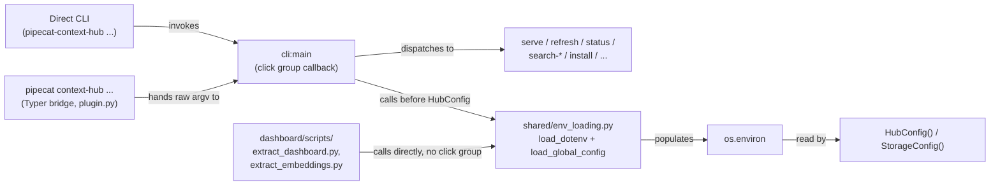

# Task: Global config.toml fallback + refresh prune safety for machine-scoped hub installs

**Status**: Not Started
**Component**: cli
**Assigned to**: Claude
**Priority**: Medium
**Branch**: feature/global-config-toml
**Created**: 2026-08-07
**Completed**: (fill when done)
**Review Gates**: none

## Objective

Two fixes from the same discussion, landing together because they compose:

1. Let a globally-installed context-hub (invoked with no meaningful project
   `cwd` — e.g. as an MCP server from Claude Code) source `PIPECAT_HUB_*`
   settings from `~/.config/pipecat-context-hub/config.toml`, so the operator
   stops exporting them from `~/.zshrc`, without changing the existing
   project-local `.env` behavior or its precedence.
2. Stop `refresh` from silently deleting indexed data for any repo not named
   in *that invocation's* `effective_repos` — today this fires even when the
   repo is still configured, just not visible from the current directory/env
   layering (e.g. a project checkout with its own narrower `.env`). Without
   this fix, #1 alone does not close the bug it's meant to fix: a project
   `.env` still wins over `config.toml` per-key (whole-string override, not a
   list merge), so running `refresh` from inside such a project reproduces
   the exact deletion markbackman reported, on top of `config.toml`.

## Context

Repo config (`PIPECAT_HUB_EXTRA_REPOS`, etc.) is read from `os.environ`,
populated either by the real shell environment or by `_load_dotenv()`
(`src/pipecat_context_hub/cli.py:92-128`), which loads `.env` from
`Path.cwd()`. That works for a project-local checkout, but the on-disk index
and repo clones are machine-global (`~/.pipecat-context-hub` by default —
`shared/config.py:58-67`), and a globally-installed MCP server may have no
project `cwd` to hold a `.env` at all. **Assumption, not yet verified**:
whether Claude Code spawns this server with a fixed/no project `cwd`, or
inherits a project directory — see Phase 0 below, which adds an explicit
verification step before the rest of the plan leans on this claim. The
operator (vr000m) has been working around the gap by `export`ing
`PIPECAT_HUB_*` vars from `~/.zshrc` (currently: `PIPECAT_HUB_STALE_AFTER_DAYS`,
a ~70-repo `PIPECAT_HUB_EXTRA_REPOS` list), which is unversioned, invisible
to `refresh`/`serve` provenance, and awkward to maintain.

This mirrors the design agreed in the discussion at
`pipecat-ai/pipecat#5122` (comment 5209812757, markbackman/vr000m): the
index is machine-global, so config that governs it should have a
machine-global home too, layered under real env vars and cwd `.env` so
nothing about the existing precedence changes for project-local use. The
config file itself lives in `~/.config/pipecat-context-hub/` rather than
alongside the index (`~/.pipecat-context-hub/`) — see Architecture
Decisions for why the two must not share a directory.

**The deletion bug (markbackman, same thread):** `refresh` already runs a
cleanup pass —

```
configured = set(config.sources.effective_repos)
...
if slug not in configured:
    ...
    await index_store.delete_by_repo(slug)
```

(`cli.py:623-637`, present today, unconditional). His repro: `cd customer-a
&& refresh` indexes it; `cd anywhere-else && refresh` deletes it, because
that directory's env doesn't name it. He proposed two fixes that "compose":
(1) a quick safety fix — warn instead of silently deleting, gated behind an
explicit `--prune` flag/`PIPECAT_HUB_PRUNE` env var to actually delete — and
(3) the global config file this plan already builds. Both land here.

## Requirements

- Project-local `.env` (loaded from `Path.cwd()`) is unchanged — same file,
  same loader, same "first-writer-wins" semantics.
- A new `~/.config/pipecat-context-hub/config.toml`, read only if present,
  adds a third precedence layer *below* real env vars and cwd `.env`,
  *above* `HubConfig` field defaults.
- `config.toml` uses the exact same `PIPECAT_HUB_*` names as flat string
  keys — no separate schema to keep in sync by hand. Only keys under the
  `PIPECAT_HUB_` prefix are honored; any other key is skipped with a
  `logger.warning` naming it (matches the Objective's stated scope, keeps a
  machine-global file from becoming a general environment injector).
- The `config.toml` *lookup path* (`~/.config/pipecat-context-hub/`) is
  fixed and does not follow `PIPECAT_HUB_DATA_DIR` — it lives outside
  `StorageConfig.data_dir` entirely, so this is not a chicken-and-egg case:
  `PIPECAT_HUB_DATA_DIR` set inside `config.toml` still relocates the
  storage/index directory for every other purpose once loaded into
  `os.environ`.
- A `config.toml.example` ships alongside `.env.example`. Its key set is
  kept from silently drifting apart from `docs/README.md`'s Environment
  Variables table (the full 11-var registry) by a parity test — see
  Architecture Decisions for why the README table, not `.env.example`, is
  the parity partner.
- Every consumer that constructs `StorageConfig`/`HubConfig` independently
  of `cli.main()` — today, the dashboard scripts — also loads
  `config.toml`, via a shared loader module rather than duplicated logic.
- No new runtime dependency — `tomllib` is stdlib as of the project's
  `>=3.11` floor (`pyproject.toml:18`) and is already used elsewhere in this
  codebase (`services/ingest/github_ingest.py:664,668`).
- `docs/README.md` and `CLAUDE.md` document the three-layer precedence and
  both file locations.
- `refresh`'s repo-cleanup pass (`cli.py:623-637`) no longer deletes index
  records for an unconfigured-this-invocation repo by default — it warns
  instead. Deletion happens only when the operator opts in via `--prune`
  (or `PIPECAT_HUB_PRUNE=1`). Tainted repos (`config.sources.tainted_repos`)
  are unaffected by this change — they are an explicit skip list, not an
  accidental-absence case, and continue to be cleaned up unconditionally as
  today.

## Review Focus

- Precedence must degrade cleanly: unset `config.toml` → identical behavior
  to today (verifies the feature is additive, not a behavior change for
  existing `.env`-only or env-var-only users).
- `config.toml`'s own lookup path must survive `refresh --reset-index`
  (which `shutil.rmtree`s `StorageConfig.data_dir`) — this is why the file
  lives outside `data_dir` rather than inside it. Cover with a test, not
  just directory separation by construction.
- Every `PIPECAT_HUB_*`-var consumer that builds config independently of
  `cli.main()` (dashboard scripts) must see `config.toml` too — not just
  `serve`/`refresh`.
- Parity test must fail (not silently pass) when a key is added to one
  source (`config.toml.example` or the README table) and not the other, and
  must not vacuously pass on a format change that empties one side's
  extracted set.
- Test mechanisms must actually work on the platforms CI runs — in
  particular, `Path.home()` overrides must work on the `windows-latest` CI
  leg, not just POSIX.
- The manual verification step must be capable of observing the feature at
  all — on the operator's actual machine, real env vars (from `~/.zshrc`)
  outrank `config.toml` per this plan's own precedence, so the manual check
  must neutralize those exports rather than compete with them.
- The prune-safety fix must actually close markbackman's repro: a `refresh`
  run from a directory whose local `.env` sets a narrower
  `PIPECAT_HUB_EXTRA_REPOS` than `config.toml`'s must NOT delete the
  config.toml-only repos' index records without `--prune`/`PIPECAT_HUB_PRUNE=1`.
  Cover with a test that reproduces his exact scenario, not just the
  unit-level warn/delete branch.
- Tainted-repo cleanup (`config.sources.tainted_repos`) must remain
  unconditional — it is an explicit exclusion, not an accidental absence,
  and gating it behind `--prune` would be a regression (a tainted repo's
  data would linger until the operator remembers to pass a flag for an
  exclusion they already made explicitly).

## Architecture & Call Flow

This plan touches multiple independently-invoked front doors that must all
route through the same loader for the design to hold: the CLI entry point,
the `pipecat context-hub` Typer bridge, the MCP `serve` process, and the
dashboard build scripts (a separate, non-CLI entry point).




| Step | Trigger | Enters context | Cleared/persisted | Turn boundary |
|------|---------|-----------------|--------------------|----------------|
| 1 | Any `cli:main` subcommand invoked (direct CLI, Typer bridge, one-shot query) | CLI args | N/A (single process) | before `_configure_logging` |
| 2 | `shared.env_loading.load_dotenv()` | cwd `.env` contents | written into `os.environ`, process-lifetime | immediately, synchronous |
| 3 | `shared.env_loading.load_global_config()` | `~/.config/pipecat-context-hub/config.toml` contents | written into `os.environ` (only unset keys), process-lifetime | immediately, synchronous |
| 4 | `HubConfig()` construction | resolved `os.environ` | held for process lifetime | after step 3, before any tool/command runs |
| 5 | `dashboard/scripts/*.py` run directly (not through `cli:main`) | same two loader calls, invoked at script top | written into `os.environ`, process-lifetime | before `StorageConfig()`/`HubConfig()` construction in the script |

## Implementation Checklist

### Phase 0: Verify the MCP-cwd assumption

**Impl files:** (none — investigation only; findings feed Phase 3 docs)
**Test files:** (none)
**Test command:** (none — manual verification)
**Goal:** Confirm (rather than assume) how Claude Code's MCP client spawns this server, since the Context section's claim about `cwd` was flagged as unverified during review and the operator was unsure.

- Add a one-line `logger.debug("serve cwd=%s", Path.cwd())` (or equivalent) at `serve` startup, or temporarily log it, and inspect a real Claude-Code-spawned `serve` session's logs to see what `cwd` resolves to.
- Record the finding in `## Findings` below the marker once known.
- Document the actual behavior in Phase 3's README precedence note — specifically, whether a project `.env` can shadow `config.toml` even in a "global" MCP install, and what that means for an operator who expects `config.toml` to always apply.

### Phase 1: Shared env-loading module + precedence wiring

**Impl files:** `src/pipecat_context_hub/shared/env_loading.py` (new), `src/pipecat_context_hub/cli.py`
**Test files:** `tests/unit/test_env_loading.py` (new), `tests/unit/test_cli.py`
**Test command:** `uv run pytest tests/unit/test_env_loading.py tests/unit/test_cli.py -v`
**Goal:** Real env vars > cwd `.env` > `~/.config/pipecat-context-hub/config.toml` > `HubConfig` defaults, using the same first-writer-wins pattern the existing `_load_dotenv()` already uses — no new precedence concept — and every entry point (CLI, dashboard scripts) reaches the same loader.

- Create `src/pipecat_context_hub/shared/env_loading.py` with two functions:
  - `load_dotenv()` — moved from `cli.py:92-128` verbatim (same cwd-`.env`
    behavior, same quoting/comment handling, same `not in os.environ` guard).
  - `load_global_config()` — new. Reads
    `Path.home() / ".config" / "pipecat-context-hub" / "config.toml"` via
    `tomllib.load`. Returns silently if the file doesn't exist. On a TOML
    parse error, `logger.warning` naming the file and the error, then
    return (do not raise) — matches the Architecture Decision below. For
    each top-level `key, value` pair: if `key` doesn't start with
    `PIPECAT_HUB_`, `logger.warning` naming the skipped key and continue.
    If `value` isn't a plain `str`/`int`/`float`/`bool` (i.e. is a table or
    array), `logger.warning` naming the offending key and continue. Coerce
    the accepted scalar to `str()` (booleans thus become the Python-style
    `"True"`/`"False"` strings that `cli.py`'s `_WARMUP_DISABLED_VALUES` and
    `shared/config.py`'s reranker check already accept case-insensitively —
    see the test added below). If `key not in os.environ: os.environ[key] = str(value)`.
- Update `cli.py` to import both functions from `shared/env_loading` (delete
  the old `_load_dotenv` body, keep a thin re-export or update call sites
  directly — whichever keeps `cli.py`'s existing tests passing with minimal
  churn). Call `load_dotenv()` then `load_global_config()` in `main()`
  *after* `_configure_logging(log_level)` and *before* `HubConfig()`
  construction (`cli.py:161`) — ordering after logging setup means
  malformed-file warnings are emitted through configured logging, not
  Python's last-resort handler.
- Tests (`tests/unit/test_env_loading.py`): file present/absent, file
  present but empty, real env var wins over `config.toml`, cwd `.env` wins
  over `config.toml`, `config.toml` fills an unset var, malformed TOML syntax
  logs a warning and doesn't raise, a non-`PIPECAT_HUB_` key is skipped with
  a warning and doesn't leak into `os.environ`, a key with a non-scalar
  value (array/table) is skipped with a warning and doesn't crash, and a
  behavioral round-trip test that a TOML-native `false`/`true` value
  produces the intended effect through the real consumers (`_warmup_enabled()`
  is `False` when `config.toml` sets `PIPECAT_HUB_WARMUP = false`;
  `HubConfig().reranker.effective_enabled` is `False` when
  `PIPECAT_HUB_RERANKER_ENABLED = false`) — not just the raw string in
  `os.environ`.
- **Hermeticity**: add an autouse `pytest` fixture (in `tests/unit/test_cli.py`,
  or a `conftest.py` shared by both new/old test files) that monkeypatches
  `pathlib.Path.home` to a `tmp_path`-derived directory for the whole test
  module, so existing `CliRunner`-based tests in `test_cli.py` never read a
  real `~/.config/pipecat-context-hub/config.toml` on the machine running
  the tests. Monkeypatch `pathlib.Path.home` directly (not `HOME`/`USERPROFILE`
  env vars) so the same fixture works unmodified on the `windows-latest` CI
  leg that runs `test_cli.py` (`.github/workflows/ci.yml`).
- Emit one `logger.info("Loaded %d key(s) from %s", n, path)` line from
  `load_global_config()` when `n > 0` — this becomes the concrete manual/
  smoke-test observable (see Phase 1 Testing Notes below), replacing the
  vague "visible via status" claim from the original draft.

### Phase 2: `config.toml.example` + parity test

**Impl files:** `config.toml.example` (new, repo root), `tests/unit/test_config.py`
**Test files:** `tests/unit/test_config.py`
**Test command:** `uv run pytest tests/unit/test_config.py -v -k parity`
**Goal:** Adding a `PIPECAT_HUB_*` var to one example/doc source without the other must fail CI, the same way `test_every_click_command_is_bridged` (`tests/unit/test_plugin.py:87-90`) catches an unbridged CLI command — and the check must not be foolable by a format change that empties one side's extracted set.

- Add `config.toml.example` at repo root: one commented block per
  `PIPECAT_HUB_*` var (all 11 — see Technical Specifications), each with a
  one-line description and a commented-out `# KEY = "value"` example, TOML
  key/value syntax (not `export KEY=value`). Show boolean examples as
  quoted strings (`# PIPECAT_HUB_WARMUP = "false"`), matching the
  string-coercion contract documented in the Architecture Decisions, rather
  than bare TOML `false` — reduces (does not eliminate) the chance of an
  operator hand-editing a native-typed value the loader would otherwise
  warn-and-skip only if it were a table/array, not a scalar bool.
- Parity source is `docs/README.md`'s Environment Variables table
  (`docs/README.md:302-317`), which already lists all 11 vars — not
  `.env.example`, which is intentionally a curated subset of copy/paste
  repo-bundle presets (5 of 11 vars today). This is stated once, here and
  in Architecture Decisions, and nowhere else in the plan — Requirements
  above names this table explicitly rather than `.env.example`.
- Add `test_config_toml_example_matches_readme_env_var_table` to
  `tests/unit/test_config.py`: extract `PIPECAT_HUB_[A-Z_]+` tokens via
  regex from `config.toml.example` (matches whether the line is commented
  or not, tolerant of missing space around `=`) and from the first-column
  cells of `docs/README.md`'s "Environment Variables" section specifically
  (not the whole file) into two sets; assert both sets are non-empty
  (guards against a format change silently zeroing one side and vacuously
  passing set equality); assert the sets are equal, with a message naming
  the symmetric-difference keys on failure.

### Phase 3: Dashboard script wiring + Docs

**Impl files:** `dashboard/scripts/extract_dashboard.py`, `dashboard/scripts/extract_embeddings.py`, `docs/README.md`, `CLAUDE.md`
**Test files:** (none new — covered by Phase 1's `env_loading` tests, since the dashboard scripts call the same functions)
**Test command:** `uv run pytest tests/unit/test_config.py -v -k parity`
**Validation cmd:** `uv run python dashboard/scripts/extract_dashboard.py --help`

- `dashboard/scripts/extract_dashboard.py` and `extract_embeddings.py`: call
  `shared.env_loading.load_dotenv()` and `load_global_config()` at script
  startup, before constructing `StorageConfig()`/`HubConfig()` — same two
  calls, same order, as `cli.py:main()`. This closes the gap where a
  `config.toml`-only `PIPECAT_HUB_DATA_DIR` would otherwise diverge the
  dashboard's data dir from `serve`/`refresh`'s.
- `docs/README.md`: extend the "Environment Variables" section
  (`docs/README.md:302-320`) with a short subsection describing the
  three-layer precedence (real env > cwd `.env` > `~/.config/pipecat-context-hub/config.toml`
  > defaults), link `config.toml.example` next to the existing
  `.env.example` link (`docs/README.md:319-320`), and document the actual
  MCP-client `cwd` behavior found in Phase 0 (including the precedence
  consequence if a project `.env` can shadow `config.toml`).
- `CLAUDE.md`: add a short note under an appropriate existing section
  pointing at the same precedence rule and file locations, so agents
  reading project instructions don't miss the global-config path.

### Phase 4: Refresh prune safety

**Impl files:** `src/pipecat_context_hub/cli.py`
**Test files:** `tests/unit/test_cli.py`
**Test command:** `uv run pytest tests/unit/test_cli.py -v -k "Prune or Refresh"`
**Goal:** `refresh` must never delete previously-indexed data for a repo that's still configured somewhere, just not visible from the current invocation's env layering — deletion becomes an explicit, opt-in action, not an automatic side effect of running `refresh` from the "wrong" directory.

- Add `--prune` (`is_flag=True`) to the `refresh` command (`cli.py:456-472`,
  alongside `--force`/`--reset-index`/`--framework-version`), plus
  `PIPECAT_HUB_PRUNE` as its env-var equivalent (same `1`/`0`-style parsing
  as `PIPECAT_HUB_WARMUP`'s `_warmup_enabled()` — CLI flag wins if passed,
  else the env var, else default `False`).
- In the repo-cleanup pass (`cli.py:623-637`): keep the loop that finds
  `slug not in configured`, but split its two branches differently than
  today:
  - `slug in tainted_repos` (explicit exclusion): unchanged — always
    `logger.warning(...)` and delete, regardless of `--prune`.
  - `slug not in tainted_repos` (implicit absence — the actual bug): when
    `--prune`/`PIPECAT_HUB_PRUNE` is **not** set, `logger.warning("Repo %s
    not configured in this run; leaving %d indexed record(s) in place — "
    "pass --prune to remove", slug, <count>)` and **do not delete**. When
    `--prune`/`PIPECAT_HUB_PRUNE` **is** set, behave as today (log + delete).
  - Getting `<count>` needs one extra `index_store` lookup (e.g. count
    records for that repo slug) purely for the warning's operator-facing
    number — keep it cheap (a `COUNT`-style query, not a full record fetch).
- Surface prune-skipped repos in the `refresh` summary output (the existing
  end-of-run summary block) as a distinct line, e.g. `Skipped pruning: N
  repo(s) not in this run's config (use --prune to remove)` — so an operator
  who *did* mean to remove a repo notices the warning instead of it scrolling
  past in `INFO`-level log noise.
- Tests: repo not in `effective_repos`, no `--prune` → record survives,
  warning logged, summary line present; same setup with `--prune` → record
  deleted (today's behavior, preserved as opt-in); `PIPECAT_HUB_PRUNE=1` env
  var alone (no flag) → same as `--prune`; tainted repo, no `--prune` → still
  deleted (unconditional, unchanged); and the markbackman repro itself —
  `config.toml` configures repo A+B, a project-local `.env` configures only
  repo A, `refresh` runs from that project directory without `--prune` → repo
  B's records survive.
- `docs/README.md`: document `--prune`/`PIPECAT_HUB_PRUNE` next to the
  existing `--reset-index` documentation, and add a one-line callout that
  `refresh` no longer deletes unconfigured-this-run repos by default.

## Technical Specifications

### Files to Modify
- `src/pipecat_context_hub/cli.py` — remove `_load_dotenv()` body (moved), call the new shared loaders in `main()` after `_configure_logging`; add `--prune`/`PIPECAT_HUB_PRUNE`, split the repo-cleanup pass's warn-vs-delete branches (Phase 4).
- `dashboard/scripts/extract_dashboard.py` — call the shared loaders at startup.
- `dashboard/scripts/extract_embeddings.py` — call the shared loaders at startup.
- `tests/unit/test_cli.py` — update/relocate `TestLoadDotenv` per the module move; add the autouse home-patching fixture; new prune-safety tests (Phase 4).
- `tests/unit/test_config.py` — new parity test.
- `docs/README.md` — Environment Variables section + `.example` link + Phase 0 finding + `--prune` documented alongside `--reset-index`.
- `CLAUDE.md` — config precedence note; `--prune` behavior note.

### New Files to Create
- `src/pipecat_context_hub/shared/env_loading.py` — `load_dotenv()` (moved from `cli.py`) + `load_global_config()` (new), shared by the CLI entry point and the dashboard scripts.
- `tests/unit/test_env_loading.py` — tests for both loader functions.
- `config.toml.example` (repo root) — TOML mirror of the full `PIPECAT_HUB_*` var registry.

### Architecture Decisions

- **`config.toml` lives at `~/.config/pipecat-context-hub/config.toml`, deliberately outside `StorageConfig.data_dir` (`~/.pipecat-context-hub/`).** Review surfaced that `refresh --reset-index` (`cli.py:140-142`, `_delete_local_index_storage`) `shutil.rmtree`s `data_dir` wholesale — placing config inside that directory would mean the documented index-recovery command destroys the operator's hand-authored config. Separating the two directories by construction removes the failure mode entirely rather than requiring `_delete_local_index_storage` to special-case a file it must preserve. This also removes what would otherwise be a `PIPECAT_HUB_DATA_DIR` chicken-and-egg case: since `config.toml`'s own lookup path never depends on `data_dir`, there is no circularity to reason about.
- **Only `PIPECAT_HUB_`-prefixed keys are honored from `config.toml`; other keys are skipped with a warning.** A machine-global file is a wider trust boundary than a cwd-local `.env`, and the Objective specifically scopes this feature to `PIPECAT_HUB_*` settings — unprefixed pass-through (e.g. silently setting `HF_HOME`) would be an undocumented, untested widening of that surface.
- **Parity source is `docs/README.md`'s Environment Variables table, not `.env.example`.** `.env.example` is intentionally curated (repo-bundle copy/paste presets) and documents only 5 of the 11 known `PIPECAT_HUB_*` vars. The README table already lists all 11 with defaults and descriptions (`docs/README.md:302-317`) and is the closest existing thing to a var registry. This decision is stated once here and mirrored in Requirements — a prior draft of this plan stated the parity partner as `.env.example` in Requirements while defining it as the README table in Phase 2, a contradiction caught in review; Requirements above has been corrected to match.
- **Malformed `config.toml` (bad TOML syntax, non-`PIPECAT_HUB_` keys, non-scalar values) always logs a warning and continues — never raises, never fails silently.** A prior draft of this plan said invalid TOML syntax specifically "returns silently" in the loader spec while its own test list and this Architecture Decision both said "logs and continues" — a contradiction caught in review. The behavior is now singular: every malformed-input case warns and continues. `serve`/`refresh`/dashboard scripts must never crash on a hand-edited global file.
- **The shared loader lives in `shared/env_loading.py`, called identically from `cli.py:main()` and both dashboard scripts.** Prior to review, only `cli.py` called the (then-CLI-local) loader, so a `config.toml`-only `PIPECAT_HUB_DATA_DIR` would silently diverge the dashboard's data directory from `serve`/`refresh`'s. Moving the loader to `shared/` and calling it from every independent entry point removes that divergence rather than documenting it as a known gap.
- **`refresh`'s repo-cleanup deletion is opt-in (`--prune`/`PIPECAT_HUB_PRUNE`), except for explicitly tainted repos.** This is the other half of the `pipecat-ai/pipecat#5122` discussion (markbackman's option 1), landing alongside the config.toml fix (option 3) because they compose: without prune-safety, `config.toml` alone doesn't close the deletion bug, since a project-local `.env`'s `PIPECAT_HUB_EXTRA_REPOS` still wins over `config.toml`'s per-key (whole-string override, not a merge), so the exact repro he gave (`cd customer-a && refresh` → `cd elsewhere && refresh` deletes it) still fires post-config.toml. Tainted-repo cleanup stays unconditional because it's an explicit exclusion the operator already made, not an accidental absence.

### Dependencies
None new — `tomllib` is stdlib at the project's `>=3.11` floor and already
imported in `services/ingest/github_ingest.py:664`.

### Integration Seams

| Seam | Writer (task) | Caller (task) | Contract |
|------|---------------|----------------|----------|
| `os.environ` population order | Phase 1 (`shared/env_loading.py`) | `cli.py:main()` → `HubConfig()` construction; dashboard scripts → `StorageConfig()`/`HubConfig()` construction | Must run after `_configure_logging` (CLI) / at script top (dashboard) and before any `HubConfig`/`StorageConfig` construction, using the `not in os.environ` guard so precedence holds without new logic in `HubConfig`/`shared/config.py` |
| Key-set source of truth | Phase 2 (`config.toml.example`) | Phase 3 (`docs/README.md` table) | Both must list the same 11 `PIPECAT_HUB_*` keys; the Phase 2 parity test is the enforcement mechanism Phase 3's doc edits must not silently break |
| Dashboard entry-point parity | Phase 1 (`shared/env_loading.py`) | Phase 3 (dashboard scripts) | Both dashboard scripts must call the identical two loader functions, in the identical order, as `cli.py:main()` — no divergent bootstrap logic |
| Effective-repos → cleanup pass | Phase 1/3 (`effective_repos` resolution, now also reachable via `config.toml`) | Phase 4 (repo-cleanup pass, `cli.py:623-637`) | Whatever `effective_repos` resolves to for *this* invocation still drives which repos are considered "not configured" — Phase 4 changes what happens on that outcome (warn vs. delete), not how the set is computed |

## Testing Notes

### Test Approach
- [ ] Unit tests for `load_dotenv()`/`load_global_config()` precedence and error handling (Phase 1)
- [ ] Parity test for `config.toml.example` vs. README var table (Phase 2)
- [ ] Prune-safety tests, including the markbackman repro reproduced end-to-end (Phase 4)
- [ ] Manual: back up any existing `~/.config/pipecat-context-hub/config.toml`,
      write one with `PIPECAT_HUB_EXTRA_REPOS` set, then run
      `env -u PIPECAT_HUB_EXTRA_REPOS -u PIPECAT_HUB_STALE_AFTER_DAYS uv run pipecat-context-hub status`
      with `.env` absent from cwd — the `env -u` flags are required because the
      operator's own `~/.zshrc` exports both vars, which outrank `config.toml`
      per this plan's precedence; without neutralizing them the manual check
      observes nothing. Confirm via the `Loaded N key(s) from ...` INFO log
      line added in Phase 1 (not `status`/`check_deprecation`, neither of
      which surfaces configured-but-unindexed repos).

### Test Results
- [ ] All existing tests pass
- [ ] New tests added and passing
- [ ] Manual verification complete

### Edge Cases Tested
- [ ] `config.toml` absent (today's default behavior, unchanged)
- [ ] `config.toml` present but empty
- [ ] `config.toml` present, malformed TOML syntax — logs a warning, doesn't raise
- [ ] `config.toml` sets a non-`PIPECAT_HUB_` key — skipped with a warning, not leaked into `os.environ`
- [ ] `config.toml` sets a key already set by a real env var — real env var wins
- [ ] `config.toml` sets a key already set by cwd `.env` — `.env` wins
- [ ] `config.toml` sets `PIPECAT_HUB_DATA_DIR` — storage dir relocates for `serve`/`refresh`/dashboard scripts alike, independent of `config.toml`'s own (fixed) lookup path
- [ ] `refresh --reset-index` run with `config.toml` present — file survives (directory separation, verified by test)
- [ ] TOML-native `true`/`false` values produce the correct *behavioral* outcome, not just the right string in `os.environ`
- [ ] `refresh` without `--prune`, repo unconfigured this run — indexed records survive, warning + summary line emitted
- [ ] `refresh --prune` (or `PIPECAT_HUB_PRUNE=1`), repo unconfigured this run — indexed records deleted (today's behavior, now opt-in)
- [ ] `refresh` without `--prune`, tainted repo — indexed records still deleted (unconditional, unchanged)
- [ ] markbackman's repro end-to-end: `config.toml` configures A+B, a project `.env` configures only A, `refresh` from that project dir without `--prune` — B survives

## Acceptance Criteria

- `~/.config/pipecat-context-hub/config.toml`, if present, fills any
  `PIPECAT_HUB_*` var not already set by a real env var or cwd `.env` —
  verified by test.
- `config.toml` is unaffected by `refresh --reset-index` — verified by test.
- Non-`PIPECAT_HUB_` keys in `config.toml` are skipped with a warning, never
  written to `os.environ` — verified by test.
- Absence of `config.toml` is fully backward compatible — no behavior change
  for existing users.
- Dashboard scripts and `cli.py:main()` see identical resolved config —
  verified by both calling the same shared loader functions.
- `config.toml.example` exists and its key set matches `docs/README.md`'s
  Environment Variables table, enforced by a CI test that cannot vacuously
  pass on an empty extracted set.
- `docs/README.md` and `CLAUDE.md` document the three-layer precedence and
  the actual (verified, not assumed) MCP-client `cwd` behavior.
- `refresh` no longer deletes an unconfigured-this-run repo's indexed
  records without an explicit `--prune`/`PIPECAT_HUB_PRUNE` opt-in —
  verified by test, including markbackman's original repro. Tainted-repo
  cleanup remains unconditional.
- Code reviewed and approved
- Tests passing
- Documentation updated

<!-- reviewed: 2026-08-07 @ 00cc273cb943a34bb2d998f499116b90d01431ad -->

<!-- /review-plan writes the marker line above. Everything below is the workspace: edits here do NOT invalidate the marker. -->

## Progress

- [ ] Phase 0: Verify the MCP-cwd assumption
- [ ] Phase 1: Shared env-loading module + precedence wiring
- [ ] Phase 2: `config.toml.example` + parity test
- [ ] Phase 3: Dashboard script wiring + Docs
- [ ] Phase 4: Refresh prune safety

## Findings

- **Review round (2026-08-07)**: `/review-plan` ran 5 lenses (architecture, sequencing, spec-and-testing, assumptions at `fable`; codebase-claims at `haiku`) plus a sequential Contradiction Pass. `codebase-claims` failed to return output after 3 resend attempts and is recorded as errored/excluded from reconciliation — every path/symbol it would have checked was independently spot-verified via the other lenses' evidence citations. Reconciliation: raw=22, merged=2, unique=18, related=2, 4 Contradiction findings. 1 Critical (config.toml location vs. `reset-index`), all addressed in this revision per user decisions: relocate to `~/.config/pipecat-context-hub/` (not carve out of rmtree), restrict `config.toml` to `PIPECAT_HUB_*` keys, wire dashboard scripts into the shared loader, and add Phase 0 to verify the MCP-cwd claim instead of asserting it.
- **Scope expansion (2026-08-07, post-review)**: user asked whether `pipecat-ai/pipecat#5122`'s discussion covered anything about repo deletion. It did — markbackman's thread proposed two fixes that "compose": (1) stop `refresh`'s repo-cleanup pass (`cli.py:623-637`) from silently deleting unconfigured-this-run repos (warn + opt-in `--prune` instead), and (3) the global config file this plan already built. Only #3 was in scope before this note; user confirmed the intent was always both, so Phase 4 (Refresh prune safety) was added. **This above-marker edit invalidates the prior review marker — re-run `/review-plan` before `/conduct`, since Phase 4 has not been through the 5-lens + contradiction-pass review the rest of the plan has.**
- (append further findings here as work proceeds)

## Issues & Solutions

### Issue 1: [Brief description]
- **Problem**: [What went wrong]
- **Solution**: [How it was resolved]
- **Files affected**: [List files]

## Final Results

[Fill this section when the work is complete]

### Summary
[Brief summary of what was accomplished]

### Outcomes
- Outcome 1
- Outcome 2

### Learnings
- [Any insights or lessons learned during implementation]

### Follow-up Work
- [Any related work identified for future plans]
