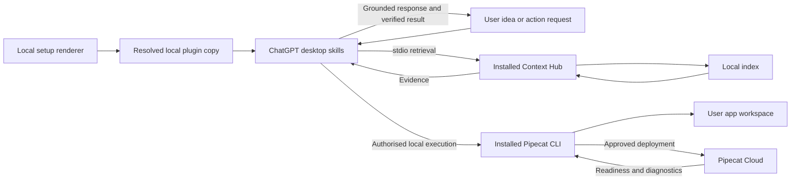
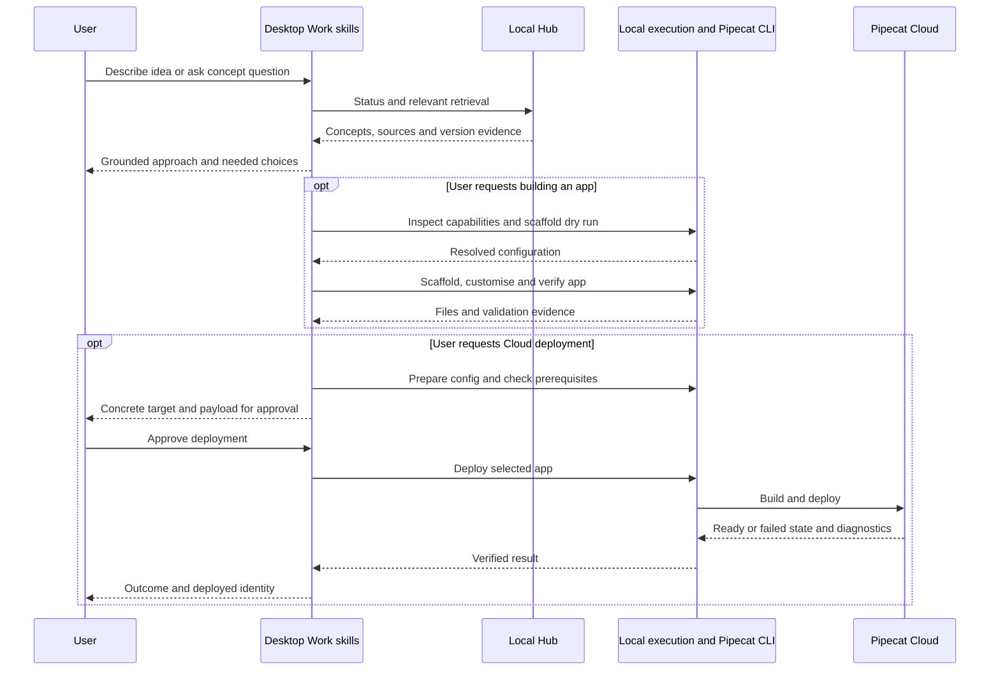

# Local Pipecat plugin: idea to Cloud deployment experiment

**Status**: Not Started — expanded plan awaiting review
**Component**: plugin packaging, retrieval instructions, CLI workflows
**Branch**: `feature/chatgpt-local-plugin`
**Created**: 2026-10-02
**Updated**: 2026-10-03

## Objective

Test a local desktop plugin that helps users describe a voice-agent idea, discover grounded Pipecat concepts, build and test a scaffolded application, and prepare a Pipecat Cloud deployment. A successful experiment includes a separately authorised deployment and verifies that the deployed agent becomes ready.

## Scope

Ship one plugin with explore, build and deploy skills. Context Hub supplies concepts, docs, definitions, examples and compatibility evidence over local stdio. The installed Pipecat CLI supplies scaffolding and Cloud operations through the host's local execution tools. Neither CLI is bundled as a copied executable or made a mandatory dependency of the hub's Python package.

Target ChatGPT desktop Work with local execution, and Codex local execution. Discussion-only usage may retrieve material but must not claim it can create files or deploy without execution tools. Native Plugin Settings, a dedicated UI, hosted retrieval and a new CLI-execution MCP adapter are outside this experiment. Start with framework-version and source preferences stated in the conversation. If the host lacks required local execution or stdio support, stop that workflow and report the missing capability; an adapter would require a separate design.

Queries must not silently refresh or replace the index. Discussing an idea does not authorise scaffolding, uploading secrets or deploying. Prepare concrete files and validation evidence before asking for final deployment approval.

## Requirements

- R1: Explore retrieves relevant concepts and sources before making Pipecat-specific API assertions; use ` + ` or ` & ` for multi-concept hub queries.
- R2: Status establishes index readiness and indexed framework provenance. An unavailable requested version is a limitation, not permission to rebuild the index.
- R3: Bind hub startup to its installed absolute Python executable using `-P -m pipecat_context_hub serve`; startup must be independent of desktop working directory.
- R4: Build discovers installed CLI capabilities, maps user choices to supported scaffold options, validates a dry run, and only creates an app after a build request. Never overwrite or re-scaffold an existing app.
- R5: Deploy preparation validates the project, runtime keys by name, selected Cloud organisation/region/agent identity, sizing and build path. Do not print secret values or send them to model-visible context.
- R6: After the user approves the concrete deployment target and payload, invoke the installed Cloud CLI, check readiness and inspect bounded diagnostic logs. Failure is not success merely because the command was issued.
- R7: Existing Context Hub server, CLI bridge, install registrations and retrieval semantics remain unchanged. No general shell execution tool is added to the retrieval MCP.

## Verified facts and compatibility boundaries

- At initial plan creation, `pyproject.toml:10–21` declares `pipecat-ai-context-hub` version `0.8.1` with `mcp>=2.0,<3.0`.
- `src/pipecat_context_hub/cli_install.py::_server_command()` resolves `sys.executable` and uses `-P -m pipecat_context_hub serve`. Existing client registration has no ChatGPT route.
- `src/pipecat_context_hub/server/main.py` already provides tool-selection guidance; plugin skills complement it.
- `src/pipecat_context_hub/shared/types.py` exposes tool-specific version and source filters. These do not switch the indexed framework version or implement a universal source filter.
- Existing `plugin.py` is the Pipecat CLI extension, not desktop plugin packaging.
- Live local probes on 2026-10-03: `pipecat --version` reports `1.3.0`; `pipecat init --help` supports `--config`, `--dry-run`, `--deploy-to-cloud` and `--list-options`; `pipecat cloud deploy --help` succeeds and offers build-directory and GitHub-source options.
- A non-interactive scaffold dry run succeeded with explicit web bot type, SmallWebRTC, cascade, Deepgram/OpenAI/Cartesia, no client and Cloud files enabled. These are probe inputs, not defaults for users. Omitting `--bot-type` failed on this installed CLI, despite newer upstream guidance describing inference. This version has no `--eval` scaffold flag in its help.
- `pipecat-context-hub install --print-config` returned the pinned launch configuration without registering a client or refreshing the index.
- Official OpenAI documentation supports local shell/files in desktop Work when available to the account/workspace. Documentation support is not evidence of activation in the user's specific target chat; Phase 1 must prove it.

## Implementation phases

### Phase 1: Prove the desktop and installed-tool path

- Inspect CLI versions/help, resolve the installed hub interpreter, and check index readiness without refresh.
- Add a minimal plugin template and local renderer, then prove desktop discovery, skill activation, stdio initialize/status and a harmless local shell command in the intended Work mode.
- Capture host mode, versions, command/argv and pass/fail evidence without machine paths in committed templates.
- If a probe fails, stop and re-plan before finishing the skills. Do not substitute an untested execution adapter.

### Phase 2: Complete grounded exploration

Depends on Phase 1. Define idea and concept workflows, source citations, version/source preference mapping and ambiguity handling. Test read-only conversations, including unsupported-filter and unavailable-version cases. The package can ship exploration without requiring the Pipecat CLI or Cloud credentials.

### Phase 3: Add build and local verification

Depends on Phase 2. Discover scaffold options from installed help/JSON options, resolve user choices, validate `--dry-run`, then create a new app in an explicitly selected empty directory. Use generated structure and dependency pins; customise against retrieved APIs. Run project-appropriate import/startup and behavioural checks. Use upstream eval support only if the installed CLI actually supports it; otherwise record an explicit local verification method. No provider choice or credentials are invented.

### Phase 4: Prepare and exercise Cloud deployment

Depends on Phase 3. Inspect installed Cloud command help, validate Dockerfile/deploy configuration and image architecture versus region, and check account/auth readiness. User performs browser login when needed. Arrange runtime secrets using supported local Cloud tooling while keeping values out of transcripts; local `.env` is not assumed to reach Cloud automatically. Present the target, build source, resources and secret-set names for final approval. After approval, deploy, inspect readiness and bounded logs, and run an explicitly approved agent session if needed to verify behaviour. Document the deployed identity and cleanup instructions; do not delete deployments or automatically roll back by deleting data.

### Phase 5: Evaluate, review and document

Depends on all preceding phases. Complete the evaluation matrix, distinguish package checks from actual desktop outcomes, and document prerequisites and version limitations. Run proportional package/setup checks, the full repo quality gate before a PR, documentation review, code review and security review. Keep focused commits; no push/PR/merge is implied by plan completion. A missing Cloud account or approval leaves live deployment explicitly untested, not silently passed.

## Technical Specifications

### New files to create

- `plugins/pipecat-context-hub/plugin.json`: portable plugin identity; OpenAI presentation metadata only where supported by current schema.
- `plugins/pipecat-context-hub/mcp.template.json`: source template for the stdio entry, with an explicit interpreter placeholder; never register this unresolved template directly.
- `plugins/pipecat-context-hub/scripts/prepare_local.py`: standard-library renderer run with the installed hub Python. Check the hub is importable, copy the package to a user-selected local destination outside the checkout, and write schema-compatible root `mcp.json` with `sys.executable`, `-P`, module and `serve`. Refuse overwriting a nonempty destination. Preserve the source template and emit no credentials.
- `plugins/pipecat-context-hub/skills/explore/SKILL.md`: retrieve concepts, docs, definitions and examples; synthesise with evidence and explicit limitations.
- `plugins/pipecat-context-hub/skills/build/SKILL.md`: preflight host execution, CLI discovery, dry run, scaffold, customise and verify.
- `plugins/pipecat-context-hub/skills/deploy/SKILL.md`: prepare target/config/secrets, obtain concrete approval, execute and verify Cloud deployment.
- `plugins/pipecat-context-hub/README.md`: prerequisites, rendering, verified installation flow, host-mode distinction, version compatibility, update/re-render and removal instructions.
- `plugins/pipecat-context-hub/evaluation.md`: frozen prompts, expected outcomes and results template; no live credentials.
- `tests/unit/test_chatgpt_plugin_setup.py`: renderer validation and refusal paths, pinned launch assertions and package-copy boundaries.

### Files to modify

`docs/setup/README.md` and `docs/README.md` link the optional desktop workflow. Update this plan and its index with progress and results. Do not modify the existing Pipecat CLI bridge or shared server handlers for this packaging experiment.

### Architecture decisions

Use a generated local copy to bind the installed interpreter; keep machine-specific paths out of the portable source package. The renderer is a setup operation, not a tool invoked during queries. Re-render into a fresh local copy after plugin/interpreter updates and use the host's documented refresh/reinstall flow.

Use native local shell tools in desktop Work/Codex for the Pipecat CLI; skills are instructions, not executable permissions. The Cloud optional extension is installed separately when a user needs deployment. Help-derived capability checks take precedence over assumptions from newer docs. Builds and Cloud operations occur in the user's app workspace, not this repository.

### Integration Seams

| Producer | Consumer | Contract |
|---|---|---|
| Setup renderer | Desktop plugin loader | Root portable manifest, skill directories and resolved `mcp.json`; installed executable with safe argv |
| ChatGPT explore skill | Hub MCP | Supported tool arguments, multi-concept delimiters, local index provenance and cited results |
| ChatGPT build/deploy skills | Host local execution tools | User-authorised project workspace and actual installed CLI capabilities; no ambient execution assumption |
| Pipecat scaffold | Build skill | Generated structure, dependency pins and named environment requirements |
| Local Cloud CLI | Pipecat Cloud | User-selected identity/config, valid authentication and runtime secrets, build/deploy result and readiness evidence |

## Architecture & Call Flow

| Step | Trigger | Enters context | Cleared/persisted | Turn boundary |
|---|---|---|---|---|
| Setup | Local rendering and install | Package identity and connection metadata | Local plugin copy; no secrets in package | Before experiment chat |
| Explore | Idea/concept request | Requirements, preferences, indexed version and retrieved evidence | Conversation history; corpus stays on disk | User and tool turns |
| Build | Explicit build request | Supported options, dry-run result, code and test output | User project files; credentials remain local | Assistant tool rounds |
| Prepare deployment | Deployment request | Target, region, resources, key names and validation | Project configuration; no secret values in chat | Before approval |
| Deploy | Concrete user approval | Deployment identity, readiness and redacted diagnostics | Cloud deployment and recorded result | Approval and tool rounds |

## Testing Notes

| Case | Expected evidence |
|---|---|
| Template rendering | Portable root files, pinned interpreter and safe argv; no unresolved placeholder in generated config |
| Destination exists or hub absent | Clear error, no overwrite or partial registration |
| Host feasibility | Actual skill discovery, stdio initialize/status and harmless shell execution in selected desktop mode |
| Unrelated/shadow-module cwd | Packaged launch completes initialize/status using installed hub, not a same-named shadow module |
| Idea versus concept prompts | Relevant retrieved material and sources precede Pipecat API assertions |
| Unavailable version; empty/stale index | Limitation/remediation disclosure; no initiated refresh/replacement; before/after version and refresh metadata |
| Source preference; unsupported filter; missing compatibility | Only supported arguments, explicit corpus limitations and no invented compatibility |
| Build request | Real options/help inspection, valid dry run and generated project; no writes on idea-only prompt |
| Existing project | No overwrite/re-scaffold; adapt existing structure |
| CLI capability drift | Installed 1.3.0 versus newer documented flags handled through discovery; unsupported flags never blindly invoked |
| Cloud auth/keys unavailable | Preparation remains incomplete with specific prerequisites; no secret values in outputs |
| Deployment declined or not yet approved | No upload/build/deploy or agent-session start |
| Approved deployment | Correct target/build configuration, readiness evidence and bounded redacted diagnostics |
| Failed deploy | Explicit failure with actionable diagnostics; no false completion |

Each run records prompt, host mode, CLI/framework versions, actual tool calls, cited response, latency and pass/fail/untested outcomes. Freeze at least 12 prompts across these cases. Local setup tests cannot establish model activation or successful Cloud behaviour.

Before a PR run `uv run ruff format src/ tests/`, `uv run ruff check src/ tests/`, `uv run mypy src/ tests/` and `uv run pytest tests/ -q`; review formatter changes and preserve unrelated work. Include the renderer path in formatting/lint checks. Retrieval handlers are unchanged; the new package still requires a real stdio smoke using its generated command.

## Review Focus

Portable OpenAI plugin packaging and host capability boundary; pinned launch independent of cwd; no index refresh during retrieval; version/source limitations; installed CLI discovery; no writes on discussion-only requests; deployment approval and credential isolation; verify ready state rather than command issuance.

## Acceptance Criteria

- Actual desktop discovery and stdio connection are demonstrated with the rendered local package.
- Idea/concept workflows retrieve relevant evidence and disclose version/source limitations.
- A build request produces a scaffolded app using installed CLI capabilities and verifies it locally.
- Deployment preparation produces concrete reviewed configuration without exposing credential values.
- Live Cloud deployment runs only after target/payload approval and is verified ready; missing prerequisites remain explicitly untested.
- All evaluation results distinguish observed passes, failures and untested behaviour.
- Existing hub CLI/server behavior and registrations are preserved.

## References

- https://developers.openai.com/plugins/build/plugins
- https://learn.chatgpt.com/docs/extend/mcp
- https://learn.chatgpt.com/docs/use-chatgpt
- https://learn.chatgpt.com/docs/enterprise/chatgpt-work-local-security
- https://github.com/pipecat-ai/pipecat/blob/main/src/pipecat/cli/agent_templates/AGENTS.md

<!-- reviewed: YYYY-MM-DD @ <hash> -->

## Progress

- Initial draft committed; original five-lens review completed with one Important setup finding and three Minor testing gaps.
- User authorised inclusion of Pipecat CLI and Cloud workflow on 2026-10-03. Expanded scope and all four original findings are incorporated here; this is not proof of a fresh review.
- Live command help and scaffold dry run verified. No app was created, index refreshed, secrets uploaded or deployment started.
- Expanded implementation phases and desktop/Cloud workflow remain unimplemented and require review before coding.

## Findings

### Original review resolutions

- Setup binding: generated local package copy owns the resolved interpreter configuration; minimal host feasibility precedes completed workflows.
- Index preservation: negative evaluations compare refresh/version metadata and require explicit remediation rather than mutation.
- Working directory: actual packaged launch is exercised with a shadow-module cwd.
- Preferences: evaluation matrix includes unsupported filters, version mismatch and absent compatibility evidence.

### Current limitations

The installed CLI reports version 1.3.0 and differs from current upstream scaffold documentation. Actual desktop activation and Cloud account/secret readiness have not been verified. The prior review JSON describes the initial draft, not this expanded contract; no valid review marker has been published.

## Final Results

Expanded plan only. Prototype implementation, installation and live deployment are pending.
