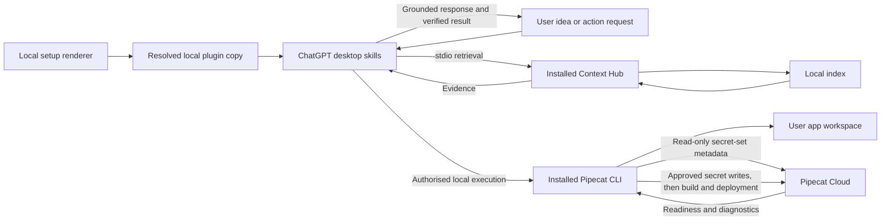
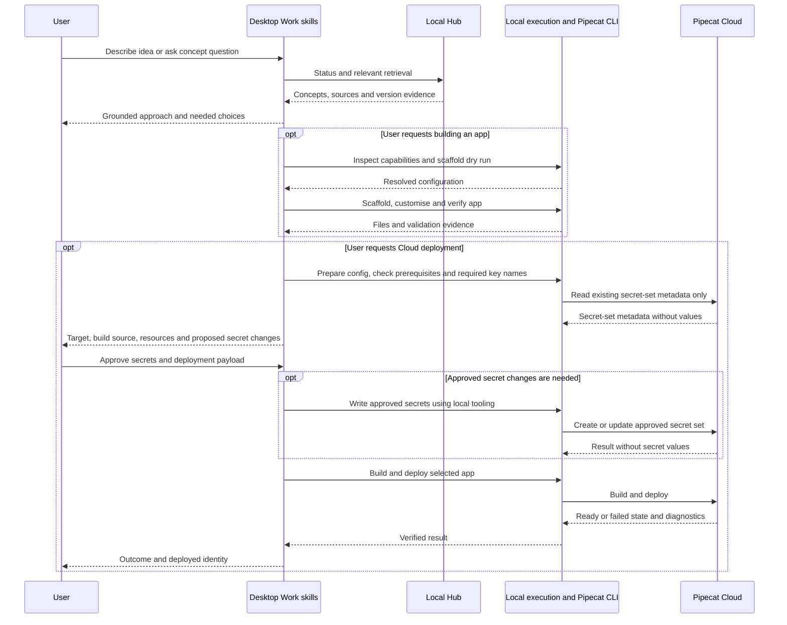

# Local Pipecat plugin: idea to Cloud deployment experiment

**Status**: In Progress — Phase 1 desktop MCP retest pending
**Component**: plugin packaging, retrieval instructions, CLI workflows
**Branch**: `feature/chatgpt-local-plugin`
**Created**: 2026-10-02
**Updated**: 2026-10-03

## Objective

Test a local desktop plugin that helps users describe a voice-agent idea, discover grounded Pipecat concepts, build and test a scaffolded application, and prepare a Pipecat Cloud deployment. A successful experiment includes a separately authorised deployment and verifies that the deployed agent becomes ready.

## Scope

Ship one plugin with explore, build and deploy skills. Context Hub supplies concepts, docs, definitions, examples and compatibility evidence over local stdio. The installed Pipecat CLI supplies scaffolding and Cloud operations through the host's local execution tools. Neither CLI is bundled as a copied executable or made a mandatory dependency of the hub's Python package.

Target ChatGPT desktop Work with local execution, and Codex local execution. Discussion-only usage may retrieve material but must not claim it can create files or deploy without execution tools. Native Plugin Settings, a dedicated UI, hosted retrieval and a new CLI-execution MCP adapter are outside this experiment. Start with framework-version and source preferences stated in the conversation. If the host lacks required local execution or stdio support, stop that workflow and report the missing capability; an adapter would require a separate design.

Queries must not silently refresh or replace the index. Discussing an idea does not authorise scaffolding, uploading secrets or deploying. Prepare concrete files and validation evidence before asking for final deployment approval.

## Requirements

- R1: Explore retrieves relevant concepts and sources before making Pipecat-specific API assertions; use ` + ` or ` & ` for multi-concept hub queries.
- R2: Status establishes index readiness and indexed framework provenance. An unavailable requested version is a limitation, not permission to rebuild the index.
- R3: Name the packaged MCP server `pipecat-context-hub-chatgpt-plugin`, independently of the standalone `pipecat-context-hub` registration. Bind hub startup to its installed Python using that executable's bare name and a generated `PATH` containing only its absolute interpreter directory, with `-P -m pipecat_context_hub serve`. The portable loader rejects absolute `command` values; startup must remain independent of desktop working directory and must not fall back to an ambient Python.
- R4: Build discovers installed CLI capabilities, maps user choices to supported scaffold options, validates a dry run, and only creates an app after a build request. Never overwrite or re-scaffold an existing app.
- R5: Deploy preparation validates the project, required runtime key names, selected Cloud organisation/region/agent identity, sizing and build path. Cloud inspection before approval is read-only: inspect existing secret-set metadata and prepare proposed key additions/updates without uploading or creating secrets. Do not print secret values or send them to model-visible context.
- R6: Present one concrete approval payload covering the deployment target, build source, resources, secret-set name and proposed key additions/updates. After the user approves that payload, use supported local tooling to create/update the approved Cloud secrets, then build/deploy through the installed Cloud CLI, check readiness and inspect bounded diagnostic logs. If secrets are already available and no changes are needed, skip the secret write. Failure is not success merely because a command was issued.
- R7: Existing Context Hub server, CLI bridge, install registrations and retrieval semantics remain unchanged. No general shell execution tool is added to the retrieval MCP.

## Verified facts and compatibility boundaries

- At initial plan creation, `pyproject.toml:10–21` declares `pipecat-ai-context-hub` version `0.8.1` with `mcp>=2.0,<3.0`.
- `src/pipecat_context_hub/cli_install.py::_server_command()` resolves `sys.executable` and uses `-P -m pipecat_context_hub serve`. Existing client registration has no ChatGPT route.
- `src/pipecat_context_hub/server/main.py` already provides tool-selection guidance; plugin skills complement it.
- `src/pipecat_context_hub/shared/types.py` exposes tool-specific version and source filters. These do not switch the indexed framework version or implement a universal source filter.
- Existing `plugin.py` is the Pipecat CLI extension, not desktop plugin packaging.
- Live local probes on 2026-10-03: `pipecat --version` reports `1.3.0`; `pipecat init --help` supports `--config`, `--dry-run`, `--deploy-to-cloud` and `--list-options`; `pipecat cloud deploy --help` succeeds and offers build-directory and GitHub-source options.
- A non-interactive scaffold dry run succeeded with explicit web bot type, SmallWebRTC, cascade, Deepgram/OpenAI/Cartesia, no client and Cloud files enabled. These are probe inputs, not defaults for users. Omitting `--bot-type` failed on this installed CLI, despite newer upstream guidance describing inference. This version has no `--eval` scaffold flag in its help.
- `pipecat-context-hub install --print-config` returned the pinned launch configuration without registering a client or refreshing the index.
- Official OpenAI documentation supports local shell/files in desktop Work when available to the account/workspace. Documentation support is not evidence of activation in the user's specific target chat; Phase 1 records retrieval and execution capabilities separately.

## Implementation Checklist

### Phase 1: Prove the desktop and installed-tool path

- Retrieval outcome: resolve the installed hub interpreter, check index readiness without refresh, add the minimal plugin template and local renderer, then prove desktop discovery, explore-skill activation and stdio initialize/status. This gates Phase 2.
- Execution outcome: separately check local shell availability with a harmless command, and inspect Pipecat CLI versions/help when installed. This gates Phase 3 only; absent shell access or CLI must not block working retrieval.
- Cloud outcome: when the optional Cloud CLI is present, record command discovery; account/auth readiness remains a Phase 4 gate. Its absence does not block Phases 2 or 3.
- Capture independent retrieval/execution/Cloud availability, host mode, versions, command/argv and pass/fail evidence without machine paths in committed templates.
- If retrieval fails, stop the retrieval-dependent work and re-plan. If an optional capability is missing, mark only its dependent workflow unavailable and continue independent work. Do not substitute an untested execution adapter.

### Phase 2: Complete grounded exploration

Depends only on Phase 1's retrieval outcome. Define idea and concept workflows, source citations, version/source preference mapping and ambiguity handling. Test read-only conversations, including unsupported-filter and unavailable-version cases. The package can ship exploration without local shell access, the Pipecat CLI or Cloud credentials.

### Phase 3: Add build and local verification

Depends on Phase 2 and Phase 1's execution outcome. If local shell access or the Pipecat CLI is unavailable, report build as unavailable while retaining exploration. Otherwise discover scaffold options from installed help/JSON options, resolve user choices, validate `--dry-run`, then create a new app in an explicitly selected empty directory. Use generated structure and dependency pins; customise against retrieved APIs. Run project-appropriate import/startup and behavioural checks. Use upstream eval support only if the installed CLI actually supports it; otherwise record an explicit local verification method. No provider choice or credentials are invented.

### Phase 4: Prepare and exercise Cloud deployment

Depends on Phase 3 and available Cloud CLI/account prerequisites. If Cloud prerequisites are absent, retain exploration/build and report deployment as unavailable. Inspect installed Cloud command help, validate Dockerfile/deploy configuration and image architecture versus region, and check account/auth readiness. User performs browser login when needed. Before approval, inspect only required key names and existing Cloud secret-set metadata, and prepare a local upload plan; do not create, update or upload Cloud secrets. Local `.env` is not assumed to reach Cloud automatically. Present one concrete payload identifying organisation, region, agent, build source, resources, secret-set name and proposed key additions/updates for final approval. After approval, use supported local tooling to write only those secrets without exposing values to transcripts, then build/deploy, inspect readiness and bounded logs, and run an explicitly approved agent session if needed to verify behaviour. If a proposed secret change or deployment target changes after approval, present the revised payload before executing it. Document the deployed identity and cleanup instructions; do not delete deployments or automatically roll back by deleting data.

### Phase 5: Evaluate, review and document

Evaluate each workflow as its prerequisites become available; finish the live build/deploy cases after Phases 3 and 4 run. Complete the evaluation matrix, distinguish package checks from actual desktop outcomes, and document prerequisites and version limitations. Run proportional package/setup checks, the full repo quality gate before a PR, documentation review, code review and security review. Keep focused commits; no push/PR/merge is implied by plan completion. Missing optional prerequisites mark dependent workflows unavailable/untested and do not prevent recording successful exploration; a missing Cloud account or approval leaves live deployment explicitly untested, not silently passed. The full experiment remains incomplete until its live acceptance targets are demonstrated.

## Technical Specifications

### New files to create

- `plugins/pipecat-context-hub/plugin.json`: portable plugin identity; OpenAI presentation metadata only where supported by current schema.
- `plugins/pipecat-context-hub/mcp.template.json`: source template for the uniquely named `pipecat-context-hub-chatgpt-plugin` stdio entry, with explicit interpreter-name and interpreter-directory placeholders; never register this unresolved template directly.
- `plugins/pipecat-context-hub/scripts/prepare_local.py`: standard-library renderer run with the installed hub Python. Check the hub is importable, require exactly the unique packaged server entry, copy package resources to a user-selected local destination outside the checkout, and write schema-compatible root `mcp.json` with the bare name of `sys.executable`, `PATH` restricted to its absolute parent directory, `-P`, module and `serve`. Preserve interpreter symlinks so virtual-environment identity is retained. Refuse overwriting a nonempty destination. Preserve the source template, exclude repository evaluation reports and emit no credentials.
- `plugins/pipecat-context-hub/skills/explore/SKILL.md`: retrieve concepts, docs, definitions and examples; synthesise with evidence and explicit limitations.
- `plugins/pipecat-context-hub/skills/build/SKILL.md`: preflight host execution, CLI discovery, dry run, scaffold, customise and verify.
- `plugins/pipecat-context-hub/skills/deploy/SKILL.md`: prepare target/config/secrets, obtain concrete approval, execute and verify Cloud deployment.
- `plugins/pipecat-context-hub/README.md`: prerequisites, rendering, verified installation flow, host-mode distinction, version compatibility, update/re-render and removal instructions.
- `docs/evaluations/pipecat-context-hub-plugin.md`: repository-owned frozen prompts, expected outcomes and results template; no live credentials. This report is not an installed plugin resource.
- `tests/unit/test_chatgpt_plugin_setup.py`: renderer validation and refusal paths, pinned launch assertions and package-copy boundaries.

### Files to modify

`docs/setup/README.md` and `docs/README.md` link the optional desktop workflow. Update this plan and its index with progress and results. Do not modify the existing Pipecat CLI bridge or shared server handlers for this packaging experiment.

### Architecture decisions

Use a generated local copy to bind the installed interpreter; keep machine-specific paths out of the portable source package. Portable stdio commands use an executable name plus a generated `PATH` containing only the installed interpreter directory, rather than an absolute command rejected by the host loader. The packaged MCP server has a unique identity; keep the standalone registration unchanged. Evaluation reports stay under `docs/evaluations/` and are excluded from generated packages. The renderer is a setup operation, not a tool invoked during queries. Re-render into a fresh local copy after plugin/interpreter updates and use the host's documented refresh/reinstall flow.

Use native local shell tools in desktop Work/Codex for the Pipecat CLI; skills are instructions, not executable permissions. The Cloud optional extension is installed separately when a user needs deployment. Help-derived capability checks take precedence over assumptions from newer docs. Builds and Cloud operations occur in the user's app workspace, not this repository.

Retrieval, local execution/Pipecat CLI and Cloud readiness are separate gates. Missing optional capabilities disable only the workflows that require them; working hub retrieval remains usable without local shell or either optional CLI.

Secret mutation is an explicit approved Cloud operation, distinct from read-only deployment preparation. Include proposed secret creation/update in the same concrete approval payload as the deployment. Preapproval checks expose only key names and secret-set metadata; after approval, supported local tooling transfers secret values directly without returning them to model context. Upload secrets before starting the approved build/deploy so required runtime secrets are available at startup.

### Integration Seams

| Producer | Consumer | Contract |
|---|---|---|
| Setup renderer | Desktop plugin loader | Root portable manifest, skill directories and resolved `mcp.json`; installed executable with safe argv |
| ChatGPT explore skill | Hub MCP | Supported tool arguments, multi-concept delimiters, local index provenance and cited results |
| ChatGPT build/deploy skills | Host local execution tools | User-authorised project workspace and actual installed CLI capabilities; no ambient execution assumption |
| Pipecat scaffold | Build skill | Generated structure, dependency pins and named environment requirements |
| Local Cloud CLI | Pipecat Cloud | Read-only metadata inspection before approval; approved secret creation/update precedes approved build/deploy; identity/config, authentication, readiness and redacted diagnostics |

## Architecture & Call Flow

| Step | Trigger | Enters context | Cleared/persisted | Turn boundary |
|---|---|---|---|---|
| Setup | Local rendering and install | Package identity and connection metadata | Local plugin copy; no secrets in package | Before experiment chat |
| Explore | Idea/concept request | Requirements, preferences, indexed version and retrieved evidence | Conversation history; corpus stays on disk | User and tool turns |
| Build | Explicit build request | Supported options, dry-run result, code and test output | User project files; credentials remain local | Assistant tool rounds |
| Prepare deployment | Deployment request | Target, region, resources, key names, existing secret-set metadata and proposed changes | Local configuration/upload plan; no Cloud mutations or secret values in chat | Before approval |
| Write secrets | Concrete payload approval, when changes are needed | Redacted result and approved key names | Approved Cloud secret set; values stay out of chat | After approval, before build/deploy |
| Deploy | Concrete user approval | Deployment identity, readiness and redacted diagnostics | Cloud deployment and recorded result | Approval and tool rounds |

## Testing Notes

| Case | Expected evidence |
|---|---|
| Template rendering | Portable root files, exactly the unique packaged MCP server, bare executable with `PATH` restricted to its installed directory and safe argv; no unresolved placeholder or repository evaluation report in generated package |
| Host MCP loader | Installed Codex `plugin/read` discovers the unique server; freeze the absolute-command rejection and verify the generated configuration passes the real loader, separately from desktop activation |
| Destination exists or hub absent | Clear error, no overwrite or partial registration |
| Host feasibility | Actual skill discovery, stdio initialize/status and harmless shell execution in selected desktop mode |
| Optional shell/CLI absent | Retrieval still activates and answers with sources; build is unavailable without shell/Pipecat CLI, and Cloud absence does not block working exploration/build |
| Unrelated/shadow-module cwd | Packaged launch completes initialize/status using installed hub, not a same-named shadow module |
| Idea versus concept prompts | Relevant retrieved material and sources precede Pipecat API assertions |
| Unavailable version; empty/stale index | Limitation/remediation disclosure; no initiated refresh/replacement; before/after version and refresh metadata |
| Source preference; unsupported filter; missing compatibility | Only supported arguments, explicit corpus limitations and no invented compatibility |
| Build request | Real options/help inspection, valid dry run and generated project; no writes on idea-only prompt |
| Existing project | No overwrite/re-scaffold; adapt existing structure |
| CLI capability drift | Installed 1.3.0 versus newer documented flags handled through discovery; unsupported flags never blindly invoked |
| Cloud auth/keys unavailable | Preparation remains incomplete with specific prerequisites; no secret values in outputs |
| Deployment declined or not yet approved | Read-only preparation only; no secret create/update/upload, build/deploy or agent-session start |
| Approved deployment | Only approved secret changes are written before approved build/deploy; correct target/configuration, readiness evidence and bounded redacted diagnostics |
| Failed deploy | Explicit failure with actionable diagnostics; no false completion |

Each run records prompt, host mode, CLI/framework versions, actual tool calls, cited response, latency and pass/fail/untested outcomes. Freeze at least 12 prompts across these cases. Local setup tests cannot establish model activation or successful Cloud behaviour.

Before a PR run `uv run ruff format src/ tests/`, `uv run ruff check src/ tests/`, `uv run mypy src/ tests/` and `uv run pytest tests/ -q`; review formatter changes and preserve unrelated work. Include the renderer path in formatting/lint checks. Retrieval handlers are unchanged; the new package still requires a real stdio smoke using its generated command.

## Review Focus

Portable OpenAI plugin packaging and host capability boundary; pinned launch independent of cwd; no index refresh during retrieval; version/source limitations; installed CLI discovery; no writes on discussion-only requests; deployment approval and credential isolation; verify ready state rather than command issuance.

## Acceptance Criteria

- Actual desktop discovery and stdio connection are demonstrated with the rendered local package.
- Idea/concept workflows retrieve relevant evidence and disclose version/source limitations.
- A build request produces a scaffolded app using installed CLI capabilities and verifies it locally.
- Deployment preparation produces concrete reviewed configuration and proposed secret changes without Cloud mutation or exposure of credential values. Approved secret changes occur before the approved build/deploy.
- Missing optional CLI, shell or Cloud prerequisites leave working exploration usable and disable only dependent workflows.
- Live Cloud deployment runs only after target/payload approval and is verified ready; missing prerequisites remain explicitly untested.
- All evaluation results distinguish observed passes, failures and untested behaviour.
- Existing hub CLI/server behavior and registrations are preserved.

## References

- https://developers.openai.com/plugins/build/plugins
- https://learn.chatgpt.com/docs/extend/mcp
- https://learn.chatgpt.com/docs/use-chatgpt
- https://learn.chatgpt.com/docs/enterprise/chatgpt-work-local-security
- https://github.com/pipecat-ai/pipecat/blob/main/src/pipecat/cli/agent_templates/AGENTS.md

<!-- reviewed: 2026-10-04 @ a50b5abfe2dfd0d13d6a97f467c9f2cbac7b8319 -->

## Progress

- [ ] Phase 1: Prove the desktop and installed-tool path
- [ ] Phase 2: Complete grounded exploration
- [ ] Phase 3: Add build and local verification
- [ ] Phase 4: Prepare and exercise Cloud deployment
- [ ] Phase 5: Evaluate, review and document

- Initial draft committed; original five-lens review completed with one Important setup finding and three Minor testing gaps.
- User authorised inclusion of Pipecat CLI and Cloud workflow on 2026-10-03. Expanded scope and all four original findings are incorporated here; this is not proof of a fresh review.
- Live command help and scaffold dry run verified. No app was created, index refreshed, secrets uploaded or deployment started.
- Expanded implementation phases and desktop/Cloud workflow were unimplemented at the second review; acceptance and execution results follow below.
- Second five-lens review completed with three Important findings and zero contradictions; user requested all fixes on 2026-10-03. Secret approval boundaries and capability gates are now explicit; fixes require final acceptance before publishing the review marker.
- Post-fix checks passed: capability gates are separate, the sequence places approval before secret writes and secret writes before build/deploy, and obsolete conflicting wording is absent. A fresh independent contradiction pass found zero contradictions and confirmed the fixes are compatible.
- User accepted publication of the review marker on 2026-10-03. The implementation section heading was normalised for conduct's parser without changing phase scope.
- Conduct Phase 1 prepared and installed the minimal local package on 2026-10-03. Renderer formatting/lint, nonempty-destination refusal, and real generated-command stdio initialize/status passed from ordinary and shadow-module working directories; refresh/version metadata remained unchanged. Local shell, Pipecat CLI and Cloud command discovery passed. Desktop explore-skill activation is unobserved, so Phase 1 remains incomplete and conduct stopped before the test-writer, canonical tests or a phase-boundary commit.
- Resume prerequisite: safely refresh/restart the desktop, open a new local chat, confirm the installed Pipecat Context Hub explore skill is discoverable, and exercise evaluation prompt 1 with plugin-owned initialize/status evidence. Package/subprocess checks do not establish this host outcome. No later phase ran.
- Follow-up desktop report on 2026-10-03 confirms the packaged explore skill loaded and plugin 0.1.0 enabled. Plugin-owned MCP activation remains unverified: observed Hub processes use the existing registration's argv without `-P`. Both the package and existing registrations use the server name `pipecat-context-hub`; this is a possible collision to investigate, not a confirmed root cause.
- `search_docs("TTS + STT")` failed on the existing MCP connection with Chroma `Internal error: Error finding id`. The same query failed from a fresh installed-Hub Python process with `-P`, so restarting an old MCP process alone does not resolve the observed failure. Status still succeeds. No refresh or index mutation was performed; refresh date, record count and indexed framework version remained unchanged. Keep packaged MCP activation and this retrieval/index failure as separate open checks.
- Desktop evidence recorded on 2026-10-03: the Codex skill catalogue exposes the installed 0.1.0 explore skill, its packaged instructions were read and invoked, and the plugin is enabled. The available Hub connection returned 45,411 records, indexed framework 1.12.0 with zero commits ahead, and an enabled reranker. STT/TTS/pipeline docs and two framework pipeline examples were retrieved with source URLs; refresh timestamp and framework provenance were unchanged.
- Desktop MCP ownership remains unresolved: a same-name manual MCP registration is present, and observed Hub processes use `-m pipecat_context_hub serve` while the package declares `-P -m pipecat_context_hub serve`. These successes prove packaged skill activation and existing Hub retrieval, but do not yet prove the package-owned desktop initialize/status outcome. Resume Phase 1 to audit that remaining gate before Phase 2.
- Retrieval limitation frozen in the evidence record: `search_docs("TTS + STT")` and a narrower docs search returned `Internal error: Error finding id`; direct lookups under `/pipecat/learn/*.md` succeeded. No index refresh or retrieval-handler change was made.
- Autonomous conduct resume on 2026-10-03 accepted the existing review marker and dispatched a fresh Phase 1 implementer sequentially. Its read-only ownership audit confirmed installed/enabled plugin and safe cached argv, but found no attributable package-owned desktop initialize/status trace. The worker reported blocked; conduct persisted that result before dispatching a test-writer, running canonical tests or making a phase-boundary commit. Phase 2 and later phases did not run.
- User authorised a packaging correction on 2026-10-03: give the packaged MCP connection the unique identity `pipecat-context-hub-chatgpt-plugin` and move the evaluation report to repository docs before another desktop activation test. The standalone MCP registration and plugin manifest identity remain unchanged. This is a test of the suspected name collision, not proof of its cause or of host activation. The amended contract requires marker refresh by conduct's resume preflight.
- Packaging correction verified locally: nine renderer regressions passed, including the exact unique server key, safe argv and interpreter-symlink preservation, exclusion of repository evaluation files, and refusal of legacy/additional server entries, unsafe launch templates, nonempty destinations, checkout destinations and unavailable Hub imports. Targeted Ruff format/check and mypy passed. The evaluation report and repository setup links now point to `docs/evaluations/pipecat-context-hub-plugin.md`. Desktop installation/activation of the renamed connection remains the next test; these checks do not mark Phase 1 complete.
- Autonomous resume after the correction refreshed the amended review marker and resynchronised the Codex state hash, then dispatched a fresh Phase 1 implementer sequentially because phase file slots are absent. Supported local reinstallation succeeded from the fresh source under the existing marketplace/plugin identity. The installed cache now has exactly `pipecat-context-hub-chatgpt-plugin` with the safe argv and excludes the evaluation report. The running chat still exposes only standalone Hub tools; no attributable package-owned desktop initialize/status was observed. Native desktop inspection was refused by the computer-use tool. The worker reported blocked, so conduct persisted Phase 1 as blocked and released its lock before any test-writer, canonical tests or boundary commit. Restart the desktop and run the report's retest prompt in a new local chat, then resume. Before/after Hub status confirmed the refresh timestamp, record count and framework provenance unchanged; the docs-search error remains independently unresolved.
- User's new-chat retest on 2026-10-03 still found only the standalone connection. A local diagnostic app-server reproduced the loader failure: `plugin/read` returned no packaged MCP servers and stderr reported `Agent Plugins stdio command must be a bare executable name or a contained ./ path`. Four isolated package variants confirmed that the absolute-command package and an OpenAI legacy override were rejected, while a bare executable with a pinned interpreter-only `PATH` and a contained launcher were discovered. The bare-command variant launched the exact installed virtual-environment Python from a shadow-module cwd. The contract now uses that minimal portable binding; the standalone registration and retrieval semantics remain unchanged. Real loader acceptance must accompany renderer regressions; desktop initialize/status remains an independent gate.
- A fresh delegated implementer corrected the renderer/template and updated package guidance, qualification tests and evaluation evidence. Fifteen renderer regressions, targeted Ruff format/check and mypy passed before its terminal report. Supported rendering/reinstallation succeeded under the existing identity; accepted-source and installed-cache `mcp.json` bytes match. Real Codex `plugin/read` now discovers the unique server, and generated-command stdio initialize/status passes from ordinary and shadow-module directories with unchanged index provenance and no shadow import. The direct-cache diagnostic with an unsupported marketplace source path was inconclusive and is not counted as a loader pass. The worker's final report still blocks Phase 1 on actual desktop activation, so conduct saved that blocker and released the lock without a test-writer, canonical phase test run or boundary commit. Reload/restart the desktop and repeat the unique-connection retest in a new local chat.

- User requested ordinary focused commits for the prepared work on 2026-10-03. Commit `f7994bf` records the local exploration plugin, portable launch correction, renderer regressions and evaluation evidence; repository setup and plan links are recorded separately. Fifteen renderer tests and targeted Ruff/mypy passed again before committing, and the staged secret/PII scan found no matches. Phase 1 remains pending actual desktop activation; conduct state has no completed phases.

## Findings

- Conduct resume on 2026-10-03 dispatched a fresh Phase 1 implementer sequentially because phase file slots are absent. The runtime now exposes the uniquely named packaged tools, and an actual `mcp__pipecat_context_hub_chatgpt_plugin__get_hub_status({})` call succeeded, establishing desktop activation. Its first-call baseline was 45,448 records, refresh `2026-10-04T06:34:32.826220+00:00`, framework pin `latest`, indexed framework 1.12.0 with zero commits ahead and enabled reranker; this differed from the historical snapshot before any probes in this run. No refresh was initiated. Four subsequent packaged docs/API/example/page probes returned `Transport closed`, and a sequential status retry confirmed the closed connection. Exact query/filter arguments are frozen in the evaluation report. Shell and installed CLI/help discovery passed. Conduct validated the implementer's blocked report and persisted Phase 1 as blocked, with no completed phases, test-writer, canonical test run or phase-boundary commit. Desktop ownership is resolved; usable retrieval is the new blocker. Raw initialize response/startup argv and the previous documentation errors remain unverified or unresolved as recorded.

- Commit preparation on 2026-10-03 ran the full local gate: Ruff passed for source, tests and the renderer; mypy passed for 123 files; pytest reported 1,835 passed and 7 skipped. Targeted formatting made no changes. The reviewed contract hash matched, and a direct template/AST assertion confirmed the unique server and fixed-argv, shell-free startup probe. Bandit's single low B404 import warning was reviewed and remains disclosed in the evaluation report. These checks do not resolve desktop attribution or documentation retrieval, and do not advance conduct's phase state.

- User-reported desktop retest on 2026-10-03 states that the installed explore skill used `pipecat-context-hub-chatgpt-plugin` and returned 45,411 records, a September 26 refresh date, indexed framework 1.12.0 and an enabled reranker. API and example excerpts were retrieved with pinned source links, while `search_docs("TTS + STT")` still errored and direct page lookups returned `Not Found`. Examples were partial and not run; no refresh occurred. The evaluation report records this as user-reported status/API/example success. An actual unique-connection initialize/status trace and startup argv were not supplied, so independent attribution and conduct's Phase 1 completion remain pending.

### Original review resolutions

- Setup binding: generated local package copy owns the resolved interpreter configuration; minimal host feasibility precedes completed workflows.
- Index preservation: negative evaluations compare refresh/version metadata and require explicit remediation rather than mutation.
- Working directory: actual packaged launch is exercised with a shadow-module cwd.
- Preferences: evaluation matrix includes unsupported filters, version mismatch and absent compatibility evidence.

### Current limitations

The installed CLI reports version 1.3.0 and differs from current upstream scaffold documentation. Packaged explore-skill activation and an attributable packaged desktop MCP status call are observed in Codex local. Subsequent retrieval calls and a status retry failed with `Transport closed`, so usable retrieval remains blocked. Raw initialize/startup traces and Cloud account/secret readiness remain unverified. The persisted second-review JSON describes the expanded plan before these fixes; it remains the historical findings record, not a claim that the updated bytes were re-reviewed by all five lenses. User acceptance permits publication of the review marker.

### Second review resolutions

- Architecture ambiguity and secret-write ordering: preparation remains read-only; the concrete deployment approval includes proposed secret-set/key changes, and approved secret writes precede approved build/deploy. Requirements, phases, call flow, integration seam and evaluation expectations express the same boundary.
- Optional capability gate: exploration depends only on retrieval readiness; building requires local execution/Pipecat CLI, and deploying additionally requires Cloud readiness. Missing optional capabilities no longer block independent retrieval or its evaluation.

## Final Results

Minimal Phase 1 prototype is committed in `f7994bf` and locally validated. Packaged skill activation and historical sourced retrieval are recorded; the user's retest reports successful status/API/example retrieval through the unique connection with failed documentation-page retrieval. The latest conduct resume independently established packaged desktop activation with an actual named status call, but subsequent retrieval calls and the status retry returned `Transport closed`. Phase 1 therefore remains blocked on usable retrieval, with no completed conduct phases. The corrected portable launch, loader acceptance, source/cache parity, ordinary/shadow-cwd subprocess qualification, fifteen renderer regressions and full local quality gate remain historical passes. The latest first-call baseline differed from the historical snapshot before probing; this run initiated no refresh or index mutation, and the closed connection prevented an after-status comparison. Conduct validated and saved the new worker blocker without a test-writer, canonical test run or phase-boundary commit. Later workflows and live deployment remain pending. Installed Hub 0.8.0 and checkout 0.8.1 are distinguished. Raw initialize/startup traces and the previous Chroma docs-search/direct-page failures remain unverified or unresolved as recorded.
