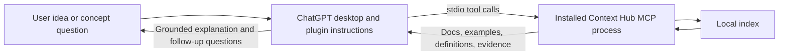
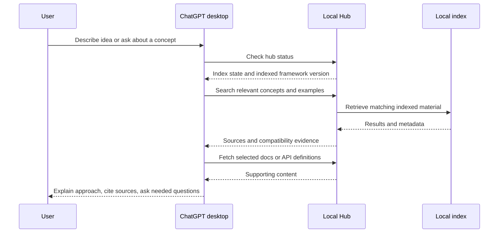

# Local ChatGPT Context Hub plugin experiment

**Status**: Not Started — architecture confirmation pending
**Component**: plugin packaging, retrieval instructions
**Branch**: `feature/chatgpt-local-plugin`
**Created**: 2026-10-02

## Objective

Test ChatGPT desktop helping users turn voice-agent ideas into grounded Pipecat building blocks, and answer concept questions using definitions, docs and examples from the local Context Hub.

## Scope

Package the existing local stdio server with retrieval workflow instructions, setup documentation and representative evaluation prompts. Keep the corpus local. Start with conversational framework-version and source preferences; native Plugin Settings are a later experiment. Do not silently refresh or replace the user's index during queries.

## Verified codebase facts

- `pyproject.toml:10–21`: package `pipecat-ai-context-hub`, version `0.8.1`, dependency `mcp>=2.0,<3.0`.
- `src/pipecat_context_hub/cli_install.py:94`: existing registration pins the interpreter and launches `-P -m pipecat_context_hub serve`; reuse this launch invariant.
- `src/pipecat_context_hub/server/main.py:95–110`: server already supplies tool-selection guidance; bundled instructions must complement it.
- `src/pipecat_context_hub/shared/types.py:304–347,619–664`: API/example version filtering is tool-specific, not a universal corpus-version selector.
- `src/pipecat_context_hub/shared/config.py:57,153`: local data-directory override exists; default corpus remains `~/.pipecat-context-hub`.
- Existing `plugin.py` is a Pipecat CLI bridge, not ChatGPT plugin packaging. No desktop plugin manifest currently exists.
- Related command-pinning, CLI-plugin, global-config and MCP-migration plans were checked. This additive package does not supersede their contracts.

## Technical Specifications

Candidate package location: `plugins/pipecat-context-hub/`, containing portable manifest, stdio MCP configuration, retrieval skill, setup guide and evaluation prompts. Exact installation/registration details must be validated against the desktop host before claiming success.

### Integration Seams

The package must launch the installed interpreter with `-P`, independent of the desktop working directory. ChatGPT chooses supported tool arguments; the hub retains retrieval responsibility. Return source references and compatibility evidence without inventing unsupported filters. Installation requires an existing populated local index.

## Architecture & Call Flow

| Step | Trigger | Enters context | Cleared/persisted | Turn boundary |
|---|---|---|---|---|
| 1 | User request | Idea, constraints and stated preferences | Conversation history | User turn |
| 2 | Plugin activation | Retrieval workflow instructions | Host-managed skill context | Assistant turn |
| 3 | Status and retrieval calls | Indexed version, sources, content and compatibility | Results enter chat; corpus stays on disk | Tool round trips |
| 4 | Answer and follow-up | Grounded explanation and unresolved requirements | Conversation history; no new preference store | Assistant reply |

## Testing Notes

Validate package schemas and launch configuration, perform a real MCP initialization/status round trip, and test idea/concept prompts in ChatGPT desktop. Record actual tool selection, evidence quality, version handling and latency. Package validation is not proof of ChatGPT activation or orchestration.

## Acceptance Criteria

- Local desktop host discovers the skill and connects to the installed stdio hub.
- Idea and concept workflows retrieve supporting sources before asserting Pipecat-specific APIs.
- Version/source preferences use only supported filters and disclose corpus limitations.
- Evaluation outcomes distinguish passed checks from untested desktop behavior.

## Progress

- Repo and official packaging requirements inspected; feature branch created.
- Architecture drafted; implementation phases and review remain pending confirmation.

## Final Results

Not implemented or installed yet.

## References

- https://developers.openai.com/plugins/build/plugins
- https://learn.chatgpt.com/docs/extend/mcp
