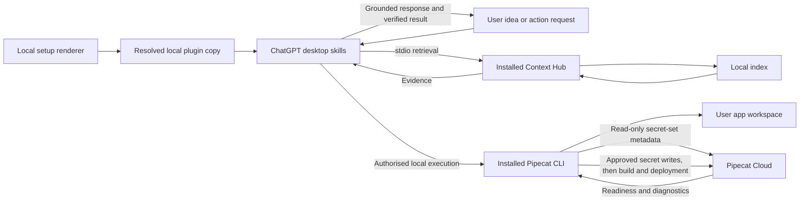
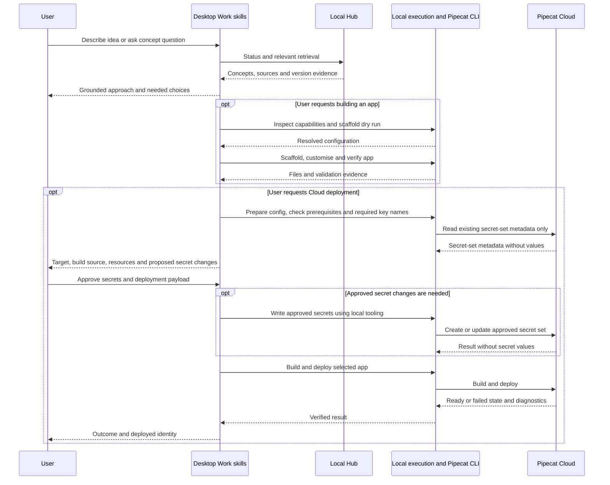

# Local Pipecat plugin: idea to Cloud deployment experiment

**Status**: Complete — local Codex acceptance; ChatGPT Work remains unqualified
**Component**: plugin packaging, retrieval instructions, CLI workflows
**Branch**: `feature/chatgpt-local-plugin`
**Created**: 2026-10-02
**Updated**: 2026-10-05

## Objective

Test a local desktop plugin that helps users describe a voice-agent idea, discover grounded Pipecat concepts, build and test a scaffolded application, and prepare a Pipecat Cloud deployment. A successful experiment includes a separately authorised deployment and verifies that the deployed agent becomes ready.

## Scope

Ship one plugin with explore, build and deploy skills. Context Hub supplies concepts, docs, definitions, examples and compatibility evidence over local stdio. The installed Pipecat CLI supplies scaffolding and Cloud operations through the host's local execution tools. Neither CLI is bundled as a copied executable or made a mandatory dependency of the hub's Python package.

Target ChatGPT desktop Work with local execution, and Codex local execution. Discussion-only usage may retrieve material but must not claim it can create files or deploy without execution tools. Native Plugin Settings, a dedicated UI, hosted retrieval and a new CLI-execution MCP adapter are outside this experiment. Start with framework-version and source preferences stated in the conversation. If the host lacks required local execution or stdio support, stop that workflow and report the missing capability; an adapter would require a separate design.

Queries must not silently refresh or replace the index. Discussing an idea does not authorise scaffolding, uploading secrets or deploying. Prepare concrete files and validation evidence before asking for final deployment approval.

## Requirements

- R1: Explore retrieves relevant concepts and sources before making Pipecat-specific API assertions; use ` + ` or ` & ` for multi-concept hub queries.
- R2: Status establishes index readiness and indexed framework provenance. An unavailable requested version is a limitation, not permission to rebuild the index.
- R3: Name the packaged MCP server `pipecat-context-hub-chatgpt-plugin`, independently of the standalone `pipecat-context-hub` registration. Bind hub startup to its installed Python using that executable's bare name and a generated `PATH` containing only its absolute interpreter directory, with `-P -m pipecat_context_hub serve`. The portable loader rejects absolute `command` values; startup must remain independent of desktop working directory and must not fall back to an ambient Python.
- R4: Build discovers installed CLI capabilities, maps user choices to supported scaffold options, validates a dry run, and only creates an app after a build request. Never overwrite or re-scaffold an existing app.
- R5: Deploy preparation validates the project, required runtime key names, selected Cloud organisation/region/agent identity, sizing and build path. Cloud inspection before approval is read-only: inspect existing secret-set metadata and prepare proposed key additions/updates without uploading or creating secrets. Do not print secret values or send them to model-visible context.
- R6: Present one concrete approval payload covering the deployment target, build source, resources, secret-set name and proposed key additions/updates. After the user approves that payload, use supported local tooling to create/update the approved Cloud secrets, then build/deploy through the installed Cloud CLI, check readiness and inspect bounded diagnostic logs. If secrets are already available and no changes are needed, skip the secret write. Failure is not success merely because a command was issued.
- R7: Existing Context Hub server handlers, CLI bridge, install registrations and retrieval semantics remain unchanged. A bounded exception permits a read-only pre-open check for oversized persisted HNSW link-list files, using the existing index-unready error/remediation path. This check must precede native Chroma client construction, must not repair or delete index files, and does not assert that other corruption shapes are detected. No general shell execution tool is added to the retrieval MCP.

## Verified facts and compatibility boundaries

- At initial plan creation, `pyproject.toml:10–21` declares `pipecat-ai-context-hub` version `0.8.1` with `mcp>=2.0,<3.0`.
- `src/pipecat_context_hub/cli_install.py::_server_command()` resolves `sys.executable` and uses `-P -m pipecat_context_hub serve`. Existing client registration has no ChatGPT route.
- `src/pipecat_context_hub/server/main.py` already provides tool-selection guidance; plugin skills complement it.
- `src/pipecat_context_hub/shared/types.py` exposes tool-specific version and source filters. These do not switch the indexed framework version or implement a universal source filter.
- Existing `plugin.py` is the Pipecat CLI extension, not desktop plugin packaging.
- Live local probes on 2026-10-03: `pipecat --version` reports `1.3.0`; `pipecat init --help` supports `--config`, `--dry-run`, `--deploy-to-cloud` and `--list-options`; `pipecat cloud deploy --help` succeeds and offers build-directory and GitHub-source options.
- A non-interactive scaffold dry run succeeded with explicit web bot type, SmallWebRTC, cascade, Deepgram/OpenAI/Cartesia, no client and Cloud files enabled. These are probe inputs, not defaults for users. Omitting `--bot-type` failed on this installed CLI, despite newer upstream guidance describing inference. This version has no `--eval` scaffold flag in its help.
- `pipecat-context-hub install --print-config` returned the pinned launch configuration without registering a client or refreshing the index.
- Official OpenAI documentation supports local shell/files in desktop Work when available to the account/workspace. Documentation support is not evidence of activation in the user's specific target chat; Phase 1 records retrieval and execution capabilities separately.

## Implementation Checklist

### Phase 1: Prove the desktop and installed-tool path

- Crash prerequisite (2026-10-04): reject an oversized persisted HNSW graph before native loading; regress the actual `TTS + STT` query against a synthetic corrupt index and prove healthy persisted indexes still reopen and search. Agents must not initiate live index recovery or refresh. A user-performed refresh supplies a new read-only baseline. Conduct recomputes the review-marker hash on resume; record that hash update separately from a new plan review.
- Retrieval outcome: resolve the installed hub interpreter, check index readiness without refresh, add the minimal plugin template and local renderer, then prove desktop discovery, explore-skill activation and stdio initialize/status. This gates Phase 2.
- Execution outcome: separately check local shell availability with a harmless command, and inspect Pipecat CLI versions/help when installed. This gates Phase 3 only; absent shell access or CLI must not block working retrieval.
- Cloud outcome: when the optional Cloud CLI is present, record command discovery; account/auth readiness remains a Phase 4 gate. Its absence does not block Phases 2 or 3.
- Capture independent retrieval/execution/Cloud availability, host mode, versions, command/argv and pass/fail evidence without machine paths in committed templates.
- If retrieval fails, stop the retrieval-dependent work and re-plan. If an optional capability is missing, mark only its dependent workflow unavailable and continue independent work. Do not substitute an untested execution adapter.

### Phase 2: Complete grounded exploration

Depends only on Phase 1's retrieval outcome. Define idea and concept workflows, source citations, version/source preference mapping and ambiguity handling. Test read-only conversations, including unsupported-filter and unavailable-version cases. The package can ship exploration without local shell access, the Pipecat CLI or Cloud credentials.

### Phase 3: Add build and local verification

Depends on Phase 2 and Phase 1's execution outcome. If local shell access or the Pipecat CLI is unavailable, report build as unavailable while retaining exploration. Otherwise discover scaffold options from installed help/JSON options, resolve user choices, validate `--dry-run`, then create a new app in an explicitly selected empty directory. Use generated structure and dependency pins; customise against retrieved APIs. Run project-appropriate import/startup and behavioural checks. Use upstream eval support only if the installed CLI actually supports it; otherwise record an explicit local verification method. No provider choice or credentials are invented.

### Phase 4: Prepare and exercise Cloud deployment

Depends on Phase 3 and available Cloud CLI/account prerequisites. If Cloud prerequisites are absent, retain exploration/build and report deployment as unavailable. Inspect installed Cloud command help, validate Dockerfile/deploy configuration and image architecture versus region, and check account/auth readiness. User performs browser login when needed. Before approval, inspect only required key names and existing Cloud secret-set metadata, and prepare a local upload plan; do not create, update or upload Cloud secrets. Local `.env` is not assumed to reach Cloud automatically. Present one concrete payload identifying organisation, region, agent, build source, resources, secret-set name and proposed key additions/updates for final approval. After approval, use supported local tooling to write only those secrets without exposing values to transcripts, then build/deploy, inspect readiness and bounded logs, and run an explicitly approved agent session if needed to verify behaviour. If a proposed secret change or deployment target changes after approval, present the revised payload before executing it. Document the deployed identity and cleanup instructions; do not delete deployments or automatically roll back by deleting data.

### Phase 5: Evaluate, review and document

Evaluate each workflow as its prerequisites become available; finish the live build/deploy cases after Phases 3 and 4 run. Complete the evaluation matrix, distinguish package checks from actual desktop outcomes, and document prerequisites and version limitations. Run proportional package/setup checks, the full repo quality gate before a PR, documentation review, code review and security review. Keep focused commits; no push/PR/merge is implied by plan completion. Missing optional prerequisites mark dependent workflows unavailable/untested and do not prevent recording successful exploration; a missing Cloud account or approval leaves live deployment explicitly untested, not silently passed. The full experiment remains incomplete until its live acceptance targets are demonstrated.

## Technical Specifications

### New files to create

- `plugins/pipecat-context-hub/plugin.json`: portable plugin identity; OpenAI presentation metadata only where supported by current schema.
- `plugins/pipecat-context-hub/mcp.template.json`: source template for the uniquely named `pipecat-context-hub-chatgpt-plugin` stdio entry, with explicit interpreter-name and interpreter-directory placeholders; never register this unresolved template directly.
- `plugins/pipecat-context-hub/scripts/prepare_local.py`: standard-library renderer run with the installed hub Python. Check the hub is importable, require exactly the unique packaged server entry, copy package resources to a user-selected local destination outside the checkout, and write schema-compatible root `mcp.json` with the bare name of `sys.executable`, `PATH` restricted to its absolute parent directory, `-P`, module and `serve`. Preserve interpreter symlinks so virtual-environment identity is retained. Refuse overwriting a nonempty destination. Preserve the source template, exclude repository evaluation reports and emit no credentials.
- `plugins/pipecat-context-hub/skills/explore/SKILL.md`: retrieve concepts, docs, definitions and examples; synthesise with evidence and explicit limitations.
- `plugins/pipecat-context-hub/skills/build/SKILL.md`: preflight host execution, CLI discovery, dry run, scaffold, customise and verify.
- `plugins/pipecat-context-hub/skills/deploy/SKILL.md`: prepare target/config/secrets, obtain concrete approval, execute and verify Cloud deployment.
- `plugins/pipecat-context-hub/README.md`: prerequisites, rendering, verified installation flow, host-mode distinction, version compatibility, update/re-render and removal instructions.
- `docs/evaluations/pipecat-context-hub-plugin.md`: repository-owned frozen prompts, expected outcomes and results template; no live credentials. This report is not an installed plugin resource.
- `tests/unit/test_chatgpt_plugin_setup.py`: renderer validation and refusal paths, pinned launch assertions and package-copy boundaries.

### Files to modify

`docs/setup/README.md` and `docs/README.md` link the optional desktop workflow. Update this plan and its index with progress and results. The crash prerequisite may modify `src/pipecat_context_hub/services/index/vector.py` and `errors.py`, add a read-only `hnsw_validation.py` helper and unit regressions, and extend `tests/integration/test_report_hint_e2e.py`. Update `AGENTS.md`, `CHANGELOG.md`, the evaluation report and related recovery/migration plans in the same pass. Do not modify the existing Pipecat CLI bridge or shared server handlers for this packaging experiment. Phase 5 security-gate remediation may update only the root lockfile’s `fsspec` package to the patched `2026.6.0` for CVE-2026-104851; preserve all other package metadata and dependency edges. This does not update the installed Hub runtime, qualification app or Cloud image.

### Architecture decisions

Use a generated local copy to bind the installed interpreter; keep machine-specific paths out of the portable source package. Portable stdio commands use an executable name plus a generated `PATH` containing only the installed interpreter directory, rather than an absolute command rejected by the host loader. The packaged MCP server has a unique identity; keep the standalone registration unchanged. Evaluation reports stay under `docs/evaluations/` and are excluded from generated packages. The renderer is a setup operation, not a tool invoked during queries. Re-render into a fresh local copy after plugin/interpreter updates and use the host's documented refresh/reinstall flow.

Use native local shell tools in desktop Work/Codex for the Pipecat CLI; skills are instructions, not executable permissions. The Cloud optional extension is installed separately when a user needs deployment. Help-derived capability checks take precedence over assumptions from newer docs. Builds and Cloud operations occur in the user's app workspace, not this repository.

Retrieval, local execution/Pipecat CLI and Cloud readiness are separate gates. Missing optional capabilities disable only the workflows that require them; working hub retrieval remains usable without local shell or either optional CLI.

Secret mutation is an explicit approved Cloud operation, distinct from read-only deployment preparation. Include proposed secret creation/update in the same concrete approval payload as the deployment. Preapproval checks expose only key names and secret-set metadata; after approval, supported local tooling transfers secret values directly without returning them to model context. Upload secrets before starting the approved build/deploy so required runtime secrets are available at startup.

### Integration Seams

| Producer | Consumer | Contract |
|---|---|---|
| Setup renderer | Desktop plugin loader | Root portable manifest, skill directories and resolved `mcp.json`; installed executable with safe argv |
| ChatGPT explore skill | Hub MCP | Supported tool arguments, multi-concept delimiters, local index provenance and cited results |
| ChatGPT build/deploy skills | Host local execution tools | User-authorised project workspace and actual installed CLI capabilities; no ambient execution assumption |
| Pipecat scaffold | Build skill | Generated structure, dependency pins and named environment requirements |
| Local Cloud CLI | Pipecat Cloud | Read-only metadata inspection before approval; approved secret creation/update precedes approved build/deploy; identity/config, authentication, readiness and redacted diagnostics |

## Architecture & Call Flow

| Step | Trigger | Enters context | Cleared/persisted | Turn boundary |
|---|---|---|---|---|
| Setup | Local rendering and install | Package identity and connection metadata | Local plugin copy; no secrets in package | Before experiment chat |
| Explore | Idea/concept request | Requirements, preferences, indexed version and retrieved evidence | Conversation history; corpus stays on disk | User and tool turns |
| Build | Explicit build request | Supported options, dry-run result, code and test output | User project files; credentials remain local | Assistant tool rounds |
| Prepare deployment | Deployment request | Target, region, resources, key names, existing secret-set metadata and proposed changes | Local configuration/upload plan; no Cloud mutations or secret values in chat | Before approval |
| Write secrets | Concrete payload approval, when changes are needed | Redacted result and approved key names | Approved Cloud secret set; values stay out of chat | After approval, before build/deploy |
| Deploy | Concrete user approval | Deployment identity, readiness and redacted diagnostics | Cloud deployment and recorded result | Approval and tool rounds |

## Testing Notes

| Case | Expected evidence |
|---|---|
| Template rendering | Portable root files, exactly the unique packaged MCP server, bare executable with `PATH` restricted to its installed directory and safe argv; no unresolved placeholder or repository evaluation report in generated package |
| Host MCP loader | Installed Codex `plugin/read` discovers the unique server; freeze the absolute-command rejection and verify the generated configuration passes the real loader, separately from desktop activation |
| Destination exists or hub absent | Clear error, no overwrite or partial registration |
| Host feasibility | Actual skill discovery, stdio initialize/status and harmless shell execution in selected desktop mode |
| Optional shell/CLI absent | Retrieval still activates and answers with sources; build is unavailable without shell/Pipecat CLI, and Cloud absence does not block working exploration/build |
| Unrelated/shadow-module cwd | Packaged launch completes initialize/status using installed hub, not a same-named shadow module |
| Idea versus concept prompts | Relevant retrieved material and sources precede Pipecat API assertions |
| Unavailable version; empty/stale index | Limitation/remediation disclosure; no initiated refresh/replacement; before/after version and refresh metadata |
| Source preference; unsupported filter; missing compatibility | Only supported arguments, explicit corpus limitations and no invented compatibility |
| Build request | Real options/help inspection, valid dry run and generated project; no writes on idea-only prompt |
| Existing project | No overwrite/re-scaffold; adapt existing structure |
| CLI capability drift | Installed 1.3.0 versus newer documented flags handled through discovery; unsupported flags never blindly invoked |
| Cloud auth/keys unavailable | Preparation remains incomplete with specific prerequisites; no secret values in outputs |
| Deployment declined or not yet approved | Read-only preparation only; no secret create/update/upload, build/deploy or agent-session start |
| Approved deployment | Only approved secret changes are written before approved build/deploy; correct target/configuration, readiness evidence and bounded redacted diagnostics |
| Failed deploy | Explicit failure with actionable diagnostics; no false completion |

Each run records prompt, host mode, CLI/framework versions, actual tool calls, cited response, latency and pass/fail/untested outcomes. Freeze at least 12 prompts across these cases. Local setup tests cannot establish model activation or successful Cloud behaviour.

Before a PR run `uv run ruff format src/ tests/`, `uv run ruff check src/ tests/`, `uv run mypy src/ tests/` and `uv run pytest tests/ -q`; review formatter changes and preserve unrelated work. Include the renderer path in formatting/lint checks. Retrieval handlers are unchanged; the new package still requires a real stdio smoke using its generated command.

## Review Focus

Portable OpenAI plugin packaging and host capability boundary; pinned launch independent of cwd; no index refresh during retrieval; version/source limitations; installed CLI discovery; no writes on discussion-only requests; deployment approval and credential isolation; verify ready state rather than command issuance.

## Acceptance Criteria

- Actual desktop discovery and stdio connection are demonstrated with the rendered local package.
- Idea/concept workflows retrieve relevant evidence and disclose version/source limitations.
- A build request produces a scaffolded app using installed CLI capabilities and verifies it locally.
- Deployment preparation produces concrete reviewed configuration and proposed secret changes without Cloud mutation or exposure of credential values. Approved secret changes occur before the approved build/deploy.
- Missing optional CLI, shell or Cloud prerequisites leave working exploration usable and disable only dependent workflows.
- Live Cloud deployment runs only after target/payload approval and is verified ready; missing prerequisites remain explicitly untested.
- All evaluation results distinguish observed passes, failures and untested behaviour.
- Existing hub CLI/server behavior and registrations are preserved.

## References

- https://developers.openai.com/plugins/build/plugins
- https://learn.chatgpt.com/docs/extend/mcp
- https://learn.chatgpt.com/docs/use-chatgpt
- https://learn.chatgpt.com/docs/enterprise/chatgpt-work-local-security
- https://github.com/pipecat-ai/pipecat/blob/main/src/pipecat/cli/agent_templates/AGENTS.md

<!-- reviewed: 2026-10-05 @ 34ee796df12e59e4bdaadd6f7c7d21b349facf7d -->

## Progress

- [x] Follow-up (2026-10-06): Explicit Context Hub setup skill and package verification
- [x] Follow-up (2026-10-06): Required build/deploy CLIs and Cloud signup/login guidance
- [ ] Follow-up (2026-10-06): CLI-first skills-only plugin

- [x] Phase 1: Prove the desktop and installed-tool path
- [x] Phase 2: Complete grounded exploration
- [x] Phase 3: Add build and local verification
- [x] Phase 4: Prepare and exercise Cloud deployment
- [x] Phase 5: Evaluate, review and document

- Phase 5 reconciles all twenty-one frozen prompts with the actual packaged exploration, local scaffold/import/startup and independently verified Cloud acceptance, preserving dated failures and manual/synthetic limitations. Revised cached-skill and ChatGPT Work activation, provider/audio/browser sessions, secret-write and existing-app adaptation remain untested. The accepted standalone Pipecat cat mark remains optional presentation work until its exact asset and supported manifest field are qualified. The security gate found CVE-2026-104851 in locked `fsspec` 2026.2.0; its targeted 2026.6.0 update preserves all 147 package names, other metadata and dependency edges. The existing audit ignores are unchanged; dependency audit and Bandit now pass. The independent verifier passes twenty-two assertions and eighteen renderer tests, actual Ruff formatting changes no files, Ruff and mypy (124 files) pass, and the full suite passes 1,847 tests / 7 skips in 65.48 seconds. After the user-authorised resume, the fresh one-shot code/security/documentation reviewer returns zero findings. Terminal CI parity is tracked separately in conduct state after the focused commits. No push, PR, merge, refresh or Cloud mutation is implied.

- The first Phase 5 final-review worker hit a Codex usage limit before delivering a structured report. The conductor recorded the actual runtime failure, retained the successful 1,847-pass / 7-skip suite and unchanged tested code/lock bytes, and created no Phase 5 boundary commit. The user then said “go ahead”; current usage permits work again, and a fresh clean-context reviewer resumes the outstanding review. This is a runtime interruption, not a completed review or a schema-normalised report.

- The fresh read-only Phase 4 resume on 2026-10-05 proves matching Cloud acceptance without another upload or deploy: selected `phase3-source-conversation` in `disastrous-mockingbird-amethyst-180` / `us-west` is ready and available, with active deployment `da8a157d-bfe9-405a-b5a1-b0288ba8cf43` referencing successful build `3e9ff598-7578-4262-97de-3e1c2fe099e3` and its reported image digest `sha256:eb706abc9852d5be0f0e5aea06a85802e900a173547b152ce3774ad0364fe67f`. Cloud context hash `a540a4ddc103df00` and 237,542-byte size match the approved five-file archive. ARM64, 500m/1Gi, scaling 0–1, 600-second maximum sessions and the exact existing secret-set/key names match approval. Eleven deployment-filtered logs within limit 20 show historical startup/listening; current replicas and sessions are zero. The deployment manifest links the build ID but does not independently expose its image digest. Both workers preserve original/staged/config/archive bytes, historical execution evidence and the unchanged 0.8.1/45,463 Hub baseline. Independent verification passes 22 assertions, eighteen renderer tests, scoped Ruff and a fresh exact eight-file render; the canonical suite passes 1,847 tests / 7 skips in 65.08 seconds. No secret writes, sessions, refresh, retry, deletion or rollback occurred. The one-shot phase reviewer returns zero findings; Phase 5 remains separate.

- On 2026-10-05 the user approved the missing-uv repair payload `dc61327daff3e47f33cde84ca659a1b7441b30efe6852f40fab9e0559fdb03d2`. Fresh input/archive and selected-org checks passed. Cloud build `3e9ff598-7578-4262-97de-3e1c2fe099e3` received the exact 237,542-byte archive with context hash `a540a4ddc103df00`. The single approved upload/build/deploy command exited 0 after 153.766 seconds, with build-complete and deployment-ready output categories. Those CLI categories are not independent matching-deployment readiness evidence. The delegated worker then failed on a Codex usage limit before delivering its structured report, final readiness/log checks or evaluation update. Conduct preserves the real execution evidence and approval, stops before test-writer/tests/review/commit, and leaves Phase 4 unchecked. Resume must inspect the existing build/deployment, not invoke another upload or deploy. No secret writes or sessions were started.

- The one-shot review finds one Important guidance-scope issue: new exact-base tool/environment requirements were unconditional and could block existing immutable registry images or deliberately selected custom entrypoints. A fresh bounded implementer confines build-tool/dependency checks to source builds and inherited-environment/CMD preservation to builds relying on that inherited entrypoint; custom entrypoints are validated against their own runtime. All eighteen renderer tests, targeted Ruff and a fresh byte-identical seven-resource/eight-file render pass again. Final guidance hash is recorded separately from the payload's qualification-time source snapshot; immutable Dockerfile/archive/payload and the other five staged files remain unchanged. The reviewer is not looped; the remaining finding is resolved by explicit conditional checks. No build or Cloud retry is executed.

- The user then supplied the full matching build log. Its terminal error is `/bin/sh: 1: uv: not found` at Dockerfile line 5 (`uv sync`, exit 127), superseding the first twenty CLI log lines' unresolved diagnosis. Local repair preserves the original app and historical contexts, copies a digest-pinned official uv 0.12.23 binary into a new staged Dockerfile, and targets the exact base's inherited `/usr/local` Python environment with `--inexact` to retain required server packages. Immutable base config and revision-linked source, ARM64 uv manifests, lock revision support, source preservation and actual uploader archive are qualified. The new five-file archive is 237,542 bytes with context hash `a540a4ddc103df00`; the complete replacement payload is `dc61327daff3e47f33cde84ca659a1b7441b30efe6852f40fab9e0559fdb03d2`. Local repair performs no image build or Cloud mutation. Independent verification qualifies the exact immutable OCI/source chains, original-input preservation, actual five-file archive and fresh byte-identical seven-resource/eight-file render; eighteen renderer tests and targeted Ruff pass. The canonical suite reports 1,847 passed / 7 skipped in 90.55 seconds. A stale non-authoritative summary pointer is corrected with the candidate payload and protected inputs unchanged. The actual delivered implementer report validates under the conduct schema; its unfenced saved copy is preserved separately. The new payload remains unapproved and Phase 4 remains unchecked.

- On 2026-10-05 the user approved the corrected immutable payload. Fresh source/config/archive and selected-org metadata rechecks passed. The one approved retry uploaded the exact 237,200-byte context (hash `81187e5469e97345`); matching Cloud build `2b415ea3-4a92-4148-a848-4ccb5d0dd633` then failed, and the deploy command exited 1 after 39.822 seconds. The target remains absent, with no image or deployment ID. The supported first twenty build-log lines show successful source download and entry to INSTALL, but do not establish the terminal error; the timeout phrase is normal configuration, not the failure cause. No secret write, session, further retry, deletion or rollback occurred. Conduct accepted the explicit blocked report and stopped before test-writer, tests, review or a boundary commit. Phase 4 remains unchecked; the next step is a separately scoped read-only investigation of the terminal build error.
- During that approved retry, uniquely packaged Hub status before/after is identical: version 0.8.1, 45,463 records, refresh `2026-10-05T16:38:04.707267+00:00`, pin `latest`, indexed 1.12.0 and zero commits ahead. This newer externally established baseline supersedes the earlier 0.8.0/45,453 snapshot for current status. This run performed no refresh, index repair, runtime upgrade or plugin activation; the graph guard was not independently exercised in the 0.8.1 runtime.

- Corrected preparation qualification passes: the fresh implementer and test-writer reports validate under the installed conduct schema; an independent actual-uploader reproduction and all archive/content/source preservation assertions pass. Eighteen renderer tests and targeted Ruff format/check pass, and the canonical suite reports 1,847 passed / 7 skipped in 133.44 seconds. The one-shot reviewer found an Important condition-scope issue: local archive inspection incorrectly applied to registry-image/GitHub paths. A bounded wording fix confines that prerequisite to local source uploads, preserves path-appropriate immutable alternatives and passes the targeted tests plus a fresh byte-identical seven-resource/eight-file render. The retry payload hash remains unchanged through the fix. No new Cloud mutation occurs; this is a preparation handback, not a Phase 4 completion or boundary commit.
- The resumed preparation reproduces the failed context with the actual installed uploader: unordered `fnmatch` exclusions treat negations literally, so the leading `*` excludes every file. Its empty 45-byte archive and context hash match the historical Cloud build. Corrected strict staging yields exactly five regular members in a 237,200-byte archive, with all member hashes verified; synthetic secret/cache canaries produce the identical archive. The original six app/config hashes and separate deployment config are unchanged. Fresh read-only target/secret/profile metadata remains valid, including an absent target agent. The revised immutable payload changes only context packaging and remains unapproved; this preparation performs no Cloud mutation.
- On 2026-10-05 the user approved the concrete Cloud source-upload/build/deployment payload. Fresh organisation, region, agent-collision, secret-key and profile checks passed; all original app/config hashes matched. Source upload completed, but the Cloud build failed before dependency installation because its context was only 45 bytes and `Dockerfile` was absent. Read-only checks confirmed no target agent or ready deployment. No secret write, session, retry, deletion or rollback occurred. Conduct accepted the worker's blocked report and stopped without tests or a Phase 4 boundary commit. This resume prepares corrected context packaging and verifies the actual installed uploader archive before presenting a revised immutable payload; the old approval remains recorded for the failed attempt.
- The parent packaged MCP connection now passes the frozen `search_docs("TTS + STT", limit=4)` query and follow-up status on the same connection: four hits, 45,453 records, indexed Pipecat 1.12.0 and unchanged October 4 refresh metadata. This 2026-10-05 retest supersedes the historical parent-connection limitation for that query. The running Hub is still 0.8.0; the committed checkout's bounded graph guard has not been installed there. No agent refresh or recovery was initiated.

- User resumed conduct on 2026-10-04 and selected the standalone Pipecat cat mark as the plugin logo direction. The current package has no bundled logo; presentation asset packaging and its renderer coverage remain to be qualified. This preference does not approve Cloud secret changes, builds or deployment.

- The new resume accepts a fresh independent preparation worker's correctly structured report; the historical rejected report is preserved without normalisation. Five actual packaged calls preserve index provenance, all six app/config hashes match, and the deploy candidate source is unchanged. Existing coverage remains sufficient: 18 renderer tests and targeted Ruff format/check pass; the fresh canonical suite reports 1,847 passed / 7 skipped in 86.87 seconds. A fresh one-shot review returns zero findings. Conduct hands back as `awaiting_user`, replacing the historical `schema_error` state. Organisation/region selection, selected-target metadata, available sizing, provider credential supply and concrete deployment approval remain unresolved. No executable source change or Cloud mutation occurred; Phase 4 remains unchecked.

- Phase 4 source/preparation is verified independently of live acceptance. The deploy skill, handoffs and package docs are implemented; the selected pinned app has an allowlisted ARM64 build context and immutable deployment draft. Original bot/project/lock hashes are preserved. Eighteen renderer tests pass, all seven source resources propagate byte for byte into eight rendered files, and the safe MCP launch is unchanged. Ruff format/check and mypy pass; the full suite reports 1,847 passed / 7 skipped in 66.73 seconds. The one-shot source/security reviewer reports zero findings. No secret write, image build, upload, deployment or session occurred. Organisation/region, selected-target metadata, profile availability, provider credential availability and concrete approval remain unresolved.
- The supplementary independent preparation worker retained raw conversation evidence but emitted malformed report keys (`pos`, `label`, `summary_flags`). Installed conduct schema validation rejected it with `missing required key: 'phase_position'`. Conduct stopped in `schema_error`, without a respawn, report normalisation or Phase 4 boundary commit. The user's separate focused-commit request preserves verified source/tests and qualification documentation; it does not complete Phase 4. Resume absorbs those commits as its new baseline and must recover the report gate before live acceptance.

- Initial draft committed; original five-lens review completed with one Important setup finding and three Minor testing gaps.
- User authorised inclusion of Pipecat CLI and Cloud workflow on 2026-10-03. Expanded scope and all four original findings are incorporated here; this is not proof of a fresh review.
- Live command help and scaffold dry run verified. No app was created, index refreshed, secrets uploaded or deployment started.
- Expanded implementation phases and desktop/Cloud workflow were unimplemented at the second review; acceptance and execution results follow below.
- Second five-lens review completed with three Important findings and zero contradictions; user requested all fixes on 2026-10-03. Secret approval boundaries and capability gates are now explicit; fixes require final acceptance before publishing the review marker.
- Post-fix checks passed: capability gates are separate, the sequence places approval before secret writes and secret writes before build/deploy, and obsolete conflicting wording is absent. A fresh independent contradiction pass found zero contradictions and confirmed the fixes are compatible.
- User accepted publication of the review marker on 2026-10-03. The implementation section heading was normalised for conduct's parser without changing phase scope.
- Conduct Phase 1 prepared and installed the minimal local package on 2026-10-03. Renderer formatting/lint, nonempty-destination refusal, and real generated-command stdio initialize/status passed from ordinary and shadow-module working directories; refresh/version metadata remained unchanged. Local shell, Pipecat CLI and Cloud command discovery passed. Desktop explore-skill activation is unobserved, so Phase 1 remains incomplete and conduct stopped before the test-writer, canonical tests or a phase-boundary commit.
- Resume prerequisite: safely refresh/restart the desktop, open a new local chat, confirm the installed Pipecat Context Hub explore skill is discoverable, and exercise evaluation prompt 1 with plugin-owned initialize/status evidence. Package/subprocess checks do not establish this host outcome. No later phase ran.
- Follow-up desktop report on 2026-10-03 confirms the packaged explore skill loaded and plugin 0.1.0 enabled. Plugin-owned MCP activation remains unverified: observed Hub processes use the existing registration's argv without `-P`. Both the package and existing registrations use the server name `pipecat-context-hub`; this is a possible collision to investigate, not a confirmed root cause.
- `search_docs("TTS + STT")` failed on the existing MCP connection with Chroma `Internal error: Error finding id`. The same query failed from a fresh installed-Hub Python process with `-P`, so restarting an old MCP process alone does not resolve the observed failure. Status still succeeds. No refresh or index mutation was performed; refresh date, record count and indexed framework version remained unchanged. Keep packaged MCP activation and this retrieval/index failure as separate open checks.
- Desktop evidence recorded on 2026-10-03: the Codex skill catalogue exposes the installed 0.1.0 explore skill, its packaged instructions were read and invoked, and the plugin is enabled. The available Hub connection returned 45,411 records, indexed framework 1.12.0 with zero commits ahead, and an enabled reranker. STT/TTS/pipeline docs and two framework pipeline examples were retrieved with source URLs; refresh timestamp and framework provenance were unchanged.
- Desktop MCP ownership remains unresolved: a same-name manual MCP registration is present, and observed Hub processes use `-m pipecat_context_hub serve` while the package declares `-P -m pipecat_context_hub serve`. These successes prove packaged skill activation and existing Hub retrieval, but do not yet prove the package-owned desktop initialize/status outcome. Resume Phase 1 to audit that remaining gate before Phase 2.
- Retrieval limitation frozen in the evidence record: `search_docs("TTS + STT")` and a narrower docs search returned `Internal error: Error finding id`; direct lookups under `/pipecat/learn/*.md` succeeded. No index refresh or retrieval-handler change was made.
- Autonomous conduct resume on 2026-10-03 accepted the existing review marker and dispatched a fresh Phase 1 implementer sequentially. Its read-only ownership audit confirmed installed/enabled plugin and safe cached argv, but found no attributable package-owned desktop initialize/status trace. The worker reported blocked; conduct persisted that result before dispatching a test-writer, running canonical tests or making a phase-boundary commit. Phase 2 and later phases did not run.
- User authorised a packaging correction on 2026-10-03: give the packaged MCP connection the unique identity `pipecat-context-hub-chatgpt-plugin` and move the evaluation report to repository docs before another desktop activation test. The standalone MCP registration and plugin manifest identity remain unchanged. This is a test of the suspected name collision, not proof of its cause or of host activation. The amended contract requires marker refresh by conduct's resume preflight.
- Packaging correction verified locally: nine renderer regressions passed, including the exact unique server key, safe argv and interpreter-symlink preservation, exclusion of repository evaluation files, and refusal of legacy/additional server entries, unsafe launch templates, nonempty destinations, checkout destinations and unavailable Hub imports. Targeted Ruff format/check and mypy passed. The evaluation report and repository setup links now point to `docs/evaluations/pipecat-context-hub-plugin.md`. Desktop installation/activation of the renamed connection remains the next test; these checks do not mark Phase 1 complete.
- Autonomous resume after the correction refreshed the amended review marker and resynchronised the Codex state hash, then dispatched a fresh Phase 1 implementer sequentially because phase file slots are absent. Supported local reinstallation succeeded from the fresh source under the existing marketplace/plugin identity. The installed cache now has exactly `pipecat-context-hub-chatgpt-plugin` with the safe argv and excludes the evaluation report. The running chat still exposes only standalone Hub tools; no attributable package-owned desktop initialize/status was observed. Native desktop inspection was refused by the computer-use tool. The worker reported blocked, so conduct persisted Phase 1 as blocked and released its lock before any test-writer, canonical tests or boundary commit. Restart the desktop and run the report's retest prompt in a new local chat, then resume. Before/after Hub status confirmed the refresh timestamp, record count and framework provenance unchanged; the docs-search error remains independently unresolved.
- User's new-chat retest on 2026-10-03 still found only the standalone connection. A local diagnostic app-server reproduced the loader failure: `plugin/read` returned no packaged MCP servers and stderr reported `Agent Plugins stdio command must be a bare executable name or a contained ./ path`. Four isolated package variants confirmed that the absolute-command package and an OpenAI legacy override were rejected, while a bare executable with a pinned interpreter-only `PATH` and a contained launcher were discovered. The bare-command variant launched the exact installed virtual-environment Python from a shadow-module cwd. The contract now uses that minimal portable binding; the standalone registration and retrieval semantics remain unchanged. Real loader acceptance must accompany renderer regressions; desktop initialize/status remains an independent gate.
- A fresh delegated implementer corrected the renderer/template and updated package guidance, qualification tests and evaluation evidence. Fifteen renderer regressions, targeted Ruff format/check and mypy passed before its terminal report. Supported rendering/reinstallation succeeded under the existing identity; accepted-source and installed-cache `mcp.json` bytes match. Real Codex `plugin/read` now discovers the unique server, and generated-command stdio initialize/status passes from ordinary and shadow-module directories with unchanged index provenance and no shadow import. The direct-cache diagnostic with an unsupported marketplace source path was inconclusive and is not counted as a loader pass. The worker's final report still blocks Phase 1 on actual desktop activation, so conduct saved that blocker and released the lock without a test-writer, canonical phase test run or boundary commit. Reload/restart the desktop and repeat the unique-connection retest in a new local chat.

- User requested ordinary focused commits for the prepared work on 2026-10-03. Commit `f7994bf` records the local exploration plugin, portable launch correction, renderer regressions and evaluation evidence; repository setup and plan links are recorded separately. Fifteen renderer tests and targeted Ruff/mypy passed again before committing, and the staged secret/PII scan found no matches. Phase 1 remains pending actual desktop activation; conduct state has no completed phases.

## Findings

- At Phase 4's earlier preparation checkpoint, renderer and app/config hash assertions agreed with the one-shot review. Its valid implementer/test-writer reports and canonical test result are preserved separately from the rejected supplementary conversation report. Sibling recovery/migration references were accurate then. The later approved Cloud upload/build attempt and archive repair are recorded above; deployed readiness and revised cached-plugin activation remain unverified.

- Phase 3's one-shot fresh reviewer confirms the captured staged diff matches the phase scope and returns zero findings after inspecting the contract and raw qualification/conversation evidence. Staged whitespace and secret/PII scans pass. Related recovery/migration plan references remain accurate and need no Phase 3 edits. Conduct's final resume preflight refreshes the status-header contract hash; this is not a new multi-lens plan review.

- Phase 3 adds a build skill with native-execution/CLI gates, installed option discovery, resolved dry run, material user choices, existing-project preservation, generated dependency handling and grounded local verification. CLI 1.3.0 advertises JSON options and dry run but no scaffold `--eval`. A fresh outside-checkout fixture uses explicit web/SmallWebRTC/cascade/Deepgram/OpenAI/Cartesia/no-client/no-Cloud test selections, preserves generated unpinned extras and retains a lock resolving framework 1.12.0. Exact context definitions ground its customization; isolated import/context/unsupported-runner checks and loopback HTTP startup pass. No credentials, provider or browser session are used. The narrow `.gitignore` exception makes the build skill trackable; manifest description, exploration handoff and package/setup docs are updated, without renderer or Hub runtime changes.

- Two further isolated candidate-source conversations verify a named-choice build and an existing-target refusal. The new app's explicit 1.12.0 target deliberately pins the generated unbounded constraint; twenty-one packaged calls use supported schema arguments, including exact module/version/chunk-type filters recorded in the evaluation. Fifteen lifecycle lookups are scoped to named generated imports at 1.12.0. Before/after six-field Hub provenance matches. Local real construction and callback checks with doubles pass, and the loopback server returns HTTP 200 then stops. The existing-target case executes no generation and preserves all sixteen inspected metadata entries, excluding `.venv`/`.git`/`__pycache__` traversal. Seventeen renderer tests pass; the canonical suite reports 1,846 passed / 7 skipped, Ruff passes and mypy checks 124 files. The conductor's independent invariant compares every byte of six source resources with the seven-file rendered package and verifies safe launch plus explicit build-skill staging. These passes do not verify provider integration, a browser conversation, revised cached-plugin activation, JSON config execution or Cloud operations.

- Phase 2's one-shot reviewer found an Important acceptance gap: the initial manual walkthroughs and tool probes did not test actual conversations. Four fresh isolated workers subsequently read the revised source instructions, chose the actual packaged calls and answered the idea, concept, unsupported-filter and unavailable-version prompts. Their twenty-one calls (10/6/2/3) use declared, Pydantic-valid arguments; all return without MCP errors. Before/after status fields preserve record count, refresh timestamp, framework pin/version/commits and reranker state. The unsupported repository filter causes no broader retrieval; the unavailable 2.0.0 snapshot stays unresolved, with the lifecycle lookup labelled broader registry evidence. The evaluation report records exact calls, answer excerpts and sources. This resolves the review finding for candidate-source conversation testing; revised cached-plugin activation and ChatGPT Work remain untested. These calls supplement, rather than replace, the initial twelve probes and twenty-one-prompt matrix. No index mutation or later-phase work occurred.

- Phase 2 implementation on 2026-10-04 expands the source explore skill into idea/concept workflows with schema-specific preferences, source citations, material ambiguity handling and bounded read-only follow-ups. A fresh conduct worker inspects all eight packaged schemas and records twelve sequential actual named calls plus twenty-one frozen prompts in the evaluation matrix. Before/after status preserves 45,453 records, refresh `2026-10-04T16:11:55.385306+00:00`, indexed 1.12.0 with zero commits ahead and enabled reranker. Concrete edge evidence: a scoped framework/backend example query for 0.0.95 with `compatible_only` returns zero; the corresponding API method query retains two `unknown` compatibility hits; exact symbol detail distinguishes a definition from broad reference hits; a deliberately missing page returns empty `Not Found` despite `low_confidence=false`. Exact arguments, source citations and measured latency are recorded in the report. These are tool observations and candidate/manual response walkthroughs, not autonomous conversations with a reinstalled skill. Synthetic readiness/capability cases and later build/deploy remain separately labelled; the updated installed-skill activation is untested. No index refresh, registration change, source-handler/renderer change or later-phase work occurred. At the implementer handback, fifteen renderer tests and whitespace checks had passed; later test-writer, full-suite and fresh-render checks are recorded under Final Results.

- User-performed recovery on 2026-10-04 reported 45,453 upserts, zero errors and 799.1 seconds. Fresh status verifies refresh `2026-10-04T16:11:55.385306+00:00`, framework pin `latest`, indexed Pipecat 1.12.0 and zero commits ahead. A fresh exact packaged-config subprocess completes initialize, sequential docs/API/example/page retrieval and clean exit 0. A clean conduct implementer additionally calls the actual uniquely named packaged MCP tools successfully, including unfiltered `search_docs("TTS + STT")`, filtered TTS method/framework example searches, full pipeline-page retrieval, search-hit doc-id lookup, exact method snippet and full TTS example. Repeated named status calls preserve the baseline. The parent's cached connection remains closed, but this does not block fresh-worker retrieval. The worker reports `blocked=false`; the test writer confirms existing regression coverage and 26 focused tests pass. No agent refresh, recovery, registration change or later-phase work occurred. Exact calls, sources and limits are in the evaluation report.

- Pre-refresh historical checkpoint: conduct resume on 2026-10-04 ran the installed skill's stale-marker preflight, automatically refreshed the contract marker and resynchronised state to baseline `ccb4ca2`. This is a resume hash update, not a new multi-lens plan review. A fresh clean-context Phase 1 implementer independently ran patched-checkout `status` without query arguments, filters or environment overrides: exit 2 in 0.72 seconds, with the same 12,090,482,427,024-byte graph file exceeding the 289,406,976-byte capacity bound. The worker made no edits and reported blocked under the still-active no-refresh constraint. Conduct validated that report, saved `status=blocked` / phase index 0 / zero completed phases and released the lock. No native search, test-writer, canonical tests, recovery, installation/registration change or phase-boundary commit occurred. At that checkpoint, the required next action was explicitly authorised index recovery, followed by readiness and the frozen multi-concept query before further Phase 1 work.

- Bounded crash fix validation (2026-10-04): all `VectorIndex` native opens pass through `_open_client`, with graph validation before its sole `PersistentClient` call. The frozen field-shape regression asserts native construction never occurs on this corruption; real healthy persistence/reopen/query passes. CLI status, `search-docs "TTS + STT"` and MCP startup return exit 2 with actionable remediation and unchanged synthetic index bytes. The actual live read-only probe rejects the 12 TB logical file using a conservative 289,406,976-byte capacity bound; metadata/header/pickle hashes and graph file sizes/mtimes remain unchanged. Twenty-three focused tests pass; full pytest is 1,844 passed / 7 skipped in 64.69s; Ruff format/check, mypy (124 files), diff whitespace and the new helper's Bandit scan pass. The installed 0.8.0 runtime was not replaced. At that pre-refresh checkpoint, index recovery, contract re-review and conduct Phase 1 completion remained pending.

- 2026-10-04 diagnostic: a fresh process launched with the exact packaged interpreter/argv initialized and returned status, then exited with SIGSEGV (-11) on `search_docs("TTS + STT")`. Fresh single-concept docs and API searches also crashed, while a direct page lookup succeeded. macOS crash reports place the fault in `chromadb_rust_bindings`, with a near-null read at 0x88; faulthandler locates `Collection.count()` during vector loading. The live HNSW header records 551,973 historical graph elements, maximum level 3 and maxM 16. Its `link_lists.bin` is 12,090,482,427,024 logical bytes / 353,257,869,312 allocated bytes, exceeding the conservative header-derived upper bound of 152,344,548 bytes. A healthy temporary Chroma 1.5.9 index passes creation and reopened queries. This establishes persisted graph corruption rather than a desktop transport or multi-concept-only failure. No live refresh, repair, deletion or registration change was performed. At that pre-refresh checkpoint, the above-marker backend exception invalidated the previous review marker and conduct remained blocked on review/readiness. The later resume hash update and successful retrieval are recorded above.

- Conduct resume on 2026-10-03 dispatched a fresh Phase 1 implementer sequentially because phase file slots are absent. The runtime now exposes the uniquely named packaged tools, and an actual `mcp__pipecat_context_hub_chatgpt_plugin__get_hub_status({})` call succeeded, establishing desktop activation. Its first-call baseline was 45,448 records, refresh `2026-10-04T06:34:32.826220+00:00`, framework pin `latest`, indexed framework 1.12.0 with zero commits ahead and enabled reranker; this differed from the historical snapshot before any probes in this run. No refresh was initiated. Four subsequent packaged docs/API/example/page probes returned `Transport closed`, and a sequential status retry confirmed the closed connection. Exact query/filter arguments are frozen in the evaluation report. Shell and installed CLI/help discovery passed. Conduct validated the implementer's blocked report and persisted Phase 1 as blocked, with no completed phases, test-writer, canonical test run or phase-boundary commit. Desktop ownership is resolved; usable retrieval is the new blocker. Raw initialize response/startup argv and the previous documentation errors remain unverified or unresolved as recorded.

- Commit preparation on 2026-10-03 ran the full local gate: Ruff passed for source, tests and the renderer; mypy passed for 123 files; pytest reported 1,835 passed and 7 skipped. Targeted formatting made no changes. The reviewed contract hash matched, and a direct template/AST assertion confirmed the unique server and fixed-argv, shell-free startup probe. Bandit's single low B404 import warning was reviewed and remains disclosed in the evaluation report. These checks do not resolve desktop attribution or documentation retrieval, and do not advance conduct's phase state.

- User-reported desktop retest on 2026-10-03 states that the installed explore skill used `pipecat-context-hub-chatgpt-plugin` and returned 45,411 records, a September 26 refresh date, indexed framework 1.12.0 and an enabled reranker. API and example excerpts were retrieved with pinned source links, while `search_docs("TTS + STT")` still errored and direct page lookups returned `Not Found`. Examples were partial and not run; no refresh occurred. The evaluation report records this as user-reported status/API/example success. An actual unique-connection initialize/status trace and startup argv were not supplied, so independent attribution and conduct's Phase 1 completion remain pending.

### Original review resolutions

- Setup binding: generated local package copy owns the resolved interpreter configuration; minimal host feasibility precedes completed workflows.
- Index preservation: negative evaluations compare refresh/version metadata and require explicit remediation rather than mutation.
- Working directory: actual packaged launch is exercised with a shadow-module cwd.
- Preferences: evaluation matrix includes unsupported filters, version mismatch and absent compatibility evidence.

### Current limitations

After the user's refresh, recorded docs/API/example/page/snippet checks pass through the actual packaged connection in clean Codex workers. The parent also passed the frozen `TTS + STT` query and follow-up status on 2026-10-05; its historical closed-connection result no longer describes that query. Raw desktop initialize/startup traces remain unobserved. Exact packaged argv and initialization are separately qualified in a fresh subprocess. The later approved retry observes Hub 0.8.1 with 45,463 records and unchanged before/after October 5 refresh provenance; that run performs no runtime upgrade and does not independently exercise the graph guard. Broad unfiltered ranking and other previously failed page paths remain unverified; retrieved examples were not executed. CLI 1.3.0's named-choice flags path and bounded local app construction/startup are qualified, but JSON config execution, general adaptation, absent-execution hosts, provider/browser conversations and revised cached-plugin activation remain untested. Selected Cloud account/secret/profile metadata was verified before the approved source upload, but the 45-byte context failed to provide Dockerfile and no agent was deployed. Corrected archive preparation does not establish Cloud build/readiness or provider validity. The supplied full matching build log subsequently establishes missing uv (exit 127); a separate immutable Dockerfile repair explicitly supplies uv and targets the inherited runtime environment. Its newly approved Cloud command exited 0; after the worker usage-limit interruption, fresh independent checks now verify the matching ready deployment, settings, preserved inputs and bounded logs. Provider/session validity and revised cached-skill activation remain untested. Conduct's marker refresh is a hash update, not a new multi-lens review.

### Second review resolutions

- Architecture ambiguity and secret-write ordering: preparation remains read-only; the concrete deployment approval includes proposed secret-set/key changes, and approved secret writes precede approved build/deploy. Requirements, phases, call flow, integration seam and evaluation expectations express the same boundary.
- Optional capability gate: exploration depends only on retrieval readiness; building requires local execution/Pipecat CLI, and deploying additionally requires Cloud readiness. Missing optional capabilities no longer block independent retrieval or its evaluation.

## Final Results

The user-performed refresh clears the recorded retrieval blocker: actual packaged calls from a clean conduct worker now retrieve docs, API definitions, framework examples, an assembled page, a search-hit doc ID and an exact snippet. Repeated status preserves 45,453 records and indexed Pipecat 1.12.0. The agent initiated no refresh. The historical parent closed-connection result is retained separately; on 2026-10-05 that parent packaged connection returned four hits for the frozen `TTS + STT` query and successful follow-up status with unchanged index provenance.

The minimal package, portable loader correction and read-only corruption guard are committed in `f7994bf` and `ccb4ca2`, with historical loader/shadow-cwd qualification and frozen regressions. At the Phase 1 boundary, its test writer found existing automated coverage sufficient and passed 26 focused tests; the canonical full suite passed with 1,844 tests and 7 skips in 64.93 seconds. Phase 1's recorded readiness criteria were verified and committed in `510dd63`; Phases 2–5 were pending at that checkpoint. Installed Hub 0.8.0 differs from checkout 0.8.1, and raw desktop initialize/startup traces remain unobserved. The evaluation report preserves historical failures and bounds each retrieval pass.

At the Phase 2 boundary, the repository skill and package guide define grounded idea/concept exploration and supported version/source handling. The evaluation matrix freezes twenty-one prompts; twelve initial named calls ground relevant manual walkthroughs. Four subsequent fresh-worker conversations under the revised source instructions add twenty-one actual packaged calls and resolve the reviewer's missing-conversation finding. Both evidence sets preserve reported index provenance. Missing-snapshot and unknown-compatibility limitations are preserved rather than converted into compatibility claims. The test writer confirms existing coverage: 182 focused tests pass in 0.74 seconds, and the canonical full suite passes with 1,844 tests and 7 skips in 80.31 seconds. A real fresh render copies all five source resources byte for byte, emits exactly six package files including resolved `mcp.json`, and preserves the safe installed-interpreter launch. The revised skill hash differs from the unchanged installed cache, so revised cached-plugin activation and ChatGPT Work remain untested. Phase 2's source implementation, selected read-only conversations and package propagation were verified and committed in `98ae602`; Phases 3–5 were pending at that checkpoint. No runtime handlers, renderer or registrations changed, and no index refresh/recovery was initiated.

At the Phase 3 boundary, its build skill and local qualification were verified. CLI discovery, resolved dry run and real scaffolding use named test choices; generated unpinned constraints and an explicitly requested 1.12.0 target pin are documented as distinct fixtures. Retrieved definitions ground context/system-instruction changes. Credential-free imports, real local construction, narrow context/callback assertions, HTTP startup and process cleanup pass. Two fresh source-candidate conversations independently demonstrate a new build and refusal to scaffold an existing target. Every declared package resource propagates unchanged, and existing safe launch remains intact. Seventeen renderer tests and the canonical 1,846-test suite (7 skips, 64.77 seconds) pass; Ruff and mypy also pass. Provider/browser conversations, revised installed-skill activation and ChatGPT Work remain untested. No index refresh, credential access or Cloud action occurred. Phases 4–5 were pending at that checkpoint; live acceptance had not yet been demonstrated.

Phase 4's first approved source upload failed with an empty 45-byte context. Its corrected 237,200-byte retry reached Cloud, but failed before deployment because the exact pinned base lacked uv; the user-supplied full log establishes exit 127 at the Dockerfile sync step. A new staged Dockerfile explicitly supplies immutable ARM64 uv and targets the inherited system Python with inexact locked sync to retain base server packages. Exact base/uv OCI and source evidence, lock support, original-file preservation, actual five-file archive and renderer propagation pass independent verification. The canonical suite reports 1,847 passed / 7 skipped, and the one-shot guidance-scope finding is fixed with targeted checks and a fresh render. The user approved the new immutable 237,542-byte payload; its single upload/build/deploy command exited 0 and matching build metadata confirms the approved archive. After the worker usage-limit interruption, a fresh read-only resume independently proves the existing selected deployment is ready and available with matching build, architecture, resources, scaling, duration and secret identity. Bounded matching logs show historical startup/listening; current replicas and sessions are zero. Twenty-two independent assertions, eighteen renderer tests, scoped Ruff and a fresh byte-identical render pass, followed by 1,847 passed / 7 skipped in the canonical suite. No secret writes, sessions, refresh or deploy retry occurred. Phase 4 live acceptance was demonstrated at that boundary; Phase 5 evaluation, documentation and review remained next. Provider/session validity and revised cached-skill/ChatGPT Work activation remain untested.

Phase 5 closes the local Codex experiment with all twenty-one frozen prompts reconciled against their actual evidence types. Twenty-two independent assertions, eighteen renderer regressions, unchanged formatting, Ruff, mypy across 124 files and the full 1,847-pass / 7-skip suite pass. The initial security audit found CVE-2026-104851; updating only root locked `fsspec` to 2026.6.0 preserves all 147 package names, dependency edges and other metadata, and dependency audit/Bandit pass with existing policy unchanged. The first final reviewer failed on a usage limit without a report or commit; after the user’s resume, a fresh clean-context branch-wide code/security/documentation review returns zero findings and independently verifies the safe launch and guard-before-native-construction invariants. The conductor records terminal CI against the final committed state separately. Revised cached skills/ChatGPT Work, provider/audio/browser sessions, secret-write behaviour, general adaptation and optional standalone cat-mark packaging remain unqualified; successful core acceptance does not pass those cases.

## Cat-mark follow-up (2026-10-06)

The user requested the selected standalone cat mark after reloading the three
skills. The supplied brand-folder PNG matches the cat in the supplied SVG lockup.
The follow-up preserves those five vector paths, omits both wordmarks and fits
them on a transparent square 512-pixel canvas. Black and white variants are
declared through OpenAI's documented `logo` / `logoDark` and `composerIcon` /
`composerIconDark` fields. The renderer adds only these two explicit resource
paths; its safe MCP command and refusal to copy symlinked resources are unchanged.

Package-byte, asset-boundary and visual checks precede local re-rendering and
reinstallation. No index refresh, provider session or Cloud action is involved.
The earlier phase results above remain dated checkpoints; the cat-mark packaging
deferral is resolved by this follow-up, while host display needs its own check.

Verification passes: twenty-one renderer tests; a real installed-Hub ten-file
render with byte-identical assets; square dimensions and no executable/external
SVG content; browser previews on both backgrounds at 48 pixels and larger sizes;
successful local reinstallation and matching cache bytes. Ruff formatting/checks
and mypy pass; the full suite reports 1,850 passed / 7 skipped in 68.35 seconds.
The MCP launch and all three skill files remain byte-identical to the previous
local installation. Codex application inspection is prohibited by computer use,
so the refreshed plugin-page icon remains unobserved. Source and local installed
packaging are complete; no index or Cloud operation is performed.

### Labelled logo follow-up

The user approved a small `context-hub` label beneath the larger cat logo,
aligned to the outer edge of the right whiskers. Two new square transparent
SVGs preserve the cat's five paths and add eleven outlined Helvetica glyphs.
The outline right edge and whisker right edge are both 464.1506 pixels; the
label needs no host font. `logo` / `logoDark` select these labelled assets;
`composerIcon` / `composerIconDark` retain the existing standalone cat files.
The renderer names all four assets explicitly and excludes unrelated files.

The user's later screenshot confirms the original white header logo displayed
in dark mode. The small MCP-row icon appears black on that background, so its
contrast remains a separate host-surface issue. This label change preserves
the small icons and does not claim to resolve that issue.

Labelled-logo verification passes: twenty-one renderer tests; a real installed-Hub
twelve-file render; preserved five-path cat geometry and unchanged small-icon
bytes; square dimensions with no executable or external SVG content; inspected
light/dark PNG previews; successful reinstallation with matching manifest,
four assets, renderer and three skills in the installed cache. The reviewed
contract hash remains valid. Ruff formatting/checks and mypy pass; the full suite
reports 1,850 passed / 7 skipped in 61.36 seconds. The newly labelled logo's live
host display remains unobserved. No index refresh or Cloud mutation occurs.

## Retrieval CLI backup (2026-10-06)

The user's follow-up identifies the existing Pipecat CLI bridge. Explore now
accepts verified `pipecat context-hub` query commands as well as standalone
`pipecat-context-hub`; Build/Deploy inherit that shared guidance. The current
upstream setup guide documents PCH bundled with `pipecat-ai[cli]`. The local
Pipecat CLI 1.3.0 environment contains neither PCH nor its extension entry points,
and `pipecat context-hub --help` reports an absent command. Standalone PCH 0.8.1
is separately installed and its query commands are available. These observations
are distinct from a successful live bridge query; no dependency is installed
or upgraded to make the bridge available.

This follow-up passes Explore skill validation and forty existing bridge/renderer
tests. Reinstallation preserves all twelve package members; only README and
Explore bytes change, and all cached files match the rendered copy. The reviewed
contract remains valid. No index refresh or Cloud mutation occurs.

The user requested MCP as the default and the installed PCH CLI as backup.
This instruction-only follow-up changes Explore and the retrieval guidance
in Build/Deploy. It adds no runtime adapter, installation hook or dependency.
Missing connections/tools or transport failures may use native read-only CLI
queries; index/data failures, invalid input, low confidence, empty results and
unavailable versions do not change routes. CLI help controls flag mapping,
status and available MCP provenance prevent silent corpus changes, and CLI
evidence is not presented as MCP activation. Installation, refresh, repair,
index switching and Cloud operations remain outside retrieval recovery.

The package guide now distinguishes installed skills/icons/MCP configuration
from the existing PCH runtime, model/index data and optional
Pipecat/Cloud CLIs. A cloud plugin install does not upload the user's local index
or provision those dependencies; remote MCP uses the server's existing runtime.
Historical MCP qualification above remains dated. CLI query smoke and instruction
checks are recorded separately from autonomous fallback and ChatGPT Work tests.

Validation: all three skills pass Skill Creator's validator and all twenty-one
existing renderer tests pass. Actual default MCP and direct CLI searches each
return four results for `TTS + STT`; a CLI doc-ID lookup returns a nonempty
198-character excerpt. CLI before/after status matches the packaged MCP baseline
(0.8.1, 45,463 records, October 5 refresh, latest / 1.12.0 / zero commits ahead,
same index path/commits and enabled reranker). Follow-up MCP status preserves that
provenance. These are real interface smoke checks, not an induced transport
outage or autonomous installed-skill fallback proof. No runtime code or tests are
added; no index, dependency or Cloud mutation occurs.

## Explicit Context Hub setup follow-up (2026-10-06)

The user approved a one-time setup workflow after clarifying that plugin
installation itself does not install PCH. This approved extension adds a fourth
skill, `setup`, to the previously qualified three-skill package. The original
reviewed acceptance contract and its dated results remain above; this follow-up
does not claim a fresh-user installation or ChatGPT Work qualification.

Implementation: add `plugins/pipecat-context-hub/skills/setup/SKILL.md`; link to
setup from Explore when prerequisites are absent; explain the first-use flow
in the plugin README; extend existing renderer membership and byte-preservation
regressions for the new skill. The existing resource glob should include the
new skill without changing the renderer or MCP launch template. Update the
evaluation report, setup guides and plan index in the same pass.

The skill must discover native execution and existing MCP/CLI readiness before
offering mutations. Explicit setup authorisation covers only the agreed package,
initial index and selected host configuration. Reuse healthy installations and
indexes, keep ordinary exploration read-only, preserve the unique packaged MCP
identity and use CLI only as backup. Installation and initial indexing must be
separate from the existing `install` command's all-client registration behaviour.
No hooks, automatic plugin-install execution, Cloud provisioning, credential
access, index repair/reset or upgrade of an existing working installation is added.
Unsupported host registration must remain pending with usable CLI reported
separately. Cloud execution and local desktop configuration are separate hosts.

Verification: validate all four skills; run existing renderer tests with the
new package member; render with installed Hub Python, verify all thirteen
members and unchanged MCP configuration, reinstall and compare cache bytes;
perform read-only healthy-install readiness checks. Run Ruff formatting/checks,
mypy and the full suite. Do not install dependencies, refresh the live index,
re-register standalone MCP or mutate Cloud services to test this addition.

All four skills validate. The renderer's new membership and byte-preservation
cases pass with twenty-two tests. Real installed-Hub rendering produces exactly
thirteen files; the four assets, renderer, build/deploy skills and MCP launch
configuration retain their bytes. Reinstallation succeeds, and every cache
file matches the rendered copy. Thirty-six relative links resolve. The original
reviewed contract remains `34ee796df12e59e4bdaadd6f7c7d21b349facf7d`.

Ruff formatting leaves all 138 Python files unchanged; Ruff checks and mypy
(124 files) pass. The full suite reports 1,851 passed / 7 skipped in 61.70 seconds.
Actual packaged MCP and direct CLI each return four TTS/STT hits. All status
fields match between CLI/MCP and before/after: Hub 0.8.1, 45,463 records,
October 5 refresh, latest pin / indexed 1.12.0 / zero commits ahead and enabled
reranker, with unchanged index path and source commit list.

The instruction review checks explicit authorisation, healthy-state reuse,
initial-index-only writes, selected-client-only binding and pending outcomes for
unsupported hosts. No runtime installer code changes, dependency installations,
index refreshes, standalone registration changes or Cloud operations occur.
Fresh installation/index creation, cloud persistence and autonomous execution
of the new cached skill remain untested; package/reuse checks do not establish
those outcomes. Sanitized CLI JSON and separate stderr are retained outside
the checkout under `pch-setup-readiness-ecx9oqdy`.

## Required workflow CLI and Cloud login follow-up (2026-10-06)

The user clarified that the Pipecat CLI is a required build/deploy tool, not
the PCH retrieval backup, and requested account/login guidance. Setup now
distinguishes Explore, Build and Deploy requirements. Full-plugin/Cloud setup
offers the documented fresh install `uv tool install "pipecat-ai[cli]" --with
pipecatcloud`; PCH-only setup remains available for explicitly retrieval-only
requests. Existing working environments are reused. Proposed changes retain
existing extensions/pins because `uv tool install --with` replaces the environment.
A root `cloud` listing alone is not readiness: supported subcommand help is required.

The setup skill guides signup at the Pipecat Cloud dashboard, user-run browser
login on the execution host and a documented secure PAT route for headless
environments. Successful sanitized organisation metadata skips unnecessary
login; missing/failed metadata remains pending. Passwords, tokens, auth URLs,
auth configuration and key values stay out of model context. Signup, token entry
and required dashboard organisation creation are user actions. No account or
deployment mutations, login/logout, default-org switch or secret transfer are
performed by this authoring follow-up. Build/Deploy link to Setup when their
required CLI or account prerequisites are missing. MCP remains the preferred
retrieval route, independently of deployment CLI readiness.

Implementation is limited to Setup, Build and Deploy instructions and existing documentation.
No renderer, manifest schema, runtime handlers, dependency pins or tests change.
Verify all four skills, existing renderer tests, source/cache parity and relevant
links, then record installed CLI help and sourced-doc evidence. Fresh installation,
account creation/login and headless credential provisioning remain unqualified.

All four skills validate; the existing renderer suite reports 22 passed in 0.10
seconds. Thirteen relevant relative links and section anchors resolve, and
`git diff --check` passes. The original reviewed contract remains
`34ee796df12e59e4bdaadd6f7c7d21b349facf7d`. Sibling-plan references concern
unchanged recovery work; the plan index already lists all four skills.

The installed Hub Python renders the same thirteen-file package. Only README
and Setup/Build/Deploy resources change; the other nine files retain their bytes.
Reinstallation succeeds and all installed cache files match the rendered copy.
Installed help supports login, PAT entry and organisation listing with Pipecat
CLI 1.3.0 / Cloud extension 1.2.0. Live official installation, authentication,
account and PAT references support the instructions; packaged MCP supplies the
CLI installation section and a partial authentication overview.

All packaged MCP status fields are equal before and after: Hub 0.8.1, 45,463
records, refresh `2026-10-05T16:38:04.707267+00:00`, latest pin / indexed 1.12.0 /
zero commits ahead and enabled reranker, with unchanged index path and source
commits. No refresh, dependency installation, login or Cloud operation occurs.
The earlier full-suite result belongs to the preceding Setup addition; this
instructions-only follow-up runs the existing packaging gate without repeating
the unchanged runtime suite. Fresh account and installation paths remain untested.

## CLI-first skills-only follow-up (2026-10-06)

The user approved replacing the plugin's required stdio MCP connection with CLI
retrieval. This supersedes the original local-plugin delivery design; the original
review marker covers that historical design, not this follow-up. The Hub package's
MCP server and standalone client registrations remain unchanged.

Prepare plugin version 0.2.0 as a skills-only package. Explore uses the installed
`pipecat context-hub` query interface or standalone `pipecat-context-hub` with the
same handlers, JSON, citations, filters and read-only index boundaries. Build and
Deploy ground their work through that CLI. Setup detects native execution, installs
only authorised missing prerequisites, creates only an authorised absent/empty
initial index and guides Cloud login. Remove MCP binding/restart requirements.
No native execution means grounded retrieval unavailable; cloud runtime, network,
storage/persistence and credentials are checked on the actual execution host.

Modify all four skills, plugin manifest/README and `scripts/prepare_local.py`;
delete the plugin's `mcp.template.json`. Retain the deterministic, atomic resource
copy but remove interpreter binding and Hub import/subprocess probing. Packaging
must succeed before runtime installation and emit exactly eleven resources with
no MCP configuration, hooks, private evaluation artifacts or machine paths.
Keep all four SVG assets byte-identical. Set the setup onboarding entrypoint and
a submission-length subtitle; do not invent publisher identity or policy URLs.

Update renderer regressions for no-runtime/no-MCP packaging, source-byte
preservation and rejected unsafe source/destination paths. Update changelog,
setup/docs guides, evaluation and sibling-plan references/index. Run four-skill
validation, targeted tests, Ruff formatting/checks, mypy and the full suite.
Review the runtime-independent packaging invariant and credential boundaries.
Prepare a real package/ZIP, inspect its membership, reinstall from the local
marketplace, verify cache parity and read-only CLI status/query/status with no
index changes. Do not install runtime dependencies, refresh, authenticate,
deploy, upload a submission, push or open a PR in this follow-up.

Acceptance requires current plugin source and installed cache to contain no MCP
configuration; actual CLI retrieval covers both TTS and STT with unchanged index
provenance. Packaging/install/query checks are distinct from autonomous skill
activation and fresh-user/cloud onboarding, which remain unqualified unless
observed. Skills-only publication remains subject to metadata/verification and
portal review, and adding MCP to the same published listing is currently unsupported.
