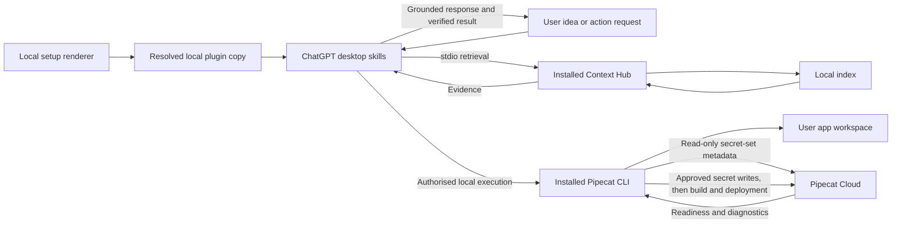
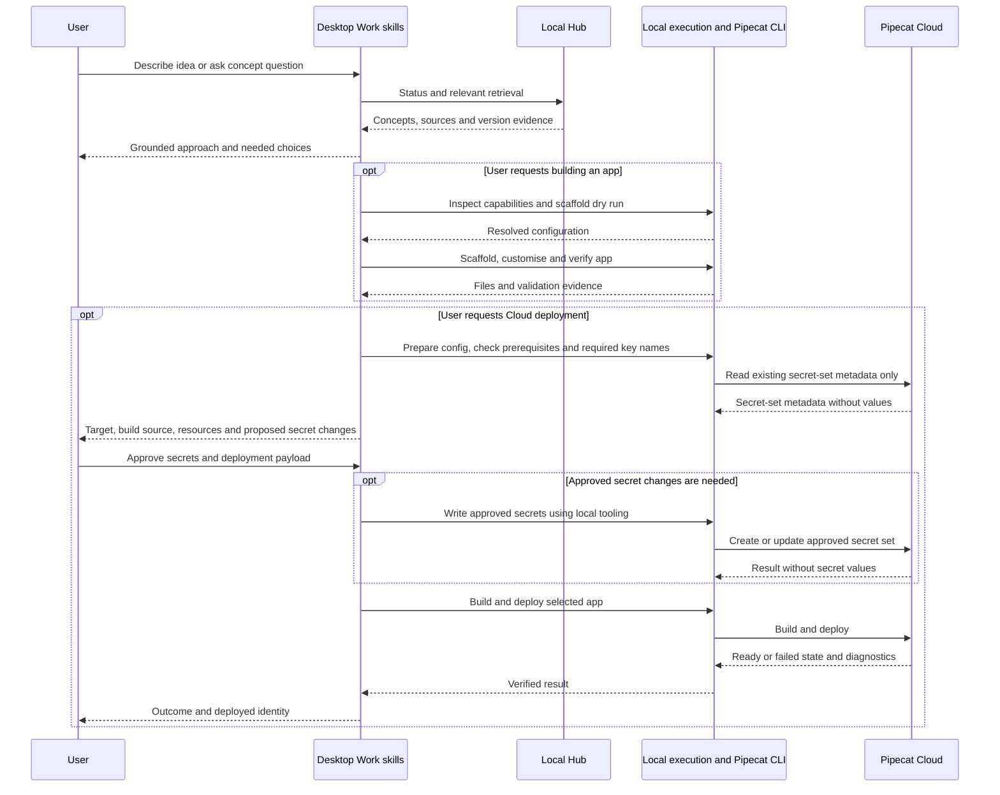

# Local Pipecat plugin: idea to Cloud deployment experiment

**Status**: Complete — local Codex acceptance; ChatGPT Work remains unqualified
**Component**: plugin packaging, retrieval instructions, CLI workflows
**Branch**: `feature/chatgpt-local-plugin`
**Created**: 2026-10-02
**Updated**: 2026-10-05

## Objective

Test a local desktop plugin that helps users describe a voice-agent idea, discover grounded Pipecat concepts, build and test a scaffolded application, and prepare a Pipecat Cloud deployment. A successful experiment includes a separately authorised deployment and verifies that the deployed agent becomes ready.

## Scope

Ship one plugin with explore, build and deploy skills. Context Hub supplies concepts, docs, definitions, examples and compatibility evidence over local stdio. The installed Pipecat CLI supplies scaffolding and Cloud operations through the host's local execution tools. Neither CLI is bundled as a copied executable or made a mandatory dependency of the hub's Python package.

Target ChatGPT desktop Work with local execution, and Codex local execution. Discussion-only usage may retrieve material but must not claim it can create files or deploy without execution tools. Native Plugin Settings, a dedicated UI, hosted retrieval and a new CLI-execution MCP adapter are outside this experiment. Start with framework-version and source preferences stated in the conversation. If the host lacks required local execution or stdio support, stop that workflow and report the missing capability; an adapter would require a separate design.

Queries must not silently refresh or replace the index. Discussing an idea does not authorise scaffolding, uploading secrets or deploying. Prepare concrete files and validation evidence before asking for final deployment approval.

## Requirements

- R1: Explore retrieves relevant concepts and sources before making Pipecat-specific API assertions; use ` + ` or ` & ` for multi-concept hub queries.
- R2: Status establishes index readiness and indexed framework provenance. An unavailable requested version is a limitation, not permission to rebuild the index.
- R3: Name the packaged MCP server `pipecat-context-hub-chatgpt-plugin`, independently of the standalone `pipecat-context-hub` registration. Bind hub startup to its installed Python using that executable's bare name and a generated `PATH` containing only its absolute interpreter directory, with `-P -m pipecat_context_hub serve`. The portable loader rejects absolute `command` values; startup must remain independent of desktop working directory and must not fall back to an ambient Python.
- R4: Build discovers installed CLI capabilities, maps user choices to supported scaffold options, validates a dry run, and only creates an app after a build request. Never overwrite or re-scaffold an existing app.
- R5: Deploy preparation validates the project, required runtime key names, selected Cloud organisation/region/agent identity, sizing and build path. Cloud inspection before approval is read-only: inspect existing secret-set metadata and prepare proposed key additions/updates without uploading or creating secrets. Do not print secret values or send them to model-visible context.
- R6: Present one concrete approval payload covering the deployment target, build source, resources, secret-set name and proposed key additions/updates. After the user approves that payload, use supported local tooling to create/update the approved Cloud secrets, then build/deploy through the installed Cloud CLI, check readiness and inspect bounded diagnostic logs. If secrets are already available and no changes are needed, skip the secret write. Failure is not success merely because a command was issued.
- R7: Existing Context Hub server handlers, CLI bridge, install registrations and retrieval semantics remain unchanged. A bounded exception permits a read-only pre-open check for oversized persisted HNSW link-list files, using the existing index-unready error/remediation path. This check must precede native Chroma client construction, must not repair or delete index files, and does not assert that other corruption shapes are detected. No general shell execution tool is added to the retrieval MCP.

## Verified facts and compatibility boundaries

- At initial plan creation, `pyproject.toml:10–21` declares `pipecat-ai-context-hub` version `0.8.1` with `mcp>=2.0,<3.0`.
- `src/pipecat_context_hub/cli_install.py::_server_command()` resolves `sys.executable` and uses `-P -m pipecat_context_hub serve`. Existing client registration has no ChatGPT route.
- `src/pipecat_context_hub/server/main.py` already provides tool-selection guidance; plugin skills complement it.
- `src/pipecat_context_hub/shared/types.py` exposes tool-specific version and source filters. These do not switch the indexed framework version or implement a universal source filter.
- Existing `plugin.py` is the Pipecat CLI extension, not desktop plugin packaging.
- Live local probes on 2026-10-03: `pipecat --version` reports `1.3.0`; `pipecat init --help` supports `--config`, `--dry-run`, `--deploy-to-cloud` and `--list-options`; `pipecat cloud deploy --help` succeeds and offers build-directory and GitHub-source options.
- A non-interactive scaffold dry run succeeded with explicit web bot type, SmallWebRTC, cascade, Deepgram/OpenAI/Cartesia, no client and Cloud files enabled. These are probe inputs, not defaults for users. Omitting `--bot-type` failed on this installed CLI, despite newer upstream guidance describing inference. This version has no `--eval` scaffold flag in its help.
- `pipecat-context-hub install --print-config` returned the pinned launch configuration without registering a client or refreshing the index.
- Official OpenAI documentation supports local shell/files in desktop Work when available to the account/workspace. Documentation support is not evidence of activation in the user's specific target chat; Phase 1 records retrieval and execution capabilities separately.

## Implementation Checklist

### Phase 1: Prove the desktop and installed-tool path

- Crash prerequisite (2026-10-04): reject an oversized persisted HNSW graph before native loading; regress the actual `TTS + STT` query against a synthetic corrupt index and prove healthy persisted indexes still reopen and search. Agents must not initiate live index recovery or refresh. A user-performed refresh supplies a new read-only baseline. Conduct recomputes the review-marker hash on resume; record that hash update separately from a new plan review.
- Retrieval outcome: resolve the installed hub interpreter, check index readiness without refresh, add the minimal plugin template and local renderer, then prove desktop discovery, explore-skill activation and stdio initialize/status. This gates Phase 2.
- Execution outcome: separately check local shell availability with a harmless command, and inspect Pipecat CLI versions/help when installed. This gates Phase 3 only; absent shell access or CLI must not block working retrieval.
- Cloud outcome: when the optional Cloud CLI is present, record command discovery; account/auth readiness remains a Phase 4 gate. Its absence does not block Phases 2 or 3.
- Capture independent retrieval/execution/Cloud availability, host mode, versions, command/argv and pass/fail evidence without machine paths in committed templates.
- If retrieval fails, stop the retrieval-dependent work and re-plan. If an optional capability is missing, mark only its dependent workflow unavailable and continue independent work. Do not substitute an untested execution adapter.

### Phase 2: Complete grounded exploration

Depends only on Phase 1's retrieval outcome. Define idea and concept workflows, source citations, version/source preference mapping and ambiguity handling. Test read-only conversations, including unsupported-filter and unavailable-version cases. The package can ship exploration without local shell access, the Pipecat CLI or Cloud credentials.

### Phase 3: Add build and local verification

Depends on Phase 2 and Phase 1's execution outcome. If local shell access or the Pipecat CLI is unavailable, report build as unavailable while retaining exploration. Otherwise discover scaffold options from installed help/JSON options, resolve user choices, validate `--dry-run`, then create a new app in an explicitly selected empty directory. Use generated structure and dependency pins; customise against retrieved APIs. Run project-appropriate import/startup and behavioural checks. Use upstream eval support only if the installed CLI actually supports it; otherwise record an explicit local verification method. No provider choice or credentials are invented.

### Phase 4: Prepare and exercise Cloud deployment

Depends on Phase 3 and available Cloud CLI/account prerequisites. If Cloud prerequisites are absent, retain exploration/build and report deployment as unavailable. Inspect installed Cloud command help, validate Dockerfile/deploy configuration and image architecture versus region, and check account/auth readiness. User performs browser login when needed. Before approval, inspect only required key names and existing Cloud secret-set metadata, and prepare a local upload plan; do not create, update or upload Cloud secrets. Local `.env` is not assumed to reach Cloud automatically. Present one concrete payload identifying organisation, region, agent, build source, resources, secret-set name and proposed key additions/updates for final approval. After approval, use supported local tooling to write only those secrets without exposing values to transcripts, then build/deploy, inspect readiness and bounded logs, and run an explicitly approved agent session if needed to verify behaviour. If a proposed secret change or deployment target changes after approval, present the revised payload before executing it. Document the deployed identity and cleanup instructions; do not delete deployments or automatically roll back by deleting data.

### Phase 5: Evaluate, review and document

Evaluate each workflow as its prerequisites become available; finish the live build/deploy cases after Phases 3 and 4 run. Complete the evaluation matrix, distinguish package checks from actual desktop outcomes, and document prerequisites and version limitations. Run proportional package/setup checks, the full repo quality gate before a PR, documentation review, code review and security review. Keep focused commits; no push/PR/merge is implied by plan completion. Missing optional prerequisites mark dependent workflows unavailable/untested and do not prevent recording successful exploration; a missing Cloud account or approval leaves live deployment explicitly untested, not silently passed. The full experiment remains incomplete until its live acceptance targets are demonstrated.

## Technical Specifications

### New files to create

- `plugins/pipecat-context-hub/plugin.json`: portable plugin identity; OpenAI presentation metadata only where supported by current schema.
- `plugins/pipecat-context-hub/mcp.template.json`: source template for the uniquely named `pipecat-context-hub-chatgpt-plugin` stdio entry, with explicit interpreter-name and interpreter-directory placeholders; never register this unresolved template directly.
- `plugins/pipecat-context-hub/scripts/prepare_local.py`: standard-library renderer run with the installed hub Python. Check the hub is importable, require exactly the unique packaged server entry, copy package resources to a user-selected local destination outside the checkout, and write schema-compatible root `mcp.json` with the bare name of `sys.executable`, `PATH` restricted to its absolute parent directory, `-P`, module and `serve`. Preserve interpreter symlinks so virtual-environment identity is retained. Refuse overwriting a nonempty destination. Preserve the source template, exclude repository evaluation reports and emit no credentials.
- `plugins/pipecat-context-hub/skills/explore/SKILL.md`: retrieve concepts, docs, definitions and examples; synthesise with evidence and explicit limitations.
- `plugins/pipecat-context-hub/skills/build/SKILL.md`: preflight host execution, CLI discovery, dry run, scaffold, customise and verify.
- `plugins/pipecat-context-hub/skills/deploy/SKILL.md`: prepare target/config/secrets, obtain concrete approval, execute and verify Cloud deployment.
- `plugins/pipecat-context-hub/README.md`: prerequisites, rendering, verified installation flow, host-mode distinction, version compatibility, update/re-render and removal instructions.
- `docs/evaluations/pipecat-context-hub-plugin.md`: repository-owned frozen prompts, expected outcomes and results template; no live credentials. This report is not an installed plugin resource.
- `tests/unit/test_chatgpt_plugin_setup.py`: renderer validation and refusal paths, pinned launch assertions and package-copy boundaries.

### Files to modify

`docs/setup/README.md` and `docs/README.md` link the optional desktop workflow. Update this plan and its index with progress and results. The crash prerequisite may modify `src/pipecat_context_hub/services/index/vector.py` and `errors.py`, add a read-only `hnsw_validation.py` helper and unit regressions, and extend `tests/integration/test_report_hint_e2e.py`. Update `AGENTS.md`, `CHANGELOG.md`, the evaluation report and related recovery/migration plans in the same pass. Do not modify the existing Pipecat CLI bridge or shared server handlers for this packaging experiment. Phase 5 security-gate remediation may update only the root lockfile’s `fsspec` package to the patched `2026.6.0` for CVE-2026-104851; preserve all other package metadata and dependency edges. This does not update the installed Hub runtime, qualification app or Cloud image.

### Architecture decisions

Use a generated local copy to bind the installed interpreter; keep machine-specific paths out of the portable source package. Portable stdio commands use an executable name plus a generated `PATH` containing only the installed interpreter directory, rather than an absolute command rejected by the host loader. The packaged MCP server has a unique identity; keep the standalone registration unchanged. Evaluation reports stay under `docs/evaluations/` and are excluded from generated packages. The renderer is a setup operation, not a tool invoked during queries. Re-render into a fresh local copy after plugin/interpreter updates and use the host's documented refresh/reinstall flow.

Use native local shell tools in desktop Work/Codex for the Pipecat CLI; skills are instructions, not executable permissions. The Cloud optional extension is installed separately when a user needs deployment. Help-derived capability checks take precedence over assumptions from newer docs. Builds and Cloud operations occur in the user's app workspace, not this repository.

Retrieval, local execution/Pipecat CLI and Cloud readiness are separate gates. Missing optional capabilities disable only the workflows that require them; working hub retrieval remains usable without local shell or either optional CLI.

Secret mutation is an explicit approved Cloud operation, distinct from read-only deployment preparation. Include proposed secret creation/update in the same concrete approval payload as the deployment. Preapproval checks expose only key names and secret-set metadata; after approval, supported local tooling transfers secret values directly without returning them to model context. Upload secrets before starting the approved build/deploy so required runtime secrets are available at startup.

### Integration Seams

| Producer | Consumer | Contract |
|---|---|---|
| Setup renderer | Desktop plugin loader | Root portable manifest, skill directories and resolved `mcp.json`; installed executable with safe argv |
| ChatGPT explore skill | Hub MCP | Supported tool arguments, multi-concept delimiters, local index provenance and cited results |
| ChatGPT build/deploy skills | Host local execution tools | User-authorised project workspace and actual installed CLI capabilities; no ambient execution assumption |
| Pipecat scaffold | Build skill | Generated structure, dependency pins and named environment requirements |
| Local Cloud CLI | Pipecat Cloud | Read-only metadata inspection before approval; approved secret creation/update precedes approved build/deploy; identity/config, authentication, readiness and redacted diagnostics |

## Architecture & Call Flow

| Step | Trigger | Enters context | Cleared/persisted | Turn boundary |
|---|---|---|---|---|
| Setup | Local rendering and install | Package identity and connection metadata | Local plugin copy; no secrets in package | Before experiment chat |
| Explore | Idea/concept request | Requirements, preferences, indexed version and retrieved evidence | Conversation history; corpus stays on disk | User and tool turns |
| Build | Explicit build request | Supported options, dry-run result, code and test output | User project files; credentials remain local | Assistant tool rounds |
| Prepare deployment | Deployment request | Target, region, resources, key names, existing secret-set metadata and proposed changes | Local configuration/upload plan; no Cloud mutations or secret values in chat | Before approval |
| Write secrets | Concrete payload approval, when changes are needed | Redacted result and approved key names | Approved Cloud secret set; values stay out of chat | After approval, before build/deploy |
| Deploy | Concrete user approval | Deployment identity, readiness and redacted diagnostics | Cloud deployment and recorded result | Approval and tool rounds |

## Testing Notes

| Case | Expected evidence |
|---|---|
| Template rendering | Portable root files, exactly the unique packaged MCP server, bare executable with `PATH` restricted to its installed directory and safe argv; no unresolved placeholder or repository evaluation report in generated package |
| Host MCP loader | Installed Codex `plugin/read` discovers the unique server; freeze the absolute-command rejection and verify the generated configuration passes the real loader, separately from desktop activation |
| Destination exists or hub absent | Clear error, no overwrite or partial registration |
| Host feasibility | Actual skill discovery, stdio initialize/status and harmless shell execution in selected desktop mode |
| Optional shell/CLI absent | Retrieval still activates and answers with sources; build is unavailable without shell/Pipecat CLI, and Cloud absence does not block working exploration/build |
| Unrelated/shadow-module cwd | Packaged launch completes initialize/status using installed hub, not a same-named shadow module |
| Idea versus concept prompts | Relevant retrieved material and sources precede Pipecat API assertions |
| Unavailable version; empty/stale index | Limitation/remediation disclosure; no initiated refresh/replacement; before/after version and refresh metadata |
| Source preference; unsupported filter; missing compatibility | Only supported arguments, explicit corpus limitations and no invented compatibility |
| Build request | Real options/help inspection, valid dry run and generated project; no writes on idea-only prompt |
| Existing project | No overwrite/re-scaffold; adapt existing structure |
| CLI capability drift | Installed 1.3.0 versus newer documented flags handled through discovery; unsupported flags never blindly invoked |
| Cloud auth/keys unavailable | Preparation remains incomplete with specific prerequisites; no secret values in outputs |
| Deployment declined or not yet approved | Read-only preparation only; no secret create/update/upload, build/deploy or agent-session start |
| Approved deployment | Only approved secret changes are written before approved build/deploy; correct target/configuration, readiness evidence and bounded redacted diagnostics |
| Failed deploy | Explicit failure with actionable diagnostics; no false completion |

Each run records prompt, host mode, CLI/framework versions, actual tool calls, cited response, latency and pass/fail/untested outcomes. Freeze at least 12 prompts across these cases. Local setup tests cannot establish model activation or successful Cloud behaviour.

Before a PR run `uv run ruff format src/ tests/`, `uv run ruff check src/ tests/`, `uv run mypy src/ tests/` and `uv run pytest tests/ -q`; review formatter changes and preserve unrelated work. Include the renderer path in formatting/lint checks. Retrieval handlers are unchanged; the new package still requires a real stdio smoke using its generated command.

## Review Focus

Portable OpenAI plugin packaging and host capability boundary; pinned launch independent of cwd; no index refresh during retrieval; version/source limitations; installed CLI discovery; no writes on discussion-only requests; deployment approval and credential isolation; verify ready state rather than command issuance.

## Acceptance Criteria

- Actual desktop discovery and stdio connection are demonstrated with the rendered local package.
- Idea/concept workflows retrieve relevant evidence and disclose version/source limitations.
- A build request produces a scaffolded app using installed CLI capabilities and verifies it locally.
- Deployment preparation produces concrete reviewed configuration and proposed secret changes without Cloud mutation or exposure of credential values. Approved secret changes occur before the approved build/deploy.
- Missing optional CLI, shell or Cloud prerequisites leave working exploration usable and disable only dependent workflows.
- Live Cloud deployment runs only after target/payload approval and is verified ready; missing prerequisites remain explicitly untested.
- All evaluation results distinguish observed passes, failures and untested behaviour.
- Existing hub CLI/server behavior and registrations are preserved.

## References

- https://developers.openai.com/plugins/build/plugins
- https://learn.chatgpt.com/docs/extend/mcp
- https://learn.chatgpt.com/docs/use-chatgpt
- https://learn.chatgpt.com/docs/enterprise/chatgpt-work-local-security
- https://github.com/pipecat-ai/pipecat/blob/main/src/pipecat/cli/agent_templates/AGENTS.md

<!-- reviewed: 2026-10-05 @ 34ee796df12e59e4bdaadd6f7c7d21b349facf7d -->

## Progress

**Outcome updated:** 2026-10-07

- [x] Phase 1: Prove the desktop and installed-tool path.
- [x] Phase 2: Complete grounded exploration.
- [x] Phase 3: Add build and local verification.
- [x] Phase 4: Prepare and exercise Cloud deployment.
- [x] Phase 5: Evaluate, review and document.
- [x] Add the setup workflow, required CLI discovery and Cloud login guidance.
- [x] Replace the original stdio-dependent package with a CLI-first, skills-only
  package after host portability testing.
- [x] Add and qualify presentation assets, corporate listing metadata, privacy
  and terms links, and voice-AI discovery copy.
- [x] Prepare a commit-pinned replacement for the submitted 0.2.3 package's
  branch-qualified evaluation link.
- [ ] Observe revised-skill activation in ChatGPT Work.
- [ ] Recheck the publisher portal outcome. The submitted ZIP is unchanged; the
  durable-link replacement is prepared but not uploaded.

Chronological command output, hashes, Cloud identifiers, package manifests,
historical failures and per-run results live in the
[evaluation report](../evaluations/pipecat-context-hub-plugin.md). User-visible
package changes live in [CHANGELOG.md](../../CHANGELOG.md).

## Findings

### Later decisions that supersede the reviewed contract

- **Retrieval transport:** the reviewed contract's generated stdio MCP package
  was a useful feasibility step, but the distributable package was later changed
  to four CLI-first skills. Setup installs or verifies Context Hub; Explore uses
  native Context Hub query commands; Build and Deploy require the Pipecat CLI.
  This supersedes the package shape in R3 and the original renderer design. It
  does not change shared CLI/MCP retrieval handlers or index semantics.
- **Index readiness:** successful initialization and status were not sufficient
  evidence of vector health. A persisted Chroma graph crashed on first search,
  so current code performs a bounded, read-only oversized-link-list check before
  native client construction and uses the existing reset remediation. This
  refines, rather than replaces, the decisions in the
  [index-recovery plan](20260324-bug-chroma-index-recovery.md) and
  [Chroma 1.x migration plan](20260529-chore-chromadb-1x-python-314.md).
- **Cloud source builds:** real uploader behavior invalidated the assumed ignore
  pattern, producing an empty archive; the first corrected build then showed
  that the pinned base image lacked `uv`. Qualification now requires inspecting
  the actual upload archive, preserving immutable inputs and explicitly supplying
  build tooling when the selected source-build path needs it. The approved
  corrected build/deploy was later verified ready without an extra deployment.
- **Publication evidence:** public listing iterations are packaging history, not
  plan-contract changes. Version 0.2.3 removed named model services after a
  dashboard finding. The submitted archive still links to a deletable feature
  branch; the prepared replacement pins the qualification document to commit
  `ad8a73c06942d78e5310d893cfd8b1f92cf067b4`. Upload waits for the active
  review decision or explicit cancellation.

### Current limitations

- ChatGPT Work activation of the revised cached skills remains unqualified.
- Provider-backed audio/browser sessions, general existing-app adaptation and
  the secret-write branch remain untested.
- The HNSW check covers the observed oversized `link_lists.bin` shape only; it
  is not general graph validation or repair.
- Packaging checks do not prove publisher-portal acceptance or publication.
- Historical runtime/index observations are dated evidence, not claims about the
  current installed Hub.

## Issues & Solutions

- **First vector search crashed after healthy status:** add the bounded pre-open
  graph-size guard and freeze both corrupt and healthy reopen regressions.
- **Cloud upload omitted the source tree:** verify the exact archive produced by
  the installed uploader and use strict staging for local source uploads.
- **Pinned Cloud base lacked `uv`:** provide an immutable ARM64 `uv` binary
  and preserve the base image's inherited runtime environment.
- **Listing copy triggered a named-platform finding:** retain capability language
  while removing named model services and unverifiable qualifiers.
- **Qualification URL depended on the feature branch:** pin it to the exact
  submitted-source commit so regular merge plus branch deletion preserves it.

## Final Results

| Area | Outcome | Durable evidence / remaining boundary |
|---|---|---|
| Package | Four-skill, CLI-first 0.2.3 package with setup, explore, build and deploy workflows | Package README and current evaluation snapshot |
| Exploration | Grounded docs, API, example and page retrieval qualified in local Codex runs | Twenty-one frozen prompts and actual call evidence in the evaluation report; ChatGPT Work remains unqualified |
| Build | Installed-CLI discovery, dry run, scaffold, import/startup and refusal to overwrite an existing target qualified | Provider/browser execution and general adaptation remain untested |
| Cloud | One approved corrected source build/deploy independently verified ready with the approved resources and existing secret identity | No provider session or secret write was exercised |
| Index safety | Observed oversized persisted-HNSW failure refused before native Chroma construction | Existing reset guidance retained; coverage is deliberately bounded |
| Presentation | Cat-mark assets, labelled logos, publisher metadata, privacy and terms links included | Host rendering and portal review are separate outcomes |
| Publication | 0.2.3 listing-fix ZIP reported submitted; commit-pinned durable-link replacement prepared | Replacement not uploaded; portal decision pending |
| Quality | Phase 5 full gate passed Ruff, mypy, security checks and 1,847 tests with 7 skips | Later listing/link-only edits passed 17 packaging tests and focused integrity/PII checks; the earlier full-suite result remains dated |

This plan now records the contract, the decisions that changed it, and the final
boundaries. The evaluation report owns the detailed timeline so future work can
ground itself in evidence without treating every intermediate run as a current
requirement.
